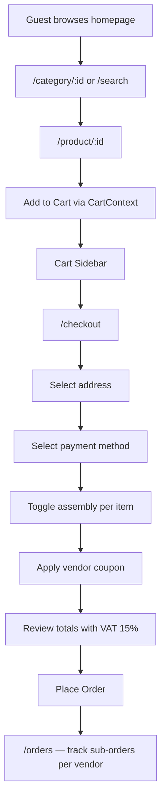
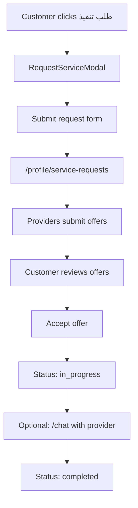
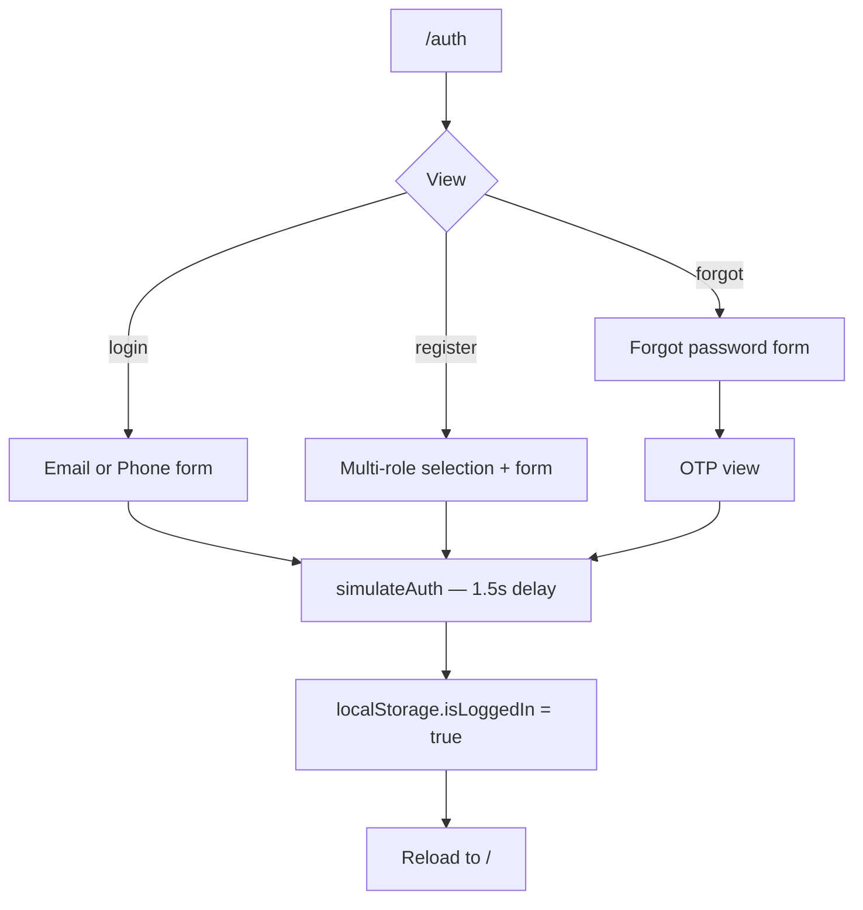
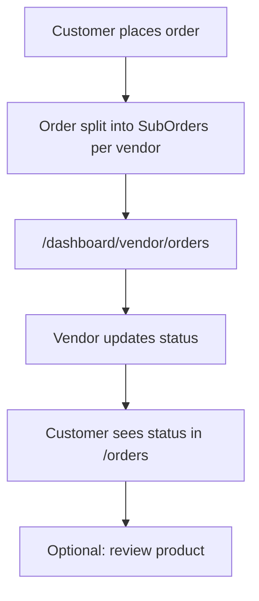
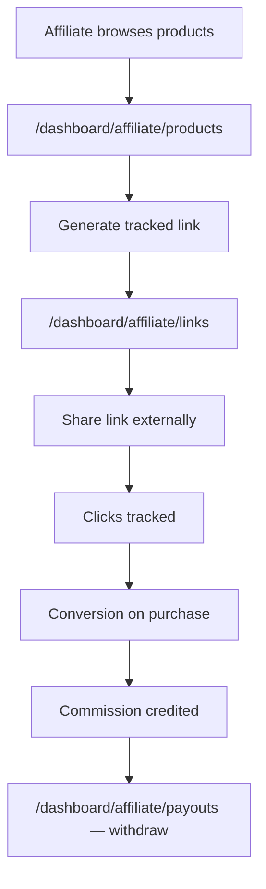
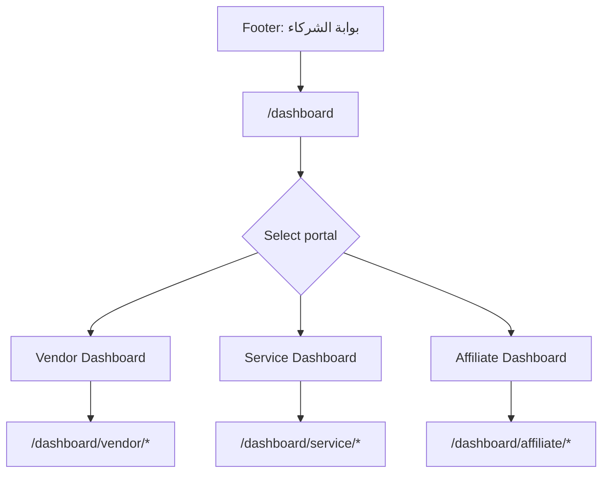
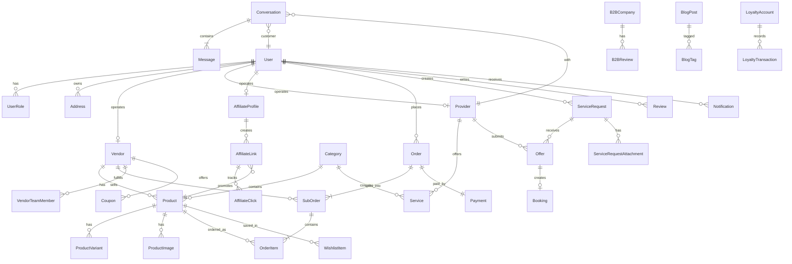
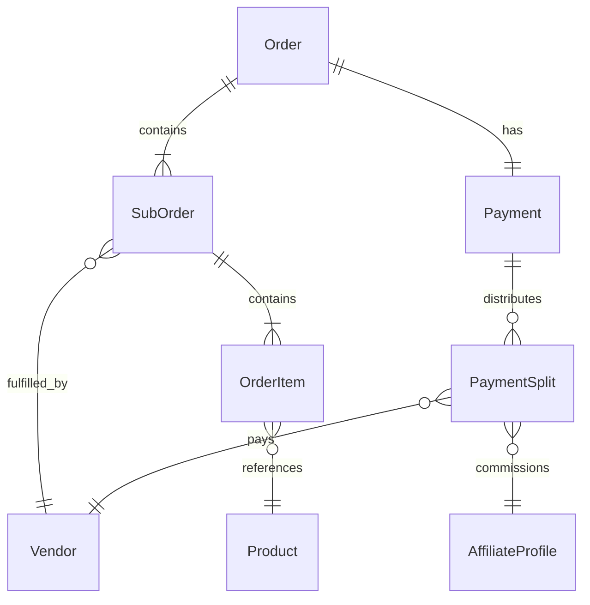

# Project Specification — DIYAR Marketplace

> **Document status:** REFERENCE — SUPERSEDED for technology decisions  
> **Superseded by:** [REQUIREMENTS_BASELINE.md](./REQUIREMENTS_BASELINE.md), [MASTER_DEVELOPMENT_PLAN.md](./MASTER_DEVELOPMENT_PLAN.md), [architecture/](./architecture/)  
> **Current tech baseline:** Laravel **13**, MySQL, Laravel Cache, database queue  
> **Version:** 1.0 (historical discovery)  
> **Date:** 2026-08-15  
> **Repository:** `diyar-marketplace`  
> **Classification key:** `EXISTING` | `INFERRED` | `REQUIRED` | `PROPOSED` | `UNKNOWN`

---

## 1. Executive Summary

**DIYAR (ديار)** is an Arabic, RTL, multi-vendor marketplace for **furniture products** and **home services**, targeting the Saudi Arabian market. The current repository is a **frontend-only UI/UX prototype** with approximately 80 source files, 46 defined routes, and all domain data mocked inline. There is no backend, database, API layer, authentication service, or test suite.

This document reverse-engineers the prototype into a complete product and technical specification. It describes what exists today, what can be inferred from the UI, what must be built for a production system, and what remains unresolved.

**Key findings:**

| Finding | Label |
|---------|-------|
| React 19 + Vite 6 + Tailwind v4 SPA with 48 page components | **EXISTING** |
| Four user personas: Customer, Vendor, Service Provider, Affiliate | **EXISTING** (UI evidence) |
| Multi-vendor checkout with per-vendor shipping, assembly, coupons, 15% VAT | **EXISTING** (mock) |
| Service request → offers → selection workflow | **EXISTING** (mock) |
| Three partner dashboards (vendor, service, affiliate) | **EXISTING** |
| Auth via `localStorage.isLoggedIn` flag only | **EXISTING** |
| AI designer, image search, chat — UI simulations only | **EXISTING** |
| Laravel API backend recommended by project stakeholders | **PROPOSED** |
| Platform admin panel | **UNKNOWN** (not in prototype) => NOT YET |

**Recommended path (historical — see REQUIREMENTS_BASELINE for current):** Build a **Laravel 13 REST API** with MySQL, Laravel Cache, and S3-compatible storage; progressively replace inline mocks in the existing React frontend with authenticated API calls.

---

## 2. Product Overview

### 2.1 Product Name

**DIYAR (ديار)** — tagline from `index.html`: *"سوق الأثاث والخدمات"* (Furniture & Services Marketplace).  
**Label:** **EXISTING**

### 2.2 Product Purpose

DIYAR aims to connect:

1. **Customers** who want to browse, compare, and purchase furniture and home-related services.
2. **Vendors (merchants)** who sell physical furniture products through individual storefronts.
3. **Service providers** who offer design, maintenance, custom fabrication, and related home services.
4. **Affiliates (marketers)** who promote products and earn commissions.

The platform also surfaces **B2B company profiles**, a **loyalty rewards program**, **blog/content marketing**, and **AI-assisted design discovery** (currently simulated).

**Label:** **INFERRED** from page structure, navigation, and mock data themes.

### 2.3 Target Market

Evidence from mock data points to **Saudi Arabia**:

- Currency: SAR (ر.س) throughout checkout and product pages
- Payment methods: Mada, Apple Pay, Tabby BNPL referenced in checkout
- VAT rate: 15% calculated in checkout
- Sample addresses: Riyadh neighborhoods (حي الملقا, برج الفيصلية)

**Label:** **INFERRED**

### 2.4 Core Value Proposition

| User | Value |
|------|-------|
| Customer | One-stop marketplace for furniture + services; multi-vendor cart; loyalty rewards; AI design assistance |
| Vendor | Storefront, product catalog management, order fulfillment, finance/payouts, team management |
| Service Provider | Receive client requests, submit offers, manage bookings and service catalog |
| Affiliate | Generate tracked links, view performance reports, withdraw earnings |

**Label:** **INFERRED** from dashboard and storefront UI.

### 2.5 Product Maturity

| Stage | Description |
|-------|-------------|
| Current (V0) | High-fidelity UI prototype with mock data |
| Target (V1) | Production MVP with real auth, payments, orders |
| Future (V2+) | AI features, mobile app, advanced analytics |

---

## 3. Current Repository State

### 3.1 Repository Inventory

| Area | Current State | Details | Status |
|------|---------------|---------|--------|
| Frontend | React 19 SPA | 48 pages, 14 shared components, RTL Arabic UI | **Existing** |
| Backend | None | No server, API, or business logic layer | **Missing** |
| Database | None | No schema, ORM, or migrations | **Missing** |
| Authentication | Mock | `localStorage.setItem('isLoggedIn', 'true')` in `AuthPage.tsx` | **Partial (mock)** |
| Authorization | None | No route guards; dashboards publicly accessible | **Missing** |
| API | None | No `fetch`, axios, or HTTP client usage | **Missing** |
| Storage | External URLs | Unsplash images, ui-avatars.com; local SVGs in `public/` | **Partial** |
| Notifications | UI mock lists | Customer + partner notification pages with inline data | **Partial (mock)** |
| Deployment | GitHub Pages | CI builds Vite `dist/` on push to `main` | **Existing (frontend only)** |
| Testing | None | `npm run lint` runs `tsc --noEmit` only | **Missing** |
| CI/CD | Partial | `deploy-pages.yml` active; `npm-publish-github-packages.yml` unused template | **Partial** |
| Environment config | None | No `.env` or `.env.example`; no `import.meta.env` usage | **Missing** |
| i18n | Hardcoded Arabic | `dir="rtl"` on root; no i18n library | **Partial** |
| State management | React Context | `CartContext` only; rest is local `useState` | **Partial** |

### 3.2 What Works Today (Prototype)

- Full storefront navigation with 46 routes
- Product/service browsing, filtering UI, search UI
- Cart with add/remove/quantity (seeded with 2 items)
- Checkout UI with multi-vendor grouping, assembly toggle, coupon simulation
- Auth UI flows (login, register, OTP, forgot password) — simulated
- Three partner dashboard UIs with charts (Recharts)
- Mobile-responsive layout with bottom navigation
- GitHub Pages deployment pipeline

### 3.3 What Does Not Work (Requires Backend)

- Real user accounts and sessions
- Persistent cart, wishlist, orders
- Payment processing
- Product/service CRUD backed by database
- Service request and offer workflow
- Affiliate link tracking and payouts
- Notifications delivery
- File uploads (product images, request attachments)
- AI designer, image search, chat messaging

---

## 4. Repository Structure

```
diyar-marketplace/
├── .github/workflows/          # CI: GitHub Pages deploy + unused npm publish template
├── conception/                 # This specification document
├── public/                     # Static assets (logo, payment SVGs, empty categories/)
├── src/
│   ├── App.tsx                 # App shell: header, 46 routes, global modals
│   ├── main.tsx                # Entry: BrowserRouter + CartProvider
│   ├── index.css               # Tailwind v4 theme tokens (diyar-dark/cream/brown)
│   ├── components/
│   │   ├── cards/              # ProductCard, ServiceCard
│   │   ├── home/               # Hero, CategoriesStrip, FeaturedDeals, Sections (20 exports)
│   │   ├── layout/             # AnnouncementBar, Footer, SidebarMenu, FloatingContactBar
│   │   └── modals/             # CartSidebar, FilterModal, ImageSearchModal, RequestServiceModal
│   ├── context/
│   │   └── CartContext.tsx     # Only global state provider
│   ├── layouts/
│   │   └── DashboardLayout.tsx # Partner portal shell (vendor/service/affiliate)
│   └── pages/                  # 27 storefront pages
│       └── dashboard/          # 21 partner dashboard pages
├── index.html
├── package.json
├── tsconfig.json
├── vite.config.ts
└── README.md
```

### Directory Responsibilities

| Directory | Responsibility |
|-----------|-----------------|
| `src/App.tsx` | Single routing file, global header/footer, modal orchestration, auth flag read |
| `src/pages/` | Route-level page components with inline mock data |
| `src/pages/dashboard/` | Partner portal pages (vendor, service provider, affiliate) |
| `src/components/home/Sections.tsx` | Homepage section blocks (BestSellers, ServicesSection, LoyaltyPromo, etc.) |
| `src/context/` | Cart state only |
| `public/` | Brand logo, payment method icons |
| `.github/workflows/` | Frontend CI/CD |

**Not present:** `backend/`, `api/`, `tests/`, `docker/`, `src/types/`, `src/services/`, `src/hooks/` (beyond `useCart`), `src/data/`

---

## 5. Current Technology Stack

### 5.1 Runtime & Framework

| Technology | Version | Purpose | Label |
|------------|---------|---------|-------|
| React | 19.0.1 | UI framework | **EXISTING** |
| TypeScript | 5.8.2 | Type safety (loosely applied) | **EXISTING** |
| Vite | 6.2.3 | Dev server (port 3000) + production build | **EXISTING** |
| react-router-dom | 7.15.0 | Client-side routing | **EXISTING** |

### 5.2 Styling & UI

| Technology | Version | Purpose | Label |
|------------|---------|---------|-------|
| Tailwind CSS | 4.1.14 | Utility-first CSS via `@tailwindcss/vite` | **EXISTING** |
| lucide-react | 0.546.0 | Icon library | **EXISTING** |
| motion | 12.23.24 | Animations (announcement bar, transitions) | **EXISTING** |
| recharts | 3.8.1 | Dashboard charts | **EXISTING** |

### 5.3 Fonts & Brand Tokens

Defined in `src/index.css`:

| Token | Value |
|-------|-------|
| `--color-diyar-dark` | `#1f3d3a` |
| `--color-diyar-cream` | `#f3ecdb` |
| `--color-diyar-brown` | `#947961` |

Fonts: Alexandria, Tajawal (Arabic), Outfit (Latin accents).

### 5.4 Development Tooling

| Tool | Status |
|------|--------|
| ESLint | Not configured |
| Prettier | Not configured |
| Vitest/Jest | Not configured |
| Type checking | `tsc --noEmit` via `npm run lint` |

### 5.5 External Dependencies (Runtime)

- Google Fonts (CDN)
- Unsplash image URLs (product/service placeholders)
- ui-avatars.com (avatar placeholders)

---

## 6. Product Actors / Users

### 6.1 Identified Roles

| Role | Arabic UI Label | Evidence | Label |
|------|-----------------|----------|-------|
| **Guest** | — | Unauthenticated browsing | **EXISTING** |
| **Customer** | عميل | Auth registration role; profile, checkout, orders pages | **EXISTING** |
| **Vendor / Merchant** | تاجر | Auth role `merchant`; `/dashboard/vendor/*`; `/store/:id` | **EXISTING** |
| **Service Provider** | مقدم خدمة | Auth role `service_provider`; `/dashboard/service/*`; `/provider/:id` | **EXISTING** |
| **Affiliate / Marketer** | مسوق | Auth role `marketer`; `/dashboard/affiliate/*` | **EXISTING** |
| **Platform Admin** | — | No admin routes or UI | **UNKNOWN** |
| **Vendor Team Member** | — | VendorTeam page: owner, manager, support roles | **EXISTING** (UI mock) |

### 6.2 Multi-Role Registration

`AuthPage.tsx` allows selecting **multiple roles** during registration (customer is default and cannot be deselected if alone). This implies a single user account may hold multiple personas.

**Label:** **EXISTING** (UI) — business rules for role activation **UNKNOWN**.

### 6.3 Vendor Team Sub-Roles

From `VendorTeam.tsx` mock data:

| Sub-Role | Arabic | Permissions (UI only) |
|----------|--------|----------------------|
| `owner` | مالك | Full store access |
| `manager` | مدير | Manage products/orders |
| `support` | دعم | Customer support |

**Label:** **EXISTING** (mock) — actual permission enforcement **MISSING**.

---

## 7. Functional Requirements

Requirements are labeled by source. Items marked **REQUIRED** are needed for production; **EXISTING** means UI prototype already represents the feature.

### 7.1 Storefront & Discovery

| ID | Requirement | Label |
|----|-------------|-------|
| FR-01 | Browse homepage with hero, categories, deals, featured stores, blog promo | **EXISTING** |
| FR-02 | Browse products by category (`/category/:id`) with filters (price, color, material, rating) | **EXISTING** |
| FR-03 | Browse services marketplace (`/services`) with category filters | **EXISTING** |
| FR-04 | Full-text search (`/search?q=`) | **EXISTING** (client-side mock) |
| FR-05 | Image-based product search | **EXISTING** (UI mock — no CV backend) |
| FR-06 | View product detail with variants (color), dimensions, materials, gallery | **EXISTING** |
| FR-07 | View service detail with provider info, gallery, reviews | **EXISTING** |
| FR-08 | View vendor store profile (`/store/:id`) | **EXISTING** |
| FR-09 | View service provider profile (`/provider/:id`) | **EXISTING** |
| FR-10 | B2B company directory and company detail pages | **EXISTING** |
| FR-11 | Blog article reading (`/blog/:id`) | **EXISTING** |
| FR-12 | Persistent search index with filters server-side | **REQUIRED** |

### 7.2 Commerce

| ID | Requirement | Label |
|----|-------------|-------|
| FR-20 | Add products/services to cart | **EXISTING** (CartContext) |
| FR-21 | Cart sidebar with quantity management | **EXISTING** |
| FR-22 | Multi-vendor checkout with per-vendor shipping and assembly options | **EXISTING** (mock) |
| FR-23 | Apply vendor-specific coupon codes | **EXISTING** (mock: `DISCOUNT10`) |
| FR-24 | Calculate VAT at 15% | **EXISTING** (checkout logic) |
| FR-25 | Payment via Mada, card, Apple Pay, Tabby | **EXISTING** (UI selection only) |
| FR-26 | Order placement and confirmation | **REQUIRED** (UI shows flow, no persistence) |
| FR-27 | Order history and multi-vendor tracking | **EXISTING** (mock) |
| FR-28 | Wishlist (products and services) | **EXISTING** (mock) |
| FR-29 | Product/service reviews | **EXISTING** (mock) |

### 7.3 Service Marketplace

| ID | Requirement | Label |
|----|-------------|-------|
| FR-30 | Submit custom service request ("طلب تنفيذ") via modal | **EXISTING** |
| FR-30 | Customer views service requests and received offers | **EXISTING** |
| FR-31 | Customer accepts an offer and tracks in-progress work | **EXISTING** (mock) |
| FR-32 | Provider receives client requests in dashboard | **EXISTING** |
| FR-33 | Provider submits offers on requests | **REQUIRED** (UI shows offers on customer side) |
| FR-34 | Provider manages bookings/appointments | **EXISTING** (mock) |
| FR-35 | Chat with provider (with optional cart-from-chat) | **EXISTING** (mock) |

### 7.4 Account & Profile

| ID | Requirement | Label |
|----|-------------|-------|
| FR-40 | Register with email/phone, multi-role selection | **EXISTING** (simulated) |
| FR-41 | Login via email or phone | **EXISTING** (simulated) |
| FR-42 | OTP verification | **EXISTING** (simulated) |
| FR-43 | Password reset | **EXISTING** (UI only) |
| FR-44 | Manage personal info, addresses | **EXISTING** (mock) |
| FR-45 | Security settings: password change, 2FA, active sessions | **EXISTING** (mock) |
| FR-46 | Notification inbox and preferences | **EXISTING** (mock) |
| FR-47 | Language selection page | **EXISTING** (mock — Arabic only in practice) |
| FR-48 | Loyalty points balance and redemption history | **EXISTING** (mock) |

### 7.5 Partner Dashboards

| ID | Requirement | Label |
|----|-------------|-------|
| FR-50 | Vendor: sales dashboard, orders, products CRUD, team, finance, settings | **EXISTING** (mock) |
| FR-51 | Service provider: earnings dashboard, client requests, bookings, services CRUD, finance, settings | **EXISTING** (mock) |
| FR-52 | Affiliate: performance dashboard, promotable products, link management, reports, payouts, settings | **EXISTING** (mock) |
| FR-53 | Partner notifications | **EXISTING** (mock) |

### 7.6 AI & Advanced Features

| ID | Requirement | Label |
|----|-------------|-------|
| FR-60 | AI personal assistant for room design and product recommendations | **EXISTING** (simulated) |
| FR-61 | AR room designer in sidebar menu | **EXISTING** (UI mock with sticker overlays) |
| FR-62 | Mobile app promotion section on homepage | **EXISTING** (marketing UI — app not built) |

---

## 8. User Flows

### 8.1 Product Purchase Flow



**Current gaps:** Steps after cart use checkout-local `MOCK_CART`, not `CartContext`. Order placement has no API call. Auth not enforced at checkout.

### 8.2 Service Request Flow



**Request statuses (mock):** `pending`, `offers_received`, `in_progress`, `completed`, `cancelled`

### 8.3 Authentication Flow



**Label:** **EXISTING** (mock). Production requires real token issuance.

### 8.4 Vendor Order Fulfillment Flow



**Sub-order status steps (mock):** processing → shipped → delivered

### 8.5 Affiliate Promotion Flow



### 8.6 Partner Dashboard Access Flow



**Note:** No authentication gate — any visitor can access dashboards. **Label:** **EXISTING** gap.

---

## 9. UI / Page Inventory

All routes are defined in `src/App.tsx`. Layout shell (header, footer, mobile nav) is hidden on `/auth` and `/dashboard/*`.

### 9.1 Storefront Pages (17 routes)

| Page | Route | Purpose | Role | Data Source | Missing |
|------|-------|---------|------|-------------|---------|
| Home | `/` | Landing: hero, categories, deals, services, stores, blog, loyalty promo | Guest/All | Inline mocks in `Sections.tsx`, `Hero.tsx`, etc. | Real catalog API |
| Auth | `/auth` | Login, register, forgot password, OTP | Guest | Form state + localStorage | Real auth API |
| Category | `/category/:id` | Product/service listing with filters | Guest/All | `MOCK_PRODUCTS`, `MOCK_SERVICES`, `CATEGORIES` | Server-side filter/search |
| Product Detail | `/product/:id` | Full product view, add to cart | Guest/All | `MOCK_PRODUCT`, `SIMILAR_PRODUCTS` | Dynamic product by ID |
| Store | `/store/:id` | Vendor storefront | Guest/All | `STORE_INFO`, `PRODUCTS` | Vendor API |
| Search | `/search` | Search results (`?q=`) | Guest/All | Inline filtered mock | Search index API |
| Services | `/services` | Services marketplace browse | Guest/All | `MOCK_SERVICES` | Services API |
| Service Detail | `/service/:id` | Service view, book/add to cart | Guest/All | `SERVICE_INFO`, reviews | Service API |
| Provider | `/provider/:id` | Service provider profile | Guest/All | `PROVIDER_INFO`, `SERVICES` | Provider API |
| B2B Directory | `/b2b` | B2B company listing | Guest/All | `B2B_COMPANIES` | B2B API |
| B2B Company | `/b2b/:id` | Company profile, portfolio, reviews | Guest/All | `COMPANIES`, `MOCK_REVIEWS` | B2B API |
| AI Designer | `/ai-designer` | AI chat for room design + product suggestions | Guest/All | Simulated responses | LLM API |
| Chat | `/chat` | Messaging with providers | Customer | `SEED_CONVERSATIONS` | WebSocket/polling API |
| Checkout | `/checkout` | Multi-step checkout | Customer | `MOCK_CART`, `MOCK_ADDRESSES`, `PAYMENT_METHODS` | Cart sync, payment gateway |
| Orders | `/orders` | Order history, tracking, reviews | Customer | `MOCK_ORDERS` | Orders API |
| Wishlist | `/wishlist` | Saved products/services | Customer | Inline mock | Wishlist API |
| Loyalty | `/loyalty` | Points balance and history | Customer | Inline `history` | Loyalty API |
| Blog Article | `/blog/:id` | Single blog post | Guest/All | `MOCK_ARTICLE` | CMS API |

**Gap:** `/blog` index route referenced in UI but not registered — only `/blog/:id` exists.

### 9.2 Customer Profile Pages (9 routes)

| Page | Route | Purpose | Data Source | Expected Backend |
|------|-------|---------|-------------|------------------|
| Profile Hub | `/profile` | Account menu/links | Static links | User profile API |
| Personal Info | `/profile/personal-info` | Edit name, phone, email | Form mock | `PATCH /api/user/profile` |
| Addresses | `/profile/addresses` | CRUD shipping addresses | Inline mock | Addresses API |
| Security | `/profile/security` | Password, 2FA, sessions | Form mock | Auth security API |
| Reviews | `/profile/reviews` | User review history | Inline mock | Reviews API |
| Notifications | `/profile/notifications` | Notification inbox | `MOCK_NOTIFICATIONS` | Notifications API |
| Notification Settings | `/profile/notification-settings` | Channel preferences | Form mock | Preferences API |
| Language | `/profile/language` | Language selection | Static (Arabic) | i18n config API |
| Service Requests | `/profile/service-requests` | RFQ list, offers, accept | `MOCK_REQUESTS`, `MOCK_OFFERS` | Service requests API |

### 9.3 Partner Dashboard Pages (22 routes)

#### Dashboard Index (1)

| Page | Route | Purpose |
|------|-------|---------|
| Portal Picker | `/dashboard` | Choose vendor / service / affiliate demo portal |

#### Vendor Portal (7)

| Page | Route | Key UI Elements | Mock Data |
|------|-------|-----------------|-----------|
| Vendor Dashboard | `/dashboard/vendor` | Sales chart, recent orders, KPI cards | Weekday sales data |
| Vendor Orders | `/dashboard/vendor/orders` | Orders table, status filters, detail modal | `ordersList` |
| Vendor Products | `/dashboard/vendor/products` | Product CRUD table, add/edit modal | `productsList` |
| Vendor Team | `/dashboard/vendor/team` | Team member list, invite modal | `MOCK_TEAM` |
| Vendor Finance | `/dashboard/vendor/finance` | Revenue chart, payout history, fee breakdown | Chart + transactions |
| Vendor Settings | `/dashboard/vendor/settings` | Store info, shipping, policies forms | Form mock |
| Vendor Notifications | `/dashboard/vendor/notifications` | Notification list | Shared `Notifications.tsx` |

#### Service Provider Portal (8)

| Page | Route | Key UI Elements | Mock Data |
|------|-------|-----------------|-----------|
| Service Dashboard | `/dashboard/service` | Earnings chart, upcoming bookings | Weekday earnings |
| Client Requests | `/dashboard/service/client-requests` | Request inbox table | `MOCK_REQUESTS` |
| Request Detail | `/dashboard/service/client-requests/:id` | Request detail, attachments, submit offer | `MOCK_REQUEST` |
| Bookings | `/dashboard/service/bookings` | Calendar/list view, status management | `MOCK_BOOKINGS` |
| My Services | `/dashboard/service/services` | Service catalog CRUD | `MOCK_SERVICES` |
| Service Finance | `/dashboard/service/finance` | Earnings chart, payout history | Chart data |
| Service Settings | `/dashboard/service/settings` | Provider profile, service areas | Form mock |
| Service Notifications | `/dashboard/service/notifications` | Notification list | Shared component |

#### Affiliate Portal (7)

| Page | Route | Key UI Elements | Mock Data |
|------|-------|-----------------|-----------|
| Affiliate Dashboard | `/dashboard/affiliate` | Clicks/conversions/earnings charts | Monthly data |
| Affiliate Products | `/dashboard/affiliate/products` | Promotable products with commission | `MOCK_PRODUCTS` |
| Affiliate Links | `/dashboard/affiliate/links` | Link CRUD, copy URL, stats | `MOCK_LINKS` |
| Affiliate Reports | `/dashboard/affiliate/reports` | Area + bar charts by channel | Chart data |
| Affiliate Payouts | `/dashboard/affiliate/payouts` | Withdrawal form, transaction history | `TRANSACTIONS` |
| Affiliate Settings | `/dashboard/affiliate/settings` | Payment info, profile | Form mock |
| Affiliate Notifications | `/dashboard/affiliate/notifications` | Notification list | Shared component |

#### Catch-all

| Route | Behavior |
|-------|----------|
| `/dashboard/*` (unmatched) | Placeholder: "هذه الصفحة قيد التطوير (Mockup)" |

### 9.4 Detailed Page Analysis — Checkout

**File:** `src/pages/CheckoutPage.tsx`  
**Route:** `/checkout`  
**Purpose:** Complete multi-vendor purchase  
**Role:** Customer (not enforced)

**UI elements:** Address selector, payment method selector (Mada, Visa, Apple Pay, Tabby), per-vendor cart groups, assembly toggle, per-vendor coupon input, order summary with VAT 15%, place order button.

**Business logic (EXISTING in UI):**
```text
vat = (subtotal + shipping + assembly - discounts - autoDiscount) * 0.15
finalTotal = subtotal + shipping + assembly - discounts - autoDiscount + vat
```

**Expected backend (REQUIRED):** Validate cart server-side, calculate shipping, validate coupons, create Order + SubOrders, initiate payment, handle webhook, deduct inventory, send notifications.

**Missing:** CartContext not connected to checkout; payment processing; order persistence.

### 9.5 Detailed Page Analysis — Auth

**File:** `src/pages/AuthPage.tsx` | **Route:** `/auth`

**Views:** login, register, forgot, otp | **Login methods:** email, phone | **Roles:** customer, merchant, service_provider, marketer (multi-select)

**Expected backend (REQUIRED):** Register, login, OTP send/verify, forgot-password endpoints; return Sanctum token.

### 9.6 Detailed Page Analysis — Service Requests

**File:** `src/pages/ServiceRequestsPage.tsx` | **Route:** `/profile/service-requests`

**Statuses:** `pending`, `offers_received`, `in_progress`, `completed`, `cancelled`

**Expected backend (REQUIRED):** CRUD for requests with attachments, provider offers, offer acceptance, status machine, notifications.

---

## 10. Component Inventory

### 10.1 Shared Components

| Component | Path | Purpose |
|-----------|------|---------|
| ProductCard | `components/cards/ProductCard.tsx` | Product grid card; `useCart()` |
| ServiceCard | `components/cards/ServiceCard.tsx` | Service grid card; `useCart()` |
| Hero | `components/home/Hero.tsx` | Homepage hero |
| CategoriesStrip | `components/home/CategoriesStrip.tsx` | Category chips |
| FeaturedDeals | `components/home/FeaturedDeals.tsx` | Countdown deals rail |
| AnnouncementBar | `components/layout/AnnouncementBar.tsx` | Rotating announcements |
| Footer | `components/layout/Footer.tsx` | Site footer |
| FloatingContactBar | `components/layout/FloatingContactBar.tsx` | Contact shortcuts |
| SidebarMenu | `components/layout/SidebarMenu.tsx` | Mega menu + AR designer |
| CartSidebar | `components/modals/CartSidebar.tsx` | Cart drawer |
| FilterModal | `components/modals/FilterModal.tsx` | Filters UI |
| ImageSearchModal | `components/modals/ImageSearchModal.tsx` | Image search mock |
| RequestServiceModal | `components/modals/RequestServiceModal.tsx` | Service request form |
| DashboardLayout | `layouts/DashboardLayout.tsx` | Partner portal shell |
| MobileBottomNav | `App.tsx` (inline) | Mobile tab bar |

### 10.2 Homepage Sections (`Sections.tsx` — 20 exports)

BestSellers, NewArrivals, SuggestedForYou, Reviews, Newsletter, StyleFilter, AIBanner, PartnerBanner, ShopByRoom, FeaturedStores, SummerBanner, SummerBanner2, WhyChooseDiyar, DesignBlog, AppPromo, FastOffersSlider, LoyaltyPromo, BrandsStrip, ServicesSection, MostInteractiveProducts

### 10.3 Global App Shell

Header: menu, logo, nav, search + image search + filters, profile, cart, notifications (hardcoded badge: 3), "طلب تنفيذ" CTA. Auth via `localStorage`; `handleLogout` not wired to profile UI.

---

## 11. Mock Data Analysis

### 11.1 Data Storage Pattern

No external mock JSON files. All data is inline constants per page/component.

### 11.2 Entity Summary

| Entity | Key Fields | DB Table? | Label |
|--------|-----------|-----------|-------|
| Category | id, name, subcategories[], img | Yes | INFERRED |
| Product | id, title, vendor, price, colors[], dimensions, stock | Yes | EXISTING |
| Service | id, name, provider, price, gallery[], duration | Yes | EXISTING |
| Vendor/Store | id, name, logo, cover, rating, location | Yes | EXISTING |
| Provider | Same as vendor pattern | Yes | EXISTING |
| Order/SubOrder/Item | Multi-vendor split, tracking | Yes | EXISTING |
| CartItem | uid, type, name, vendor, quantity, price | Yes (session) | EXISTING |
| ServiceRequest | id, title, status, offersCount | Yes | EXISTING |
| Offer | id, provider, price, duration | Yes | EXISTING |
| Booking | id, customer, service, date, status | Yes | EXISTING |
| AffiliateLink | id, url, clicks, conversions, earn | Yes | EXISTING |
| Notification | id, type, title, message, read | Yes | EXISTING |
| Review | name, rating, comment (polymorphic) | Yes | EXISTING |
| B2BCompany | id, type, stats, tags | Yes | EXISTING |
| LoyaltyTransaction | type, points, desc | Yes | EXISTING |
| BlogArticle | title, content (HTML), author | Yes | EXISTING |
| Conversation/Message | provider, messages[], cartPayload | Yes | EXISTING |
| VendorTeamMember | email, role, status | Yes | EXISTING |
| Filter/Chart config | Static UI config | No | EXISTING |

### 11.3 Duplication Issues

Categories, products, services, and B2B companies duplicated across multiple files with inconsistent field naming (`vendor` vs `store`, `name` vs `title`).

---

## 12. Domain Model

### 12.1 Core Entities

#### User

| Attribute | Value |
|-----------|-------|
| **Purpose** | Platform account for all personas |
| **Primary identifier** | `id` (UUID or bigint) |
| **Important fields** | `name`, `email`, `phone`, `password_hash`, `email_verified_at`, `phone_verified_at`, `avatar_url`, `locale` |
| **Relationships** | Has many `UserRole`; has many `Address`; has one `VendorProfile?`; has one `ProviderProfile?`; has one `AffiliateProfile?`; has many `Order`, `ServiceRequest`, `Review`, `Notification` |
| **Lifecycle** | Register → verify → active → suspended → deleted |
| **Created by** | Self-registration or admin invite |
| **Status** | `active`, `suspended`, `pending_verification` |
| **Validation** | Unique email/phone; password strength; Saudi phone format |
| **Label** | **REQUIRED** |

#### UserRole

| Attribute | Value |
|-----------|-------|
| **Purpose** | Maps user to one or more platform personas |
| **Fields** | `user_id`, `role` (`customer`, `vendor`, `service_provider`, `affiliate`), `approved_at`, `approved_by` |
| **Relationships** | Belongs to `User` |
| **Label** | **INFERRED** from multi-role registration UI |

#### Vendor (Store)

| Attribute | Value |
|-----------|-------|
| **Purpose** | Merchant storefront selling products |
| **Primary identifier** | `id` |
| **Important fields** | `user_id`, `name`, `slug`, `logo_url`, `cover_url`, `description`, `location`, `rating_avg`, `followers_count`, `status` |
| **Relationships** | Belongs to `User`; has many `Product`, `SubOrder`, `VendorTeamMember`, `Coupon` |
| **Lifecycle** | Apply → pending approval → active → suspended |
| **Status** | `pending`, `active`, `suspended` |
| **Label** | **EXISTING** (UI) + **REQUIRED** (backend) |

#### Product

| Attribute | Value |
|-----------|-------|
| **Purpose** | Sellable furniture item |
| **Fields** | `vendor_id`, `category_id`, `title`, `description`, `price`, `compare_price`, `type`, `availability`, `stock`, `dimensions`, `materials` (JSON), `includes` (JSON), `warranty`, `status` |
| **Relationships** | Belongs to `Vendor`, `Category`; has many `ProductVariant` (colors), `ProductImage`, `Review` |
| **Status** | `draft`, `active`, `out_of_stock`, `archived` |
| **Label** | **EXISTING** |

#### Service

| Attribute | Value |
|-----------|-------|
| **Purpose** | Bookable/quotable home service |
| **Fields** | `provider_id`, `category_id`, `title`, `description`, `price`, `duration`, `location_type`, `is_active` |
| **Relationships** | Belongs to `Provider`, `Category`; has many `ServiceImage`, `Booking`, `Review` |
| **Label** | **EXISTING** |

#### Provider

| Attribute | Value |
|-----------|-------|
| **Purpose** | Service provider business profile |
| **Fields** | Similar to Vendor + `service_areas`, `completed_projects_count` |
| **Relationships** | Belongs to `User`; has many `Service`, `Offer`, `Booking` |
| **Label** | **EXISTING** |

#### Order

| Attribute | Value |
|-----------|-------|
| **Purpose** | Customer purchase transaction (may span multiple vendors) |
| **Fields** | `user_id`, `order_number`, `status`, `subtotal`, `shipping_total`, `assembly_total`, `discount_total`, `vat_amount`, `grand_total`, `payment_status`, `shipping_address_id` |
| **Relationships** | Belongs to `User`; has many `SubOrder`; has one `Payment` |
| **Status** | `pending_payment`, `paid`, `processing`, `completed`, `cancelled`, `refunded` |
| **Label** | **REQUIRED** |

#### SubOrder

| Attribute | Value |
|-----------|-------|
| **Purpose** | Vendor-specific portion of a multi-vendor order |
| **Fields** | `order_id`, `vendor_id`, `status`, `status_step`, `tracking_number`, `shipping_cost`, `assembly_cost`, `coupon_id`, `discount_amount` |
| **Relationships** | Belongs to `Order`, `Vendor`; has many `OrderItem` |
| **Status** | `processing`, `shipped`, `delivered`, `cancelled` |
| **Label** | **EXISTING** (UI evidence) |

#### ServiceRequest

| Attribute | Value |
|-----------|-------|
| **Purpose** | Customer RFQ for custom work |
| **Fields** | `user_id`, `category_id`, `title`, `description`, `budget_min`, `budget_max`, `location`, `status`, `selected_offer_id` |
| **Relationships** | Belongs to `User`; has many `Offer`, `ServiceRequestAttachment` |
| **Status** | `pending`, `offers_received`, `in_progress`, `completed`, `cancelled` |
| **Label** | **EXISTING** |

#### Offer

| Attribute | Value |
|-----------|-------|
| **Purpose** | Provider bid on a service request |
| **Fields** | `service_request_id`, `provider_id`, `price`, `duration_days`, `description`, `status` |
| **Status** | `pending`, `accepted`, `rejected`, `withdrawn` |
| **Label** | **EXISTING** |

#### AffiliateLink

| Attribute | Value |
|-----------|-------|
| **Purpose** | Tracked promotion URL |
| **Fields** | `affiliate_id`, `product_id`, `code`, `url`, `clicks_count`, `conversions_count`, `earnings_total`, `is_active` |
| **Relationships** | Belongs to `AffiliateProfile`, `Product`; has many `AffiliateClick` |
| **Label** | **EXISTING** |

### 12.2 Entity Relationship Diagram



### 12.3 Order/Payment Split Diagram



**Label for split model:** **PROPOSED** — payment distribution model requires client confirmation.

---

## 13. Roles & Permissions

### 13.1 Permission Matrix

Legend: ✓ = UI shows feature | (P) = **PROPOSED** enforcement | — = no access

| Module | Guest | Customer | Vendor | Service Provider | Affiliate | Admin |
|--------|:-----:|:--------:|:------:|:----------------:|:---------:|:-----:|
| Browse storefront | ✓ | ✓ | ✓ | ✓ | ✓ | ✓ |
| Search & filter | ✓ | ✓ | ✓ | ✓ | ✓ | ✓ |
| Add to cart | ✓ | ✓ | ✓ | ✓ | ✓ | — |
| Checkout & pay | — | ✓ (P) | ✓ (P) | ✓ (P) | ✓ (P) | — |
| View own orders | — | ✓ (P) | — | — | — | ✓ (P) |
| Manage wishlist | — | ✓ (P) | ✓ (P) | ✓ (P) | ✓ (P) | — |
| Submit service request | — | ✓ (P) | ✓ (P) | ✓ (P) | ✓ (P) | — |
| Accept service offers | — | ✓ (P) | — | — | — | — |
| Chat with provider | — | ✓ (P) | — | ✓ (P) | — | — |
| Loyalty program | — | ✓ (P) | ✓ (P) | ✓ (P) | ✓ (P) | — |
| Vendor dashboard | ✓* | ✓* | ✓ (P) | — | — | ✓ (P) |
| Manage vendor products | — | — | ✓ (P) | — | — | ✓ (P) |
| Manage vendor orders | — | — | ✓ (P) | — | — | ✓ (P) |
| Vendor team management | — | — | ✓ (P) | — | — | ✓ (P) |
| Vendor finance/payouts | — | — | ✓ (P) | — | — | ✓ (P) |
| Service dashboard | ✓* | ✓* | — | ✓ (P) | — | ✓ (P) |
| View/submit offers on RFQ | — | — | — | ✓ (P) | — | ✓ (P) |
| Manage bookings | — | — | — | ✓ (P) | — | ✓ (P) |
| Manage service catalog | — | — | — | ✓ (P) | — | ✓ (P) |
| Affiliate dashboard | ✓* | ✓* | — | — | ✓ (P) | ✓ (P) |
| Create affiliate links | — | — | — | — | ✓ (P) | ✓ (P) |
| View affiliate reports | — | — | — | — | ✓ (P) | ✓ (P) |
| Request affiliate payout | — | — | — | — | ✓ (P) | ✓ (P) |
| B2B directory | ✓ | ✓ | ✓ | ✓ | ✓ | ✓ |
| AI designer | ✓ | ✓ | ✓ | ✓ | ✓ | ✓ |
| Platform user management | — | — | — | — | — | ✓ (P) |

\* **EXISTING gap:** Dashboards currently accessible without authentication.

### 13.2 Vendor Team Sub-Permissions (PROPOSED)

| Action | Owner | Manager | Support |
|--------|:-----:|:-------:|:-------:|
| View dashboard | ✓ | ✓ | ✓ |
| Manage products | ✓ | ✓ | — |
| Manage orders | ✓ | ✓ | ✓ |
| View finance | ✓ | ✓ | — |
| Manage team | ✓ | — | — |
| Edit store settings | ✓ | — | — |

**Label:** **PROPOSED** — based on `VendorTeam.tsx` mock roles.

---

## 14. Frontend Architecture

### 14.1 Current Architecture (EXISTING)

```text
main.tsx
  └── BrowserRouter
        └── CartProvider (React Context)
              └── App.tsx
                    ├── Global shell (header, footer, modals, mobile nav)
                    └── Routes (46 routes, no lazy loading)
                          ├── Storefront pages (inline mock data)
                          └── DashboardLayout → Partner pages (inline mock data)
```

**Characteristics:**
- Monolithic routing in single `App.tsx` file
- No API client layer, no data fetching library
- Only typed domain model: `CartItem` in `CartContext.tsx`
- Widespread use of `any` for product/service props
- Auth state: `localStorage.isLoggedIn` boolean flag
- No protected routes or role-based route guards
- RTL via `dir="rtl"` on root containers
- Responsive: mobile bottom nav, collapsible dashboard sidebar

### 14.2 Required Frontend Evolution (REQUIRED)

| Area | Current | Target |
|------|---------|--------|
| Data fetching | Inline mocks | API client + React Query (or SWR) |
| Types | File-local / `any` | Shared `src/types/` generated or hand-written |
| Auth | localStorage flag | AuthContext + Sanctum token/cookie |
| Routes | All public | ProtectedRoute wrappers by role |
| Cart | Context only, seeded | Sync with server cart API; persist guest cart |
| Checkout | Separate MOCK_CART | Use unified cart from API |
| Forms | No validation library | Zod + react-hook-form |
| Error handling | alert() in places | Toast notifications + error boundaries |
| i18n | Hardcoded Arabic | i18next or similar (Language page exists) |
| Code splitting | None | React.lazy per route group |

### 14.3 Proposed Frontend Structure (PROPOSED)

```text
src/
├── api/                  # Axios/fetch client, interceptors, endpoints
├── types/                # Shared domain types matching API
├── hooks/                # useAuth, useCart, useProducts, etc.
├── context/              # AuthContext, CartContext
├── components/           # (existing, refactored)
├── pages/                # (existing, connected to API)
├── layouts/              # (existing)
├── utils/                # Formatters, validators
└── routes/               # Route config with guards (extracted from App.tsx)
```

### 14.4 Frontend-to-Backend Mapping

| Current Page | Mock Data Source | Future API | DB Entities | Auth |
|--------------|------------------|------------|-------------|------|
| `/` | Sections.tsx inline | `GET /api/home` | Multiple (aggregated) | Optional |
| `/category/:id` | CategoryPage MOCK_* | `GET /api/categories/{id}/items` | Category, Product, Service | Optional |
| `/product/:id` | ProductDetailsPage | `GET /api/products/{id}` | Product, Vendor, Review | Optional |
| `/store/:id` | StorePage | `GET /api/vendors/{id}` | Vendor, Product | Optional |
| `/services` | ServicesPage | `GET /api/services` | Service, Provider | Optional |
| `/service/:id` | ServicePage | `GET /api/services/{id}` | Service, Provider, Review | Optional |
| `/provider/:id` | ProviderPage | `GET /api/providers/{id}` | Provider, Service | Optional |
| `/search` | SearchPage | `GET /api/search?q=&filters=` | Product, Service, Vendor | Optional |
| `/checkout` | CheckoutPage MOCK_CART | `POST /api/checkout` | Order, SubOrder, Payment, Address | **Required** |
| `/orders` | OrdersPage | `GET /api/orders` | Order, SubOrder | **Required** |
| `/wishlist` | WishlistPage | `GET/POST/DELETE /api/wishlist` | WishlistItem | **Required** |
| `/loyalty` | LoyaltyPage | `GET /api/loyalty` | LoyaltyAccount, LoyaltyTransaction | **Required** |
| `/auth` | AuthPage simulateAuth | `POST /api/auth/*` | User, UserRole | Guest |
| `/profile/*` | Various inline | `GET/PATCH /api/user/*` | User, Address, etc. | **Required** |
| `/profile/service-requests` | ServiceRequestsPage | `GET/POST /api/service-requests` | ServiceRequest, Offer | **Required** |
| `/chat` | ChatPage | `GET/POST /api/conversations/{id}/messages` | Conversation, Message | **Required** |
| `/b2b`, `/b2b/:id` | B2BPage | `GET /api/b2b/companies` | B2BCompany | Optional |
| `/blog/:id` | BlogArticlePage | `GET /api/blog/{id}` | BlogPost | Optional |
| `/ai-designer` | AIDesignerPage | `POST /api/ai/designer/chat` | — (AI service) | Optional |
| `/dashboard/vendor/*` | Vendor dashboard pages | `GET/PATCH /api/dashboard/vendor/*` | Vendor, Product, Order, etc. | **Required** (vendor role) |
| `/dashboard/service/*` | Service dashboard pages | `GET/PATCH /api/dashboard/service/*` | Provider, ServiceRequest, Offer, Booking | **Required** (provider role) |
| `/dashboard/affiliate/*` | Affiliate dashboard pages | `GET/POST /api/dashboard/affiliate/*` | AffiliateLink, AffiliateClick | **Required** (affiliate role) |

---

## 15. Backend Architecture

### 15.1 Recommended Stack (PROPOSED)

| Component | Choice | Rationale |
|-----------|--------|-----------|
| Framework | **Laravel 13** | Stakeholder preference; excellent for marketplace, auth, queues, payments |
| API style | REST JSON | Matches React SPA; simple to integrate |
| Auth | **Laravel Sanctum** | SPA cookie auth + API tokens |
| Database | **PostgreSQL**(IF supported by phpmyadmin else MYSQL) + ORM | JSON fields for product attributes; strong relational integrity |
| Cache | **Redis** | Session, cache, queue backend |
| Queue | **Laravel Horizon** | Notifications, payment webhooks, AI jobs |
| Storage  || Product images, attachments |
| Search | **Laravel Scout + Meilisearch** (PROPOSED) | Full-text product/service search |

### 15.2 Application Layers (PROPOSED)

```text
HTTP Request
    ↓
Route (routes/api.php)
    ↓
Middleware (auth:sanctum, role, throttle)
    ↓
Controller (thin — validate input, return resources)
    ↓
Service / Action class (business logic)
    ↓
Repository / Eloquent Model (data access)
    ↓
Database / Cache / Queue / Storage
```

### 15.3 Laravel Module Map

| Module | Key Classes | Responsibilities |
|--------|-------------|------------------|
| **Auth** | `AuthController`, `OtpService`, `RegisterUserAction` | Login, register, OTP, password reset, role assignment |
| **Catalog** | `ProductController`, `CategoryController`, `SearchController` | Products, categories, filters, search |
| **Cart** | `CartController`, `CartService` | Guest + authenticated cart, merge on login |
| **Checkout** | `CheckoutController`, `CheckoutService`, `OrderSplitter` | Validate cart, create order, initiate payment |
| **Orders** | `OrderController`, `SubOrderController` | Customer order history, vendor fulfillment |
| **Vendors** | `VendorController`, `VendorProductController`, `VendorTeamController` | Store management, team invites |
| **Services** | `ServiceController`, `ServiceRequestController`, `OfferController`, `BookingController` | RFQ workflow, bookings |
| **Affiliate** | `AffiliateLinkController`, `AffiliateTrackingService`, `AffiliatePayoutController` | Link generation, click tracking, payouts |
| **Loyalty** | `LoyaltyController`, `LoyaltyService` | Points accrual/redemption rules |
| **Notifications** | `NotificationController`, `SendOrderNotificationJob` | In-app, email, SMS |
| **Payments** | `PaymentController`, `PaymentWebhookController` | Gateway integration, split payouts |
| **CMS** | `BlogController` | Blog articles |
| **B2B** | `B2BCompanyController` | Company profiles |
| **Media** | `MediaController` | File upload/download |
| **AI** (V2) | `AIDesignerController` | Proxy to external AI service |

### 15.4 Key Business Logic Services

**OrderSplitter:** Groups cart items by `vendor_id`, calculates per-vendor shipping/assembly/coupon, creates SubOrders.

**AffiliateTrackingService:** Records click on affiliate URL; attributes conversion on order completion.

**LoyaltyService:** Awards points on order completion (mock suggests ~10% of order value in points); handles redemption at checkout.

**OfferService:** Manages service request lifecycle; on offer acceptance, rejects other pending offers and creates Booking.

---

## 16. Database Architecture

### 16.1 Table List (PROPOSED)

| Table | Primary Key | Key Foreign Keys | Notes |
|-------|-------------|------------------|-------|
| `users` | `id` | — | Core account |
| `user_roles` | `id` | `user_id` | Multi-role support |
| `addresses` | `id` | `user_id` | Shipping addresses |
| `vendors` | `id` | `user_id` | Store profile |
| `vendor_team_members` | `id` | `vendor_id`, `user_id?` | Team invites |
| `providers` | `id` | `user_id` | Service provider profile |
| `affiliate_profiles` | `id` | `user_id` | Affiliate account |
| `categories` | `id` | `parent_id?` | Hierarchical |
| `products` | `id` | `vendor_id`, `category_id` | Soft deletes |
| `product_variants` | `id` | `product_id` | Colors/options |
| `product_images` | `id` | `product_id` | Ordered gallery |
| `services` | `id` | `provider_id`, `category_id` | |
| `service_images` | `id` | `service_id` | |
| `carts` | `id` | `user_id?`, `session_id?` | Guest + auth carts |
| `cart_items` | `id` | `cart_id`, `product_id?`, `service_id?` | |
| `orders` | `id` | `user_id`, `shipping_address_id` | |
| `sub_orders` | `id` | `order_id`, `vendor_id` | Multi-vendor split |
| `order_items` | `id` | `sub_order_id`, `product_id` | Snapshot price at purchase |
| `payments` | `id` | `order_id` | Gateway reference |
| `payment_splits` | `id` | `payment_id`, `vendor_id?`, `affiliate_id?` | Revenue distribution |
| `coupons` | `id` | `vendor_id?` | Vendor or platform coupons |
| `service_requests` | `id` | `user_id`, `category_id` | RFQ |
| `service_request_attachments` | `id` | `service_request_id` | |
| `offers` | `id` | `service_request_id`, `provider_id` | |
| `bookings` | `id` | `offer_id?`, `provider_id`, `user_id` | |
| `conversations` | `id` | `user_id`, `provider_id` | |
| `messages` | `id` | `conversation_id` | |
| `reviews` | `id` | `user_id`, `reviewable_type`, `reviewable_id` | Polymorphic |
| `wishlist_items` | `id` | `user_id`, `wishable_type`, `wishable_id` | Polymorphic |
| `notifications` | `id` | `user_id` | |
| `notification_preferences` | `id` | `user_id` | |
| `affiliate_links` | `id` | `affiliate_id`, `product_id` | |
| `affiliate_clicks` | `id` | `affiliate_link_id` | |
| `affiliate_payouts` | `id` | `affiliate_id` | |
| `loyalty_accounts` | `id` | `user_id` | |
| `loyalty_transactions` | `id` | `loyalty_account_id` | |
| `b2b_companies` | `id` | — | |
| `blog_posts` | `id` | `author_id?` | |
| `media_files` | `id` | `uploadable_type`, `uploadable_id` | Polymorphic |

### 16.2 Important Constraints

| Constraint | Tables | Type |
|------------|--------|------|
| Unique email | `users.email` | UNIQUE (nullable if phone-only) |
| Unique phone | `users.phone` | UNIQUE |
| Unique vendor slug | `vendors.slug` | UNIQUE |
| Unique affiliate link code | `affiliate_links.code` | UNIQUE |
| Unique order number | `orders.order_number` | UNIQUE |
| One loyalty account per user | `loyalty_accounts.user_id` | UNIQUE |
| One cart per user/session | `carts.user_id` / `session_id` | UNIQUE |
| Price snapshot immutability | `order_items.price` | No updates after creation |

### 16.3 Recommended Indexes

| Index | Columns | Purpose |
|-------|---------|---------|
| `products_vendor_status` | `vendor_id`, `status` | Vendor product listing |
| `products_category` | `category_id`, `status` | Category browsing |
| `orders_user_created` | `user_id`, `created_at` | Order history |
| `sub_orders_vendor_status` | `vendor_id`, `status` | Vendor order management |
| `service_requests_status` | `status`, `created_at` | Provider inbox |
| `affiliate_clicks_link_date` | `affiliate_link_id`, `created_at` | Reporting |
| `notifications_user_read` | `user_id`, `read_at` | Unread count |

### 16.4 Soft Deletes

Apply to: `users`, `products`, `services`, `vendors`, `providers`, `orders` (cancelled not deleted), `blog_posts`

### 16.5 Audit Fields

All tables: `created_at`, `updated_at`. Sensitive tables add: `created_by`, `updated_by` (nullable FK to users).

---

## 17. API Architecture

Base URL: `https://api.diyar.sa/api/v1` (PROPOSED). All responses: JSON. Auth via Sanctum Bearer token or SPA cookie.

### 17.1 Authentication Endpoints

| Method | Endpoint | Purpose | Auth |
|--------|----------|---------|------|
| POST | `/auth/register` | Register with roles | Guest |
| POST | `/auth/login` | Email/phone + password login | Guest |
| POST | `/auth/logout` | Invalidate session/token | Required |
| POST | `/auth/otp/send` | Send OTP to phone | Guest |
| POST | `/auth/otp/verify` | Verify OTP code | Guest |
| POST | `/auth/forgot-password` | Send reset link/code | Guest |
| POST | `/auth/reset-password` | Set new password | Guest (with token) |
| GET | `/auth/user` | Current user + roles | Required |

**POST /auth/register** (REQUIRED)

Request:
```json
{
  "name": "string",
  "email": "string|null",
  "phone": "string",
  "password": "string",
  "password_confirmation": "string",
  "roles": ["customer", "merchant"]
}
```

Validation: phone required (Saudi format); at least one role; password min 8 chars.  
Response: `201` with user object + token.  
Errors: `422` validation, `409` duplicate email/phone.

### 17.2 Catalog Endpoints

| Method | Endpoint | Purpose | Auth |
|--------|----------|---------|------|
| GET | `/categories` | List categories tree | Optional |
| GET | `/categories/{id}/items` | Products + services in category | Optional |
| GET | `/products` | List with filters, pagination | Optional |
| GET | `/products/{id}` | Product detail + similar | Optional |
| GET | `/services` | List services | Optional |
| GET | `/services/{id}` | Service detail | Optional |
| GET | `/vendors/{id}` | Store profile + products | Optional |
| GET | `/providers/{id}` | Provider profile + services | Optional |
| GET | `/search` | Full-text search `?q=&type=&filters=` | Optional |
| GET | `/home` | Aggregated homepage data | Optional |

### 17.3 Cart & Checkout Endpoints

| Method | Endpoint | Purpose | Auth |
|--------|----------|---------|------|
| GET | `/cart` | Get current cart | Optional (session/user) |
| POST | `/cart/items` | Add item | Optional |
| PATCH | `/cart/items/{id}` | Update quantity | Optional |
| DELETE | `/cart/items/{id}` | Remove item | Optional |
| POST | `/cart/merge` | Merge guest cart on login | Required |
| POST | `/checkout/preview` | Calculate totals (shipping, VAT, coupons) | Required |
| POST | `/checkout` | Place order + initiate payment | Required |
| POST | `/checkout/payment/confirm` | Confirm payment webhook callback | System |

**POST /checkout** (REQUIRED)

Request:
```json
{
  "shipping_address_id": 1,
  "payment_method": "mada",
  "assembly_selections": { "item_uuid": true },
  "vendor_coupons": { "vendor_id": "DISCOUNT10" }
}
```

Response: `201` with `order_id`, `payment_url` or `payment_status`.  
Backend: validate stock, prices, coupons; create Order + SubOrders; call payment gateway.

### 17.4 Order Endpoints

| Method | Endpoint | Purpose | Auth |
|--------|----------|---------|------|
| GET | `/orders` | Customer order history | Customer |
| GET | `/orders/{id}` | Order detail with sub-orders | Customer |
| POST | `/orders/{id}/reviews` | Submit product review | Customer |

### 17.5 Service Marketplace Endpoints

| Method | Endpoint | Purpose | Auth |
|--------|----------|---------|------|
| POST | `/service-requests` | Create RFQ with attachments | Customer |
| GET | `/service-requests` | Customer's requests | Customer |
| GET | `/service-requests/{id}` | Request detail + offers | Customer |
| POST | `/service-requests/{id}/offers/{offerId}/accept` | Accept offer | Customer |
| GET | `/dashboard/service/requests` | Provider inbox | Provider |
| GET | `/dashboard/service/requests/{id}` | Request detail | Provider |
| POST | `/dashboard/service/requests/{id}/offers` | Submit offer | Provider |
| GET | `/dashboard/service/bookings` | Provider bookings | Provider |
| PATCH | `/dashboard/service/bookings/{id}` | Update booking status | Provider |

### 17.6 Vendor Dashboard Endpoints

| Method | Endpoint | Purpose | Auth |
|--------|----------|---------|------|
| GET | `/dashboard/vendor/stats` | Sales KPIs + chart data | Vendor |
| GET | `/dashboard/vendor/orders` | Vendor orders list | Vendor |
| PATCH | `/dashboard/vendor/orders/{id}` | Update fulfillment status | Vendor |
| GET | `/dashboard/vendor/products` | Product list | Vendor |
| POST | `/dashboard/vendor/products` | Create product | Vendor |
| PUT | `/dashboard/vendor/products/{id}` | Update product | Vendor |
| DELETE | `/dashboard/vendor/products/{id}` | Archive product | Vendor |
| GET | `/dashboard/vendor/team` | Team members | Vendor (owner) |
| POST | `/dashboard/vendor/team/invite` | Invite team member | Vendor (owner) |
| GET | `/dashboard/vendor/finance` | Revenue + payouts | Vendor |
| PUT | `/dashboard/vendor/settings` | Update store settings | Vendor |

### 17.7 Affiliate Endpoints

| Method | Endpoint | Purpose | Auth |
|--------|----------|---------|------|
| GET | `/dashboard/affiliate/stats` | Performance KPIs | Affiliate |
| GET | `/dashboard/affiliate/products` | Promotable products | Affiliate |
| GET | `/dashboard/affiliate/links` | Affiliate links | Affiliate |
| POST | `/dashboard/affiliate/links` | Generate link | Affiliate |
| GET | `/dashboard/affiliate/reports` | Detailed reports | Affiliate |
| POST | `/dashboard/affiliate/payouts` | Request withdrawal | Affiliate |
| GET | `/r/{code}` | Redirect + track click | Public |

### 17.8 User Profile Endpoints

| Method | Endpoint | Purpose | Auth |
|--------|----------|---------|------|
| GET/PATCH | `/user/profile` | Personal info | Required |
| GET/POST/PUT/DELETE | `/user/addresses` | Address CRUD | Required |
| POST | `/user/password` | Change password | Required |
| GET/PATCH | `/user/notification-preferences` | Notification settings | Required |
| GET | `/user/notifications` | Notification inbox | Required |
| PATCH | `/user/notifications/{id}/read` | Mark read | Required |
| GET/POST/DELETE | `/user/wishlist` | Wishlist CRUD | Required |
| GET | `/user/reviews` | User's reviews | Required |
| GET | `/user/loyalty` | Loyalty balance + history | Required |

### 17.9 Other Endpoints

| Method | Endpoint | Purpose | Auth |
|--------|----------|---------|------|
| GET | `/b2b/companies` | B2B directory | Optional |
| GET | `/b2b/companies/{id}` | Company detail | Optional |
| GET | `/blog` | Blog listing | Optional |
| GET | `/blog/{id}` | Article detail | Optional |
| GET/POST | `/conversations/{id}/messages` | Chat messages | Required |
| POST | `/media/upload` | File upload | Required |
| POST | `/ai/designer/chat` | AI assistant (V2) | Optional |
| POST | `/search/image` | Image search (V2) | Optional |

### 17.10 Standard Error Responses

| Code | Meaning |
|------|---------|
| 401 | Unauthenticated |
| 403 | Forbidden (wrong role) |
| 404 | Resource not found |
| 422 | Validation error (Laravel format) |
| 429 | Rate limited |
| 500 | Server error |

---

## 18. Authentication & Authorization

### 18.1 Required Authentication Model

| Feature | Status in Prototype | Production Requirement |
|---------|--------------------|-----------------------|
| Registration | UI mock | **REQUIRED** — with role selection |
| Login (email/phone) | UI mock | **REQUIRED** |
| OTP verification | UI mock | **REQUIRED** — SMS provider for Saudi numbers |
| Password reset | UI mock | **REQUIRED** |
| Session/token management | localStorage flag | **REQUIRED** — Sanctum |
| Logout | Partial (not wired) | **REQUIRED** |
| Email verification | Not in UI | **PROPOSED** |
| 2FA | UI mock in SecurityPage | **PROPOSED** for V1.1 |

### 18.2 Authorization Model (PROPOSED)

- **Role-based:** Middleware checks `user_roles` table (`vendor`, `service_provider`, `affiliate`, `customer`)
- **Policy-based:** Laravel Policies per resource (e.g., `ProductPolicy` — only vendor owner can edit)
- **Team permissions:** Vendor team sub-roles enforced via `vendor_team_members.role`

### 18.3 Route Protection (Frontend — REQUIRED)

| Route Pattern | Guard |
|---------------|-------|
| `/checkout`, `/orders`, `/profile/*` | Authenticated customer |
| `/dashboard/vendor/*` | Vendor role (+ team member) |
| `/dashboard/service/*` | Service provider role |
| `/dashboard/affiliate/*` | Affiliate role |

---

## 19. File / Media Management

### 19.1 File Types

| Type | Source UI | Storage | Max Size (PROPOSED) |
|------|-----------|---------|---------------------|
| Product images | VendorProducts |  | 5 MB each |
| Service gallery | ServiceServices |  | 5 MB each |
| Service request attachments | ServiceClientRequestDetails |  private | 10 MB each |
| Chat media | ChatPage |  | 5 MB |
| AI designer uploads | AIDesignerPage |  | 10 MB |
| Vendor logo/cover | VendorSettings | | 2 MB |
| B2B portfolio | B2BCompanyPage | | 5 MB |
| User avatar | PersonalInfoPage |  | 1 MB |

### 19.2 Implementation (PROPOSED)

- Laravel Media Library or custom `media_files` polymorphic table
- Pre-signed URLs for private files
- Image processing: resize thumbnails on upload (Intervention Image)
- Virus scanning: **PROPOSED** for V1.1 (ClamAV or cloud service)

### 19.3 Current State

**EXISTING:** All images are external Unsplash URLs or static SVGs in `public/`. No upload functionality.

---

## 20. Notifications

### 20.1 Notification Types (EXISTING in mock)

| Type | Trigger (INFERRED) | Channels |
|------|-------------------|----------|
| `order` | Order placed, shipped, delivered | In-app, email, SMS |
| `promo` | Marketing campaigns | In-app, email |
| `system` | Account changes, security alerts | In-app, email |

### 20.2 Partner Notifications (EXISTING in dashboard)

- New order received (vendor)
- New service request in area (provider)
- Offer accepted/rejected (provider)
- Commission earned (affiliate)
- Payout processed (affiliate)

### 20.3 Implementation (REQUIRED)

- `notifications` table with `type`, `data` (JSON), `read_at`
- Laravel Notifications with `database`, `mail`, `sms` channels
- Queue jobs for async delivery
- User preferences from `/profile/notification-settings`

### 20.4 Current State

**EXISTING:** Static mock lists. Hardcoded badge count (3) in header. No delivery mechanism.

---

## 21. Integrations

| Integration | Purpose | Current | Required | Dependency | Risk |
|-------------|---------|---------|----------|------------|------|
| **Payment Gateway** | Mada, Visa, Apple Pay processing | UI icons only | **REQUIRED** | HyperPay, Moyasar, or Tap (UNKNOWN) | High — blocks launch |
| **Tabby BNPL** | Buy now pay later | Referenced in checkout UI | **INFERRED** | Tabby API | Medium — regulatory |
| **SMS OTP** | Phone verification, login | Simulated | **REQUIRED** | Unifonic, Twilio, or Msegat | Medium |
| **Email** | Transactional emails | None | **REQUIRED** | SMTP, Mailgun, or SES | Low |
| **Cloud Storage** | Product images, attachments | External URLs | **REQUIRED** | AWS S3 / DO Spaces | Low |
| **Search Engine** | Full-text search | Client-side mock | **PROPOSED** | Meilisearch via Scout | Medium |
| **Maps/Geocoding** | Address validation | Static text addresses | **PROPOSED** | Google Maps API | Low |
| **LLM API** | AI designer chat | Simulated setTimeout | Future V2 | OpenAI / Azure / local | Medium |
| **Image Search/CV** | Visual product search | Simulated | Future V2 | Custom CV model or Google Vision | High |
| **Push Notifications** | Mobile app (AppPromo section) | None | Future V2 | Firebase FCM | Low |
| **Analytics** | Usage tracking | None | **PROPOSED** | Google Analytics / Plausible | Low |

---

## 22. AI / ML Architecture

### 22.1 Classification

| Feature | Classification | Label |
|---------|---------------|-------|
| AI Designer (`/ai-designer`) | **Future functionality (V2)** | EXISTING UI mock |
| Image Search (`ImageSearchModal`) | **Future functionality (V2)** | EXISTING UI mock |
| Style recommendations (homepage) | **Optional enhancement** | INFERRED |
| Chat assistant product suggestions | **Future functionality (V2)** | EXISTING UI mock |

**AI is NOT core to MVP.** The prototype simulates AI with `setTimeout` and hardcoded product suggestions.

### 22.2 AI Designer (V2 — PROPOSED)

| Aspect | Design |
|--------|--------|
| **Purpose** | Room design advice + product recommendations |
| **Input** | Text prompts, optional room photo upload |
| **Output** | Text advice + product cards from catalog |
| **Architecture** | Laravel proxy → external LLM API with product catalog RAG |
| **Serving** | Synchronous for text; async job for image analysis |
| **Storage** | Conversation history in DB; temp image storage in S3 |
| **Monitoring** | Token usage, latency, error rate |
| **Model versioning** | Config-driven model selection; A/B testing in V3 |

### 22.3 Image Search (V2 — PROPOSED)

| Aspect | Design |
|--------|--------|
| **Purpose** | Find similar products from uploaded image |
| **Input** | User-uploaded photo |
| **Output** | Ranked product list |
| **Architecture** | Async job: extract embedding → search vector index of product images |
| **Serving** | Separate Python microservice or managed CV API |
| **Storage** | Product image embeddings in vector DB (Pinecone, pgvector) |

### 22.4 Decoupling Principle (PROPOSED)

Keep AI services separate from core Laravel app:
- Core app handles auth, catalog, orders
- AI service receives authenticated requests via internal API
- Results returned as standard product IDs that core app resolves

---

## 23. Mobile Architecture

### 23.1 Current State

**EXISTING:** `AppPromo` section on homepage promotes a mobile app download. No mobile codebase exists in repository.

### 23.2 Classification

Native mobile app: **Future functionality (V2+)** — **INFERRED** from marketing UI.

### 23.3 Proposed Mobile Architecture (PROPOSED)

| Aspect | Design |
|--------|--------|
| **Platform** | React Native or Flutter (TBD) |
| **API** | Same Laravel REST API (`/api/v1/*`) |
| **Auth** | Sanctum API tokens |
| **Offline** | Cache product catalog; require network for checkout |
| **Push notifications** | Firebase FCM for order updates |
| **File handling** | Same S3 pre-signed upload flow |
| **API versioning** | `/api/v1/` prefix from start |

### 23.4 Mobile-Specific Features (PROPOSED)

- Push notifications for orders and service requests
- Camera integration for image search and AI designer
- Biometric login
- Deep links for affiliate tracking (`/r/{code}`)

---

## 24. Security

### 24.1 Required Security Controls

| Control | Priority | Notes |
|---------|----------|-------|
| HTTPS everywhere | **REQUIRED** | TLS on API and frontend |
| Sanctum token auth | **REQUIRED** | Replace localStorage flag |
| Password hashing | **REQUIRED** | bcrypt (Laravel default) |
| CSRF protection | **REQUIRED** | Sanctum SPA mode |
| Input validation | **REQUIRED** | Laravel Form Requests on all endpoints |
| Rate limiting | **REQUIRED** | Auth endpoints: 5/min; API: 60/min |
| RBAC enforcement | **REQUIRED** | Policies + middleware |
| Payment PCI compliance | **REQUIRED** | Tokenization via gateway; no card storage |
| File upload validation | **REQUIRED** | MIME type, size limits, no executable files |
| SQL injection prevention | **REQUIRED** | Eloquent ORM (parameterized) |
| XSS prevention | **REQUIRED** | React auto-escaping; sanitize blog HTML server-side |

### 24.2 Recommended Security Controls

| Control | Priority |
|---------|----------|
| 2FA (TOTP/SMS) | V1.1 |
| Audit logging (admin actions, payment events) | V1.1 |
| IP-based suspicious login detection | V1.2 |
| Content Security Policy headers | V1 |
| Dependency vulnerability scanning (CI) | V1 |
| OWASP top 10 review before launch | V1 |

### 24.3 Current Security Issues (EXISTING)

| Issue | Severity |
|-------|----------|
| No authentication enforcement | **Critical** |
| Dashboards publicly accessible | **Critical** |
| Auth state in localStorage (trivially forgeable) | **Critical** |
| No input validation on forms | **High** |
| No CSRF protection | **High** (once API exists) |
| External image URLs (SSRF risk if proxied) | **Medium** |
| Logout not wired to UI | **Medium** |

---

## 25. Non-Functional Requirements

### 25.1 Performance

| Requirement | Target | Label |
|-------------|--------|-------|
| Homepage load time | < 3s on 4G | PROPOSED |
| API response time (catalog) | < 200ms p95 | PROPOSED |
| Search response time | < 500ms p95 | PROPOSED |
| Checkout completion | < 5s including payment redirect | PROPOSED |
| Image delivery | CDN-cached, WebP format | PROPOSED |
| Frontend bundle | Code-split routes; < 500KB initial | PROPOSED |

### 25.2 Scalability

| Requirement | Approach |
|-------------|----------|
| 1,000 concurrent users (V1) | Single Laravel server + Redis + PostgreSQL |
| 10,000+ users (V2) | Horizontal scaling: load balancer + multiple app servers |
| Media storage |  |
| Search | Meilisearch cluster |

### 25.3 Availability

| Requirement | Target |
|-------------|--------|
| Uptime (V1) | 99.5% |
| Database backups | Daily automated, 30-day retention |
| Disaster recovery | Point-in-time recovery (PROPOSED) |

### 25.4 Maintainability

- Shared TypeScript types between frontend and OpenAPI spec (PROPOSED)
- Laravel Pint + ESLint + Prettier in CI
- Conventional commit messages
- API documentation via Scramble or OpenAPI

### 25.5 Accessibility

| Requirement | Current | Target |
|-------------|---------|--------|
| RTL support | **EXISTING** | Maintain |
| Keyboard navigation | Partial | WCAG 2.1 AA (PROPOSED) |
| Screen reader labels | Missing on many icons | Add aria-labels |
| Color contrast | Generally good (brand tokens) | Audit and fix |

### 25.6 Internationalization

| Requirement | Current | Target |
|-------------|---------|--------|
| Arabic UI | **EXISTING** (hardcoded) | Maintain as primary |
| English support | Language page exists but non-functional | V1.1 via i18n library |
| RTL/LTR switching | RTL only | Support both directions |
| Date/number formatting | Mixed Arabic/Latin numerals | Locale-aware formatting |

### 25.7 Logging & Monitoring

| Component | Tool (PROPOSED) |
|-----------|-----------------|
| Application logs | Laravel Log + Papertrail/CloudWatch |
| Error tracking | Sentry |
| Performance monitoring | Laravel Telescope (dev), New Relic/Datadog (prod) |
| Uptime monitoring | UptimeRobot or Pingdom |
| Queue monitoring | Laravel Horizon |

### 25.8 Backup & Recovery

- PostgreSQL: daily automated backups with point-in-time recovery
- Storage: versioning enabled for media files
- Redis: persistence for queue reliability (AOF)

---

## 26. Testing Strategy

### 26.1 Unit Tests

| Area | Framework | Coverage Target |
|------|-----------|-----------------|
| Laravel services (OrderSplitter, LoyaltyService, etc.) | PHPUnit/Pest | 80%+ on business logic |
| Frontend utilities (price formatting, cart merge) | Vitest | Key functions |

### 26.2 Feature / Integration Tests

| Workflow | Priority |
|----------|----------|
| Registration → login → profile update | High |
| Browse → add to cart → checkout → payment → order | **Critical** |
| Service request → offer → accept → booking | High |
| Vendor product CRUD | High |
| Affiliate link → click → conversion | Medium |
| Coupon validation and application | High |

### 26.3 API Tests

- Pest/PHPUnit hitting API endpoints with Sanctum auth
- Validate response schemas, status codes, authorization

### 26.4 Frontend Tests

| Type | Tool | Scope |
|------|------|-------|
| Component tests | Vitest + Testing Library | CartSidebar, ProductCard, CheckoutForm |
| Visual regression | Optional (Chromatic) | Key pages |

### 26.5 End-to-End Tests

| Tool | Critical Flows |
|------|---------------|
| Playwright | Full purchase flow, service request flow, vendor order management |

### 26.6 Security Tests

- OWASP ZAP scan on staging before launch
- Dependency audit (`npm audit`, `composer audit`) in CI
- Penetration test before production launch (PROPOSED)

### 26.7 Current State

**EXISTING:** No tests. `npm run lint` runs TypeScript type-check only. Unused CI workflow references `npm test` which would fail.

---

## 27. Deployment Architecture

### 27.1 Current Deployment (EXISTING)

```text
Developer → git push main → GitHub Actions → npm ci → vite build → GitHub Pages (static)
```

File: `.github/workflows/deploy-pages.yml` — Node 20, deploys `./dist`.

### 27.2 Proposed Production Architecture (PROPOSED)

```text
                    ┌─────────────┐
                    │  Cloudflare  │ (CDN + WAF + SSL)
                    └──────┬──────┘
                           │
              ┌────────────┴────────────┐
              │                         │
    ┌─────────▼─────────┐    ┌─────────▼─────────┐
    │  Static Frontend   │    │   api.diyar.sa     │
    │  (S3/Vercel/Netlify)│    │   Laravel 13       │
    │  React SPA (dist/)  │    │   (VPS/Forge)      │
    └────────────────────┘    └─────────┬───────────┘
                                        │
                    ┌───────────────────┼───────────────────┐
                    │                   │                   │
          ┌─────────▼────────┐ ┌───────▼───────┐ ┌────────▼────────┐
          │   PostgreSQL      │ │    Redis       │ │   Storage     │
          │   (managed)       │ │  cache+queue   │ │  media files    │
          └──────────────────┘ └───────┬───────┘ └─────────────────┘
                                       │
                              ┌────────▼────────┐
                              │  Queue Worker    │
                              │  (Horizon)       │
                              └─────────────────┘
```

### 27.3 Environment Architecture

| Environment | Purpose | Infrastructure |
|-------------|---------|----------------|
| **Local Development** | Developer machines | Vite dev server + Laravel Sail/Valet + local PostgreSQL |
| **Development/Testing** | Integration testing | Shared staging server or CI environment |
| **Staging** | Pre-production QA | Mirror of production (smaller instances) |
| **Production** | Live users | Full architecture above |

### 27.4 Environment Variables (PROPOSED)

| Variable | Purpose | Secret? |
|----------|---------|---------|
| `APP_KEY` | Laravel encryption | Yes |
| `DB_*` | PostgreSQL connection | Yes |
| `REDIS_*` | Redis connection | Yes |
| `` | Object storage | Yes |
| `PAYMENT_GATEWAY_*` | Payment provider keys | Yes |
| `SMS_PROVIDER_*` | OTP delivery | Yes |
| `MAIL_*` | Email delivery | Yes |
| `MEILISEARCH_*` | Search engine | Yes |
| `SENTRY_DSN` | Error tracking | Yes |
| `FRONTEND_URL` | CORS/Sanctum config | No |
| `VITE_API_URL` | Frontend API base URL | No |

**Note:** No `.env.example` exists today. Creating one is part of Phase 1.

### 27.5 CI/CD Pipeline (PROPOSED)

| Stage | Frontend | Backend |
|-------|----------|---------|
| On PR | lint, type-check, build | pint, pest, build |
| On merge to main | Deploy to staging CDN | Deploy to staging server |
| On release tag | Deploy to production CDN | Deploy to production (zero-downtime) |

---

## 28. Current Technical Debt

| Issue | Severity | Label | Mitigation |
|-------|----------|-------|------------|
| No authentication or route guards | **Critical** | EXISTING | Phase 3: Sanctum + ProtectedRoute |
| Dashboards publicly accessible | **Critical** | EXISTING | Role middleware on API + frontend guards |
| Auth via forgeable localStorage flag | **Critical** | EXISTING | Replace with Sanctum tokens |
| Inline mock data duplicated across 20+ files | **High** | EXISTING | Extract shared types; connect to API |
| `any` types on ProductCard/ServiceCard | **High** | EXISTING | Shared TypeScript interfaces |
| Checkout uses separate MOCK_CART, not CartContext | **High** | EXISTING | Unified cart from API |
| No input validation on any form | **High** | EXISTING | Zod + Laravel Form Requests |
| Logout handler defined but not wired | **Medium** | EXISTING | Connect ProfilePage logout button |
| Monolithic App.tsx (327 lines, all routes) | **Medium** | EXISTING | Extract route config; add lazy loading |
| Cart not persisted across sessions | **Medium** | EXISTING | Server-side cart |
| Missing `/blog` index route | **Low** | EXISTING | Add route or fix links |
| Unused npm-publish CI workflow | **Low** | EXISTING | Remove template workflow |
| No ESLint/Prettier configuration | **Low** | EXISTING | Add in Phase 1 |
| Hardcoded notification badge (3) | **Low** | EXISTING | Dynamic count from API |
| Mixed Arabic/Latin numerals in prices | **Low** | EXISTING | Standardize formatting utility |
| No strict TypeScript mode | **Low** | EXISTING | Enable `strict: true` incrementally |
| External Unsplash URLs (no CDN control) | **Medium** | EXISTING | Replace with uploaded media |
| No error boundaries in React | **Medium** | EXISTING | Add ErrorBoundary component |

---

## 29. MVP / V1 Scope

### 29.1 Must Have (V1 Launch Blockers)

| Feature | Why | Label |
|---------|-----|-------|
| User registration & login (phone + email) | All authenticated features depend on this | REQUIRED |
| OTP verification | Saudi market expects phone auth | REQUIRED |
| Product catalog with categories & search | Core marketplace value | REQUIRED |
| Product detail pages with real data | Purchase funnel entry | REQUIRED |
| Server-side cart (guest + authenticated) | Commerce foundation | REQUIRED |
| Multi-vendor checkout with VAT calculation | Core business model (EXISTING UI) | REQUIRED |
| Payment gateway integration (Mada + card) | Revenue — cannot launch without | REQUIRED |
| Order creation & customer order tracking | Post-purchase experience | REQUIRED |
| Vendor registration & approval workflow | Supply side onboarding | REQUIRED |
| Vendor product management (CRUD) | Vendors need to list products | REQUIRED |
| Vendor order management & status updates | Fulfillment loop | REQUIRED |
| Address management | Checkout dependency | REQUIRED |
| Basic in-app notifications (order events) | User engagement | REQUIRED |
| Media upload for product images | Real catalog content | REQUIRED |
| API + frontend integration (replace mocks) | Transition from prototype | REQUIRED |
| Route guards & RBAC | Security baseline | REQUIRED |

### 29.2 Should Have (Important — target V1 but can slip to V1.1)

| Feature | Why |
|---------|-----|
| Services marketplace browse & detail | Significant UI investment already exists |
| Service request (RFQ) workflow | Core differentiator from pure e-commerce |
| Provider dashboard (requests, offers, bookings) | Service marketplace needs supply side |
| Customer service request management | Completes RFQ loop |
| Vendor finance/payout view | Vendor retention |
| Email notifications | Order confirmations |
| SMS notifications for OTP + order updates | Saudi market standard |
| Product/service reviews | Trust building |
| Wishlist persistence | Existing UI, moderate effort |

### 29.3 Could Have (Useful — V1.1/V1.2)

| Feature | Why defer |
|---------|-----------|
| Loyalty program | Nice-to-have; mock exists but rules undefined |
| Affiliate system | Complex attribution logic; separate user base |
| B2B company directory | Separate business model |
| Blog/CMS | Marketing content; can use external CMS initially |
| Chat messaging | Real-time infra needed; can use WhatsApp link interim |
| 2FA | SecurityPage UI exists but not launch-critical |
| English language support | Language page exists; Arabic-first launch OK |
| Advanced search (Meilisearch) | Basic DB search sufficient for V1 catalog size |
| Vendor team management | Single vendor user sufficient initially |

### 29.4 Not V1 (Explicitly Postponed)

| Feature | Version | Reason |
|---------|---------|--------|
| AI Designer | V2 | Simulated; requires LLM integration |
| Image search | V2 | Requires CV model/service |
| AR room designer | V2+ | SidebarMenu mock only |
| Native mobile app | V2+ | AppPromo is marketing; responsive web sufficient |
| Platform admin panel | V1.1+ | No UI exists; manual DB/admin tools for V1 |
| Tabby BNPL | V1.1+ | Needs separate integration + approval |
| Apple Pay | V1.1+ | Depends on payment gateway capabilities |
| Advanced analytics dashboards | V1.2+ | Recharts UI exists but mock data only |

---

## 30. Future Versions

### V0 — Existing Prototype (Current)

- Frontend-only React SPA with inline mock data
- Simulated auth, payments, AI, notifications
- GitHub Pages deployment
- Three partner dashboard UIs (demo/preview mode)

### V1 — Production MVP

- Laravel API + PostgreSQL + Redis + Storage
- Real auth (Sanctum + OTP)
- Product catalog, cart, checkout, payments (Mada + card)
- Order management (customer + vendor)
- Vendor onboarding and product CRUD
- Address management, basic notifications
- Frontend connected to API; route guards enforced
- Staging + production deployment

### V1.1 — Stabilization & Service Marketplace

- Service marketplace (browse, detail, RFQ)
- Provider dashboard (requests, offers, bookings)
- Email + SMS notification channels
- Reviews system
- Wishlist persistence
- Loyalty program (if rules confirmed)
- Platform admin panel (basic)
- 2FA, English i18n
- Tabby BNPL, Apple Pay

### V1.2 — Growth Features

- Affiliate system (links, tracking, payouts, reports)
- B2B company directory
- Chat messaging (real-time)
- Blog/CMS
- Advanced search (Meilisearch)
- Vendor team management
- Enhanced analytics dashboards
- Marketing automation (newsletter backend)

### V2 — Intelligence & Mobile

- AI Designer (LLM + product RAG)
- Image-based product search (CV)
- Native mobile app (React Native)
- Push notifications
- AR room designer
- Personalization engine (SuggestedForYou with real data)

### V3 — Scale & Advanced Integrations

- Multi-region support
- Advanced affiliate attribution models
- ERP/accounting integrations for vendors
- AI-powered pricing and demand forecasting
- Marketplace analytics for platform operators
- White-label B2B portal

---

## 31. Risks

| Risk | Probability | Impact | Severity | Mitigation |
|------|-------------|--------|----------|------------|
| Payment gateway integration delays | Medium | High | **High** | Select provider early; start integration in Phase 4; sandbox testing |
| Multi-vendor payment split complexity | Medium | High | **High** | Confirm business model early (platform collects vs direct); legal review |
| Unclear vendor onboarding/approval process | High | Medium | **High** | Client workshop; define approval workflow in V1 |
| Mock data shapes inconsistent — integration bugs | High | Medium | **Medium** | Define shared API schema first; generate TS types from OpenAPI |
| Scope creep from 46-page prototype | High | High | **High** | Strict MVP scope (Section 29); defer affiliate, AI, B2B |
| SMS OTP delivery failures | Medium | Medium | **Medium** | Fallback provider; email OTP backup |
| No platform admin — operational blind spots | High | Medium | **Medium** | Laravel Nova/Filament for V1 internal admin |
| AI feature expectations vs V1 delivery | Medium | Medium | **Medium** | Clear communication: AI is V2; prototype is simulated |
| Saudi e-commerce regulatory compliance | Low | High | **Medium** | Legal review (VAT invoicing, consumer protection) |
| Performance with large product catalogs | Low | Medium | **Low** | Pagination, caching, search index from V1 |
| Key person dependency (single developer) | Medium | High | **Medium** | Documentation (this spec), code standards, CI |
| GitHub Pages deployment not suitable for production | Low | Low | **Low** | Separate CDN deployment planned |
| Third-party image URL dependency (Unsplash) | Medium | Low | **Low** | Replace with uploaded media in V1 |
| OneDrive sync issues with git/files | Low | Medium | **Low** | Verify file persistence; use standard git workflow |

---

## 32. Open Questions

### 32.1 Business & Product

| # | Question | Context |
|---|----------|---------|
| Q1 | Who approves vendor and service provider registrations? | No approval UI exists; **UNKNOWN** |
| Q2 | Can one user hold multiple active roles simultaneously? | UI allows multi-select; business rules **UNKNOWN** |
| Q3 | What is the platform commission rate on vendor sales? | Finance pages show "fee" but no rate defined |
| Q4 | How are multi-vendor payments handled? | Platform collects then splits, or direct vendor accounts? **UNKNOWN** |
| Q5 | Is Tabby BNPL required for V1 launch? | Referenced in checkout UI |
| Q6 | What is the loyalty points conversion rate? | Mock shows 1 point = 1 SAR — confirm? |
| Q7 | What are affiliate commission rates and attribution window? | Mock shows percentages but no rules |
| Q8 | Is B2B directory a separate paid listing or free profiles? | **UNKNOWN** |
| Q9 | Can customers cancel orders after payment? | No cancel flow in UI |
| Q10 | What happens when a vendor rejects/cannot fulfill a sub-order? | Partial fulfillment rules **UNKNOWN** |
| Q11 | Are service requests bidding-only or can providers set fixed prices? | Both patterns appear in UI |
| Q12 | Is platform admin panel required for V1? | No UI prototype exists |
| Q13 | What are the shipping cost calculation rules? | Mock uses flat per-vendor amounts |
| Q14 | Is assembly service provided by vendor or platform? | Checkout UI toggles per item |
| Q15 | Legal requirements for Saudi e-commerce (VAT invoicing, return policy)? | **UNKNOWN** — needs legal review |

### 32.2 Technical

| # | Question | Context |
|---|----------|---------|
| Q16 | Which payment gateway provider? (HyperPay, Moyasar, Tap, Stripe) | **UNKNOWN** |
| Q17 | Which SMS provider for OTP? | **UNKNOWN** |
| Q18 | Hosting provider preference? (AWS, DigitalOcean, local Saudi cloud) | **UNKNOWN** |
| Q19 | Domain and SSL certificate management? | **UNKNOWN** |
| Q20 | Should B2B companies share the Vendor/Provider model or be separate? | Duplicate profile patterns in UI |
| Q21 | Real-time chat: WebSocket (Laravel Reverb/Pusher) or polling? | **PROPOSED decision needed** |
| Q22 | Maximum file upload sizes and allowed formats? | **PROPOSED defaults listed in Section 19** |

---

## 33. Recommended Architecture

### 33.1 Overview

A **monolithic Laravel API** serving a **React SPA** — simple, pragmatic, and scalable when needed. No microservices for V1.

```text
Client (Browser / Future Mobile)
       ↓ HTTPS
┌──────────────────────────────────────┐
│  CDN (Cloudflare)                     │
│  ├── Static React SPA (diyar.sa)     │
│  └── Media CDN (images.diyar.sa)     │
└──────────────────────────────────────┘
       ↓ API calls
┌──────────────────────────────────────┐
│  Laravel  API (api.diyar.sa)       │
│  ├── Sanctum Auth                     │
│  ├── REST Controllers                 │
│  ├── Service Layer (business logic)   │
│  ├── Policies (authorization)         │
│  ├── Queue Jobs (notifications, etc.) │
│  └── Webhook Handlers (payments)      │
└──────────────────────────────────────┘
       ↓
┌────────────┐  ┌────────┐  ┌──────────────┐
│ PostgreSQL  │  │ Redis  │  │  Storage   │
│ (primary DB)│  │ cache  │  │ (media files)│
│             │  │ queue  │  │              │
└────────────┘  └────────┘  └──────────────┘

Additional services (V2+):
├── Meilisearch (product search)
├── AI Service (LLM + CV — separate Python service)
├── Firebase (mobile push notifications)
└── Payment Gateway (external SaaS)
```

### 33.2 Why This Architecture

| Decision | Reason |
|----------|--------|
| Monolithic Laravel (not microservices) | Team knows Laravel; faster V1 delivery; sufficient for expected scale |
| Separate frontend deployment | Existing React SPA; independent deploy cycles; CDN caching |
| PostgreSQL | JSON columns for product attributes; relational integrity for orders |
| Redis | Single tool for cache + queue; Laravel Horizon for monitoring |
| Storage for media | Scalable; offloads binary data from app server |
| Sanctum over Passport | Simpler for SPA + future mobile; first-party auth |
| AI as separate service (V2) | Different scaling profile; GPU/compute isolation |

### 33.3 Scale Path

When needed (V2/V3):
- Add load balancer + horizontal app servers
- Read replicas for PostgreSQL
- Meilisearch cluster for search
- Separate queue workers
- AI service auto-scaling

No premature optimization — start with single server capable of handling V1 load.

---

## 34. Architecture Decision Records

### ADR-001 — Backend Framework

| | |
|---|---|
| **Problem** | Need a backend for marketplace with auth, payments, multi-vendor orders, and partner dashboards |
| **Options** | Laravel, Node.js (NestJS), Supabase/Firebase BaaS |
| **Decision** | **Laravel ** |
| **Reason** | Stakeholder preference; mature ecosystem for marketplace patterns, queues, payments, policies |
| **Consequences** | PHP hosting required; team needs Laravel expertise; excellent package ecosystem (Horizon, Sanctum, Scout) |

### ADR-002 — Database

| | |
|---|---|
| **Problem** | Need relational storage for multi-vendor orders, user roles, and complex relationships |
| **Options** | PostgreSQL, MySQL, MongoDB |
| **Decision** | **PostgreSQL** |
| **Reason** | JSON support for product attributes; strong ACID for financial transactions; pgvector option for V2 image search |
| **Consequences** | Managed PostgreSQL service recommended; slightly different from default Laravel MySQL tutorials |

### ADR-003 — Authentication

| | |
|---|---|
| **Problem** | Replace mock localStorage auth with secure, role-aware authentication |
| **Options** | Laravel Sanctum, Passport, Auth0, Firebase Auth |
| **Decision** | **Laravel Sanctum** (SPA cookie + API tokens) |
| **Reason** | First-party auth; no external dependency; supports future mobile tokens |
| **Consequences** | Must implement OTP/SMS internally; CORS and cookie config needed for SPA |

### ADR-004 — API Architecture

| | |
|---|---|
| **Problem** | Define how frontend communicates with backend |
| **Options** | REST, GraphQL, tRPC |
| **Decision** | **REST JSON with `/api/v1/` prefix** |
| **Reason** | Simplest integration with existing React SPA; Laravel excels at REST; OpenAPI documentable |
| **Consequences** | May require multiple requests for complex pages; mitigated by aggregated endpoints (`/home`, `/checkout/preview`) |

### ADR-005 — File Storage

| | |
|---|---|
| **Problem** | Store product images, attachments, avatars |
| **Options** | Local disk, Storage, Cloudinary |
| **Decision** | **Storage -compatible object storage** |
| **Reason** | Scalable; CDN-friendly; separates media from app server |
| **Consequences** | Additional service to manage; pre-signed URL logic needed for private files |

### ADR-006 — Queue System

| | |
|---|---|
| **Problem** | Async processing for notifications, payment webhooks, AI jobs |
| **Options** | Redis + Horizon, database queue, SQS |
| **Decision** | **Redis + Laravel Horizon** |
| **Reason** | Already using Redis for cache; Horizon provides monitoring UI |
| **Consequences** | Redis becomes critical infrastructure; must run queue worker process |

### ADR-007 — Payment Gateway

| | |
|---|---|
| **Problem** | Process Mada, card, and potentially Apple Pay/Tabby payments |
| **Options** | HyperPay, Moyasar, Tap Payments, Stripe |
| **Decision** | **UNKNOWN — requires client confirmation** |
| **Recommendation** | Evaluate Moyasar or HyperPay for Saudi Mada support |
| **Consequences** | Integration effort varies; split payment support depends on provider |

### ADR-008 — AI Service Architecture

| | |
|---|---|
| **Problem** | AI designer and image search require ML capabilities |
| **Options** | Inline in Laravel, separate Python microservice, managed API (OpenAI, Google Vision) |
| **Decision** | **Separate service, V2+ only** |
| **Recommendation** | Python FastAPI service for CV; Laravel proxies LLM calls |
| **Consequences** | Additional deployment unit; decoupled scaling; not needed for V1 |

### ADR-009 — Frontend Deployment

| | |
|---|---|
| **Problem** | Deploy React SPA for production |
| **Options** | GitHub Pages (current), Vercel, Netlify, S3+CloudFront |
| **Decision** | **CDN-hosted static deployment (not GitHub Pages for production)** |
| **Recommendation** | Cloudflare Pages or S3+CloudFront |
| **Reason** | Custom domain, SSL, environment variables for API URL, better performance |
| **Consequences** | Separate deploy pipeline from API; GitHub Pages can remain for demo/staging |

---

## 35. Implementation Preparation

The following workstreams define major project phases. **Tasks are not yet broken down** — this defines the roadmap structure for subsequent planning.

### Phase 0 — Architecture & Specification ✓

- Repository discovery and analysis
- This `PROJECT_SPECIFICATION.md` document
- Stakeholder review and open question resolution

### Phase 1 — Project Foundation

- Laravel(Octane (Swoole)) API project scaffold
- PostgreSQL + Redis setup (Sail or Forge)
- Environment configuration (`.env.example` for frontend and backend)
- CI pipeline (lint, test, build for both frontend and backend)
- Shared API documentation setup (OpenAPI/Scramble)
- Remove unused npm-publish workflow; add ESLint/Prettier

### Phase 2 — Database & Domain Models

- Design and create migrations for core entities (users, vendors, products, categories, orders)
- Eloquent models with relationships
- Seeders for categories and sample data
- Extract shared TypeScript types from API schema

### Phase 3 — Authentication & Authorization

- Sanctum setup (SPA + API tokens)
- Registration with multi-role support
- Login (email/phone), OTP verification, password reset
- Role middleware and Laravel Policies
- Frontend: AuthContext, ProtectedRoute, replace localStorage auth
- Wire logout button in profile

### Phase 4 — Core Commerce

- Product catalog API (list, detail, categories, search)
- Cart API (guest session + authenticated, merge on login)
- Checkout service (OrderSplitter, VAT, shipping, coupons)
- Payment gateway integration (sandbox → production)
- Order creation and customer order tracking
- Frontend: connect catalog, cart, checkout, orders pages to API

### Phase 5 — Vendor Portal

- Vendor registration and approval workflow
- Vendor product CRUD with image upload
- Vendor order management and status updates
- Vendor settings and basic finance view
- Frontend: connect all `/dashboard/vendor/*` pages to API

### Phase 6 — Service Marketplace

- Service catalog API
- Service request (RFQ) creation with attachments
- Provider offer submission and customer acceptance
- Booking management
- Provider dashboard APIs
- Frontend: connect service pages and `/dashboard/service/*`

### Phase 7 — Frontend/API Integration (Remaining Pages)

- Profile pages (personal info, addresses, security)
- Wishlist, reviews, notifications
- Search with server-side filters
- B2B directory (if in scope)
- Blog/CMS (if in scope)
- Remove all inline mock data; delete unused mock constants

### Phase 8 — Affiliate, Loyalty, Chat & Advanced Features

- Affiliate link generation, click tracking, conversion attribution
- Affiliate dashboard APIs and payout requests
- Loyalty points accrual and redemption
- Real-time chat (WebSocket or polling)
- B2B company profiles

### Phase 9 — Notifications, Media & Integrations

- Notification system (in-app + email + SMS)
- Notification preferences
- Media upload pipeline (S3, thumbnails)
- SMS OTP provider integration
- Email templates (order confirmation, etc.)

### Phase 10 — Testing & Hardening

- PHPUnit/Pest test suite for critical business logic
- API integration tests
- Frontend component tests (Vitest)
- E2E tests (Playwright) for purchase and service flows
- Security audit (OWASP, dependency scan)
- Performance testing and optimization
- Accessibility audit

### Phase 11 — Deployment & V1 Launch

- Staging environment setup and QA
- Production infrastructure provisioning
- DNS, SSL, CDN configuration
- Production deployment (frontend + API)
- Monitoring and alerting setup (Sentry, uptime)
- Soft launch and bug triage

### Phase 12 — V1.1 Improvements

- Address launch feedback
- Loyalty program (if confirmed)
- 2FA, English i18n
- Platform admin panel (Nova/Filament)
- Tabby BNPL, Apple Pay
- Advanced search (Meilisearch)

---

## 36. Final Summary

**DIYAR Marketplace** is a well-designed Arabic RTL UI prototype for a multi-vendor furniture and home-services platform. The repository defines a rich product vision across 46 routes and four user personas, but implements **zero backend functionality** — all data is mocked inline and authentication is simulated.

### What Exists

- Complete storefront UI: browsing, cart, checkout flow, profile, loyalty, B2B, blog
- Three partner dashboards: vendor, service provider, affiliate
- Simulated AI designer, image search, and chat
- React 19 + Vite 6 + Tailwind v4 + React Router 7 frontend
- GitHub Pages CI/CD for frontend demo deployment

### What Must Be Built

- **Laravel REST API** with PostgreSQL, Redis, and storage
- **Real authentication** (Sanctum + OTP) with role-based access control
- **Commerce engine**: catalog, cart, multi-vendor checkout, payment processing, order management
- **Partner portals** backed by real data and business logic
- **Notification, media, and integration** infrastructure

### Key Decisions Made

- Backend: **Laravel** (stakeholder confirmed)
- Database: **PostgreSQL**
- Auth: **Laravel Sanctum**
- Architecture: **Monolithic API + separate React SPA** (no microservices for V1)
- AI/Mobile: **Deferred to V2**

### Key Decisions Pending

- Payment gateway provider (Q16)
- Vendor approval workflow (Q1)
- Multi-vendor payment split model (Q4)
- Platform commission rates (Q3)
- MVP scope confirmation for affiliate, loyalty, B2B (Section 29)

### Next Step

Review this specification with stakeholders, resolve open questions (Section 32), confirm MVP scope (Section 29), then proceed to **Phase 1 — Project Foundation**.

---

*End of Project Specification*
