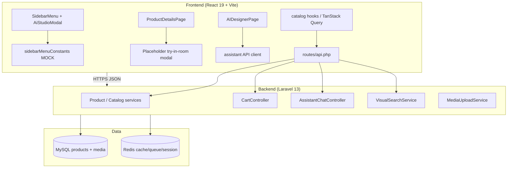

# DIYAR Room Designer — Architecture Audit

**Date:** 2026-09-19  
**Git inspected:** `62cc1ad` (Day 29 search `df0e5e1` in history)  
**Scope:** Stage 0–2 per product brief. **No production code changes.**

Evidence labels: **VERIFIED** | **PARTIALLY VERIFIED** | **NOT VERIFIED** | **NOT FOUND** | **UNKNOWN**

---

## Stage 0 — Repository Inspection

### WHAT EXISTS

| Area | Finding | Evidence |
|------|---------|----------|
| Sidebar Interactive Room Studio UI | **VERIFIED — NOT PRODUCTION READY** | `SidebarAiStudioModal.tsx`, `SidebarAiStudioCanvas.tsx`, opened from `SidebarMenu.tsx` |
| Room presets (مجلس / صالون / جناح) | **VERIFIED — MOCK** | `ROOM_BACKGROUNDS` in `sidebarMenuConstants.ts` (Unsplash URLs) |
| Furniture picker | **VERIFIED — MOCK** | `STICKERS` in `sidebarMenuConstants.ts` (not `product_id`) |
| Scale / rotate / delete / clear room | **VERIFIED — PARTIAL** | Toolbar in canvas; **no pointer-drag move** (only `cursor-grab` styling) |
| Product Detail “Try in room” CTA | **VERIFIED — PLACEHOLDER** | `ProductDetailsPage.tsx` → modal with title only (no upload, no product inject) |
| AI chat designer page | **VERIFIED — SEPARATE FEATURE** | `/ai-designer` → `AIDesignerPage.tsx` + `POST /api/v1/assistant/chat` |
| Product catalog API | **VERIFIED** | TanStack Query hooks in `frontend/src/hooks/catalog/*`, Laravel catalog/search routes |
| Product physical fields | **VERIFIED** | `products.width`, `height`, `depth`, `weight_kg` (migration + `Product` model + `ProductDetailResource`) |
| Dimension **display unit** | **VERIFIED: centimeters (cm)** | i18n `dimensionsValue`: “سم” / “cm” — **not meters in DB/UI today** |
| Cart | **VERIFIED** | `CartController`, guest + auth cart routes under `/api/v1/cart` |
| Media pipeline | **VERIFIED** | `MediaUploadService`, image validation, optimization |
| Visual Search | **VERIFIED** | Separate module; feature flag `diyar.feature.visual_search_enabled` |
| Feature-flag pattern | **VERIFIED** | `config/diyar.php` → `diyar.feature.*` (+ admin system settings) |
| Queues / Redis / Reverb | **VERIFIED** | Production compose; Octane optional |
| KVM2-equivalent load evidence | **VERIFIED (local only)** | `backend/storage/certification/kvm2-equivalent/DIYAR_LOCAL_KVM2_EQUIVALENT_VALIDATION_REPORT.md` |

### WHAT CAN BE REUSED

- Arabic UX copy and **room-preset metaphor** from sidebar modal (refactor into routed feature).
- **Catalog search/list APIs** and TanStack Query patterns (`productKeys`, pagination).
- **ProductDetailResource** dimensions block (with **unit conversion** at spatial boundary).
- **Auth** (`AuthContext`, Sanctum), **Cart** endpoints, **MediaUploadService** for try-in-room uploads (extended policy).
- **Assistant** infrastructure only as **reference** for async AI jobs — not as spatial engine.
- **Feature flags** pattern for `room_designer_enabled`, `try_in_room_enabled`, etc.

### WHAT MUST BE REFACTORED

- `SidebarAiStudioModal` / `SidebarAiStudioCanvas` → move under `frontend/src/features/room-design/` (or equivalent) with **meter-based domain** driving a **replaceable renderer**.
- `sidebarMenuConstants.ts` mock stickers → **remove from production path**.
- `ProductDetailsPage` placeholder modal → deep link to designer or try-in-room flow with `productId`.

### WHAT MUST BE REBUILT

- **Spatial domain** (room + items in meters, commands, constraints, history).
- **2D renderer adapter** (Fabric.js or Konva — see Final Architecture doc).
- **Persistence** (`room_designs` / items) — **NOT FOUND** today.
- **Try-in-my-room** pipeline (upload → job → provider → result) — **NOT FOUND** as product module.

### WHAT MUST NOT BE TOUCHED (without separate approval)

- Day 29 search / catalog hot paths (recent optimization).
- Visual Search V1 contract.
- Checkout/payment integrity paths.
- Core product/inventory truth models (extend, do not fork catalog).

---

## Stage 1 — Current Architecture Map

**Gap:** No edge from FE studio to BE design persistence. No spatial asset table.

---

## Prototype Audit (Component-Level)

| Component | Verdict | Notes |
|-----------|---------|-------|
| `SidebarAiStudioModal` | **KEEP (shell)** | Product copy aligns with brief; modal UX OK for desktop entry |
| `SidebarAiStudioCanvas` | **REBUILD** | %/px positioning; no drag; not meter-based |
| `sidebarMenuConstants` | **DELETE (prod)** | External Unsplash assets |
| `ProductDetailsPage` try CTA | **REFACTOR** | Wire to real flows |
| `AIDesignerPage` | **DO NOT MERGE** | Chat ≠ room planner; share catalog context only |
| 2D/3D libraries | **NOT FOUND** | No Fabric/Konva/Three in `package.json` |
| Global state libs | **NOT FOUND** | React Context + TanStack Query only; **no Zustand** |

### Scale risks (catalog)

| Concern | At 1k products | At 10k | At 100k |
|---------|--------------|--------|---------|
| Preloading all products in designer | N/A today | **FAIL** | **FAIL** |
| Sidebar mock stickers | Fixed 4 items | Irrelevant | Irrelevant |
| Search-driven picker | **OK** if paginated | **OK** with indexes | Requires tight filters + CDN assets |

---

## Backend Conventions (for extension)

**VERIFIED patterns to follow:**

- UUID primary keys on domain models (`Product` uses `HasUuids`).
- Controllers under `App\Http\Controllers\Api\V1\...`.
- Form Requests + API Resources for JSON shape.
- Services in `App\Services\{Domain}\...` (e.g. `Assistant`, `Search`, `Media`).
- Policies for user-owned resources (pattern exists across marketplace).
- Throttle middleware on sensitive routes (`assistant-chat`, `visual-search`).

**NOT FOUND:** Any `RoomDesign*` model, migration, controller, or policy.

---

## Two Experiences — Must Stay Separate

| | **A. Interactive Room Designer** | **B. Try in My Room** |
|---|-----------------------------------|------------------------|
| Input | Room type + dimensions + catalog | Product + user room **photo** |
| Core | Deterministic spatial state | Async visualization job |
| V1 renderer | 2D canvas (top-down) | Optional; simplest reliable preview |
| Shared foundation | Product id, dimensions, media URLs, cart revalidation | Same |
| **Do not** | Merge into one React tree implementation | Block designer if AI down |

---

## Stage 2 — Performance / Capacity Audit (Existing Platform)

Source: **KVM2-equivalent local validation** (Octane 2 workers, `DIYAR_LOADTEST_MODE=false`, mixed workload). **Not** Hostinger VPS.

| Observation | Label |
|-------------|--------|
| ~**50–56 RPS** mixed sustained 3m, p95 **< 500 ms**, 0% errors | **VERIFIED** (local kvm2-test) |
| ~**25 VU** mixed, p95 **< 500 ms** | **VERIFIED** |
| ~**100 VU / ~100 RPS** mixed, p95 **> 2 s**, still 0% 5xx/429 | **VERIFIED** (saturation) |
| Search-focused ~**145 RPS**, search p95 **~40 ms** | **VERIFIED** |
| Queue depth **0** after campaign | **VERIFIED** |
| Bottleneck component (CPU vs MySQL vs Octane) | **NOT PROVEN** under mixed load |

### Implications for Room Designer (before feature exists)

1. **Do not add per-drag API calls** — would multiply request rate under concurrent editors.
2. **Batch persistence** — single PUT/PATCH with full document or diff, debounced (≥ 2–3 s idle).
3. **Catalog side panel** — reuse **search** endpoints; never load full catalog.
4. **New endpoints budget** — target **≤ 1 request per save**, **≤ 1 per open**, **≤ 1 catalog page** at a time; avoid N+1 on design load (eager-load items + product summary).
5. **Try-in-room AI** — **async queue only**; never hold Octane worker for provider round-trip.
6. **Feature flags** — ship code dark on KVM2; enable designer for % traffic after evidence.

### Frontend performance risks (existing)

- **VERIFIED:** Heavy pages use TanStack Query caching; no Zustand.
- **UNKNOWN:** Room designer bundle size until renderer chosen (Fabric ~300KB gzipped order-of-magnitude — measure at implementation).

---

## Security & Privacy (Current + Gaps)

| Topic | Status |
|-------|--------|
| Sanctum auth | **VERIFIED** |
| Cart guest/session | **VERIFIED** |
| Media upload validation | **VERIFIED** (`MediaUploadService`, dimension limits in visual search) |
| Design ownership / IDOR | **NOT FOUND** (no designs yet) |
| Private room photo storage | **NOT FOUND** (try-in-room not built) |
| Rate limits on new routes | **PARTIALLY VERIFIED** (pattern exists; routes TBD) |
| Marketplace maintenance gate | **VERIFIED** (`EnsureMarketplaceNotInMaintenance`) — can block auth probes in seeded env |

---

## AI Architecture (Current)

| Capability | Status |
|------------|--------|
| Text assistant + optional image in chat | **VERIFIED** (`AssistantChatService`, Gemini config) |
| Provider abstraction for visualization | **NOT FOUND** |
| Spatial layout AI | **NOT FOUND** |
| Async job + status for image gen | **NOT FOUND** for room viz (queues **VERIFIED** infra) |

---

## Scalability & Infrastructure (KVM2-first)

**VERIFIED deployment model:** Single-node Docker — Nginx → Octane/FPM → MySQL + Redis + queue workers + Reverb (`docker-compose.production*.yml`).

Room Designer must fit **without**: GPU server, separate microservice, synchronous AI on request thread, server-side rendering farm.

---

## Gap Analysis (Requirement → State)

| Requirement | Current | Gap | Priority |
|-------------|---------|-----|----------|
| Meter-based spatial truth | cm in DB/UI | Normalize to **meters in domain**; convert at boundary | P0 |
| Real product placement | Mock stickers | Catalog-backed items + assets | P0 |
| Drag / snap / collision | Partial UI | Spatial engine + renderer | P0 |
| Save / load design | None | DB + API + debounced sync | P0 |
| PDP → designer | Placeholder modal | Route + state bootstrap | P1 |
| Try in my room | Copy only | Separate module + async AI | P2 |
| 3D / AR | None | Extension points only | P3+ |
| Top-down 2D assets | Product gallery only | `product_spatial_assets` or metadata | P1 |
| Feature flags | Pattern exists | Add `room_designer_*` keys | P0 |
| Performance headroom | ~50 RPS mixed safe | Cap concurrent saves; cache catalog reads | P0 |

---

## Recommended Direction (Audit Conclusion)

1. **Spatial domain first, renderer second** — mandatory per product brief.
2. **REFACTOR** sidebar UX; **REBUILD** canvas/coordinates/persistence.
3. **Separate** Try-in-Room from 2D designer; share product + cart only.
4. **Defer** 3D/AR; design JSON schema extensibility for walls/doors later.
5. **Add** one focused client store (recommend **Zustand** — not in repo today; justify in Final Architecture) *or* feature-local reducer module to avoid app-wide Context churn.
6. **Renderer V1:** **Fabric.js** preferred over Konva after bundle/interaction tradeoff (detailed in Final Architecture) — **PARTIALLY VERIFIED** until bundle measured in CI.

---

## Approval

This document is **audit-only**. Implementation requires approval of `DIYAR_ROOM_DESIGNER_FINAL_ARCHITECTURE.md`.
