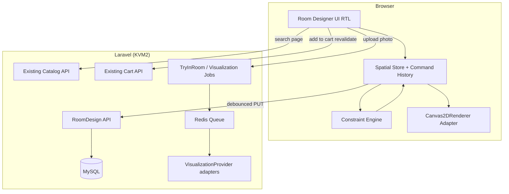

# DIYAR Room Designer — Final Architecture & Implementation Plan

**Date:** 2026-09-19  
**Prerequisite:** `DIYAR_ROOM_DESIGNER_ARCHITECTURE_AUDIT.md`  
**Status:** Planning only — **no implementation until user approval of Stage 1 (Spatial Core).**

---

## A. Audit Summary (Executive)

| Item | Conclusion |
|------|------------|
| Current prototype | **EXISTS — NOT PRODUCTION READY** (sidebar modal + mock stickers) |
| Verdict | **REFACTOR shell + REBUILD engine/data** (not greenfield UX) |
| Product dimensions | **VERIFIED** on `products`; stored/displayed as **cm** → domain uses **meters** |
| Persistence | **NOT FOUND** |
| KVM2 mixed capacity | **~50 RPS / ~25 VU** comfortable; **~100 RPS mixed** p95 > 2s (local Octane 2 workers) |
| AI try-in-room | **NOT FOUND**; build async on existing queues |
| Highest risk | Asset pipeline (top-down 2D), API spam on save, cm/m unit mistakes |

---

## B. Target Architecture



**Principle:** Domain JSON is renderer-agnostic. Fabric (V1) is an adapter; Three/AR (later) consume the same document.

---

## C. Spatial Domain Model (Meters)

### Units

- **Internal canonical unit:** `meter` (float, e.g. 4 decimal places in JSON).
- **Product API today:** centimeters in DB and `ProductDetailResource`.
- **Boundary rule:** `meters = cm / 100` on ingest; never persist designer state in pixels or %.

### Document (versioned JSON)

```typescript
// Conceptual — not implementation code
type RoomDesignDocument = {
  schema_version: 1;
  room: {
    preset_id?: string; // majlis | salon | bedroom | suite | custom
    width_m: number;
    depth_m: number;
    height_m?: number; // optional ceiling for future 3D
    origin: 'center' | 'corner'; // fixed enum, world not RTL
  };
  items: Array<{
    id: string; // client uuid
    product_id: string;
    variant_key?: string | null;
    position_m: { x: number; z: number }; // top-down; y up reserved for 3D
    rotation_deg: number;
    locked: boolean;
    layer: number;
    // dimensions_m derived from product at placement time; optional override policy: DISALLOW in V1
    snapshot: {
      name: string;
      width_m: number;
      depth_m: number;
      height_m: number;
      thumbnail_url: string | null;
      asset_ref?: string | null; // top_down_2d media id
    };
  }>;
  viewport?: { zoom: number; pan_x_m: number; pan_z_m: number }; // client-only optional, not authoritative
};
```

**Snapshot rule:** Store **display metadata** needed to render offline/snapshot; **never** snapshot price/stock. Cart always re-fetches product.

### Commands (undo/redo)

Bounded stack (max **50**): `ADD_ITEM | REMOVE_ITEM | MOVE | ROTATE | RESIZE | DUPLICATE | LOCK | CLEAR_ROOM | SET_ROOM_SIZE`.

Execution flow:

```text
User input → Command → ConstraintEngine → New document → Renderer sync
```

Persistence:

```text
dirty → debounce 2–3s idle → PUT design → SYNCED | ERROR (local retained)
```

---

## D. Constraint Engine (Deterministic, V1)

Independent of Fabric/Konva.

| Rule | V1 default | Policy enum (future) |
|------|------------|----------------------|
| Room boundary (AABB vs rectangle room) | **BLOCK** | ALLOW / WARN / BLOCK |
| Item-item overlap | **WARN** (visual) | configurable |
| Grid snap | Optional 0.1m | — |
| Wall snap | Defer | — |
| Min clearance | Defer (metadata later) | — |

Collision: **AABB** in XZ plane; rotation uses OBB approximation when needed (V1.1).

---

## E. Renderer Choice (V1 Evidence-Based)

| Option | Bundle | Touch | Object manipulate | React 19 | Replaceable |
|--------|--------|-------|-------------------|----------|-------------|
| **Fabric.js** | ~heavy | Good | Excellent | Via `fabric` + ref bridge | Yes — adapter interface |
| Konva + react-konva | Medium | Good | Good | Reconciliation cost | Yes |
| Raw Canvas | Light | Manual | High effort | N/A | Yes |
| SVG DOM | Light | Poor at scale | Moderate | Heavy DOM | Yes |

**Recommendation:** **Fabric.js** as `Canvas2DRenderer` adapter behind `RoomRenderer` interface.

**NOT VERIFIED until:** bundle size measured in Vite build with code-split `features/room-design` chunk.

**Interface (conceptual):**

```typescript
interface RoomRenderer {
  mount(el: HTMLElement): void;
  destroy(): void;
  render(doc: RoomDesignDocument): void;
  setSelection(id: string | null): void;
  onInteraction(cb: (cmd: SpatialCommand) => void): void;
}
```

Domain store never imports `fabric`.

---

## F. Client State Architecture

**Current repo:** TanStack Query for server data; React Context for auth/chat — **no Zustand**.

**Recommendation:**

| Layer | Tool |
|-------|------|
| Catalog pages | TanStack Query (existing) |
| Spatial document + history + sync FSM | **Zustand** (single new dependency, ~1KB) **OR** feature-scoped `useReducer` + module singleton |

**Prefer Zustand** if undo/history/debounce/sync FSM would otherwise sprawl across Context. **Approval required** to add dependency.

Sync FSM: `LOCAL | SYNCING | SYNCED | ERROR`.

---

## G. Database Proposal (Laravel conventions)

Uses **uuid** string PKs like `products`.

### `room_designs`

| Column | Type | Notes |
|--------|------|-------|
| id | uuid PK | |
| user_id | uuid FK users | indexed |
| name | string | |
| room_preset | string nullable | majlis, salon, … |
| width_m, depth_m, height_m | decimal(8,4) | denormalized for query |
| document_json | json | full document for forward compatibility |
| schema_version | unsignedTinyInteger | default 1 |
| snapshot_media_id | uuid nullable FK media_files | exported PNG optional |
| version | unsignedInteger | optimistic lock |
| deleted_at | timestamp nullable | soft delete |
| timestamps | | |

Indexes: `(user_id, updated_at)`, `(user_id, id)`.

### `room_design_items` (optional normalization)

**V1 option A (recommended):** Items only inside `document_json` (faster ship, fewer joins).

**V1 option B:** Normalized rows for analytics/search — defer unless reporting required.

If normalized later: `room_design_id`, `product_id`, `position_x_m`, `position_z_m`, `rotation_deg`, `layer`, `locked`, `snapshot_json`.

### `product_spatial_assets` (V1.1 / asset pipeline)

| Column | Notes |
|--------|-------|
| product_id | FK |
| kind | enum: `top_down_2d`, `silhouette_2d`, `glb`, `usdz`, … |
| media_file_id | FK |
| width_m, depth_m | footprint override if asset differs |
| meta_json | pivot, anchor |

**V1 minimum:** Fallback to product `width/depth` rectangle + `primary_image` if no top-down asset.

---

## H. API Proposal (Draft — align with existing v1 style)

Base: `/api/v1/room-designs` (auth required except public share — defer sharing to Phase 2).

| Method | Path | Purpose |
|--------|------|---------|
| GET | `/room-designs` | Paginate user's designs (light columns) |
| POST | `/room-designs` | Create empty or from preset |
| GET | `/room-designs/{id}` | Load document + version |
| PUT | `/room-designs/{id}` | Replace document (If-Match: version) |
| DELETE | `/room-designs/{id}` | Soft delete |
| POST | `/room-designs/{id}/cart` | Add all line items with **live** price/stock check |

**Batching:** One PUT carries full document (typical < 50 items → JSON < 100KB). No per-item REST in V1 unless document huge.

**Catalog:** Reuse `GET /products`, `GET /catalog/search` — **no** `/room-designs/catalog`.

### Try in my room (separate)

| Method | Path |
|--------|------|
| POST | `/room-visualizations` | multipart image + product_id → job id |
| GET | `/room-visualizations/{id}` | status + result URL |

Throttle + quota per user/day. Private disk for uploads; TTL job deletes raw photo per policy.

---

## I. AI Provider Abstraction (PHP)

```text
App\Services\RoomVisualization\
  VisualizationProviderInterface
  OpenAiVisualizationProvider   (future)
  GeminiVisualizationProvider     (future)
  NullVisualizationProvider       (tests)
  VisualizationJobService
  VisualizationPolicy             (size, mime, quota)
```

Domain calls `VisualizationJobService`, never SDK directly. Jobs implement `ShouldQueue`, timeout, retry, circuit breaker via existing queue failure handling.

**Reverb:** Optional push for job complete — **PARTIALLY VERIFIED** infra; fallback polling 2s → 5s backoff.

---

## J. Product Detail Integration

```text
/shop/products/:slug
  → "جرّب في غرفتي" (try-in-room module, Phase 2)
  → "افتح في المصمم" (room designer with ?productId=)
```

Bootstrap:

```text
productId → create or open design → ADD_ITEM at center → focus selection
```

Cart button in designer: `POST /cart/items` with server validation (existing cart rules).

---

## K. Security Model

- Policy: `RoomDesignPolicy` — `view/update/delete` owner only.
- Public share links: signed URL token phase 2; default private.
- Upload: reuse `MediaUploadService` patterns; max dimensions/size; no SVG for photos; strip EXIF policy TBD.
- Rate limits: `throttle:room-design-save`, `throttle:room-visualization`.
- Mass assignment: document validated via Form Request schema (max items, max JSON size).

---

## L. Performance Model (KVM2)

| Work | Where |
|------|--------|
| Drag/rotate/collision | **Browser** |
| Catalog search | Laravel + MySQL (cached) |
| Save design | Laravel **debounced** |
| AI visualization | **Queue worker** |
| Rendering | **Browser** (Fabric) |

**Must never happen synchronously on Octane:** AI provider call, image generation, heavy image processing.

**Budget per active editor:** ≤ 0.2 RPS save average (debounce); catalog search on demand only.

Target interaction: **60 fps** goal on mid mobile — **NOT VERIFIED** until device lab.

---

## M. Feature Flags (`config/diyar.php`)

```text
diyar.feature.room_designer_enabled          default false
diyar.feature.room_designer_try_in_room_enabled
diyar.feature.room_designer_ai_visualization_enabled
diyar.feature.room_designer_3d_enabled       default false
```

Admin system_settings mirror optional (pattern exists for visual search).

---

## N. Observability Events

`room_designer_opened`, `room_created`, `product_added`, `design_saved`, `design_save_failed`, `design_added_to_cart`, `try_in_room_started`, `try_in_room_completed`, `try_in_room_failed`.

No room photos in analytics payloads.

---

## O. Testing Strategy (Per Stage)

| Stage | Tests |
|-------|-------|
| Spatial core | Unit: cm→m, command apply, undo, AABB |
| API | Feature: auth, IDOR, version conflict |
| Frontend | Vitest: store FSM; Playwright: open → add → save |
| Performance | k6: save endpoint 10/25 VU; designer not in default mixed campaign until stable |
| Security | Upload abuse, oversize JSON |

Labels: **VERIFIED** only with CI artifacts.

---

## P. Implementation Stages (Approval Gates)

| Stage | Scope | Gate |
|-------|-------|------|
| **1 — Spatial Core** | TS domain + commands + constraints (no UI lib) | Unit tests green |
| **2 — Room Model** | Presets + rectangular room in meters | Approved schema |
| **3 — Product Spatial Assets** | Fallback footprint from product cm; optional asset table | Asset policy doc |
| **4 — 2D Renderer** | Fabric adapter + code-split route | Bundle budget |
| **5 — Interaction** | Drag, select, rotate, resize within rules | E2E smoke |
| **6 — Constraints** | Boundary + overlap WARN/BLOCK | Unit tests |
| **7 — Persistence** | Migrations + API + debounced sync | IDOR tests |
| **8 — Catalog Integration** | Search panel virtualized | No full catalog load |
| **9 — Cart Integration** | Revalidate price/stock | Checkout unchanged |
| **10 — Mobile UX** | Touch pan/zoom minimum | Manual QA matrix |
| **11 — Try-in-Room Foundation** | Upload + job model + private storage | Security review |
| **12 — AI Abstraction** | Interface + null provider | — |
| **13 — First AI Provider** | One adapter behind flag | Cost/quota evidence |
| **14 — 3D Renderer** | R3F adapter reading same JSON | Separate flag |
| **15 — AR** | model-viewer / native strategy doc | — |

**Do not start Stage 1 code until user approves this document.**

---

## Q. Risk Register

| Risk | Impact | Prob | Mitigation | Detection | Fallback |
|------|--------|------|------------|-----------|----------|
| cm vs m bug | Wrong scale | Med | Single converter module | Unit tests | Block save if dims absurd |
| Missing top-down assets | Ugly rectangles | High | Footprint from cm + photo | Asset coverage metric | Rectangle placeholder |
| Save API spam | KVM2 saturation | Med | Debounce + version | APM save RPS | Local-only mode |
| Stale cart price | Trust loss | Low | Never snapshot price | Integration tests | Server reject |
| AI cost abuse | Bill spike | Med | Quota + throttle | Daily spend alert | Disable AI flag |
| Fabric bundle bloat | LCP regression | Med | Lazy route | Bundle CI | Lighter Konva |
| IDOR on designs | Privacy | High | Policy + tests | Security audit | — |
| Maintenance gate blocks auth tests | False confidence | Low | Test env flag | CI config | Document |

---

## R. Capacity on KVM2 (How This Behaves)

| Component | KVM2 |
|-----------|------|
| Designer static assets | CDN/Vercel (existing frontend) |
| Spatial editing | **100% browser CPU** |
| Save/load | Laravel Octane — keep payloads small |
| Catalog | Existing search — already load-tested |
| New load | **+debounced writes** — stay ≪ 50 RPS aggregate |
| AI jobs | Queue — limit concurrency 2–4 workers |
| Redis | Session + queue only; no design doc cache V1 |
| MySQL | One row per design; index user_id |

**Must never:** synchronous AI, server-side render loop, WebSocket per mouse move.

---

## Final Verdicts (Section 51)

| Question | Answer |
|----------|--------|
| **Current prototype** | **REFACTOR** (UX shell) + **REBUILD** (spatial/engine) |
| **Recommended V1** | 2D rectangular room, meter domain, Fabric adapter, real catalog, save/load, cart revalidation |
| **Technology** | Fabric.js + (proposed) Zustand + existing TanStack Query/Laravel |
| **AI in V1** | **No** in core designer; try-in-room **Phase 11–13** only |
| **3D in V1** | **No** — extension points only |
| **AR in V1** | **No** |
| **Product integration** | Query param bootstrap from PDP; separate try-in-room module |
| **Data model add** | `room_designs` (+ optional assets later) |
| **Complexity** | Spatial core **Med**, Persistence **Med**, Fabric UI **Med**, Try-in-room+AI **High**, 3D **High** |

---

## Deliverable F — Approval Gate

```text
READY FOR USER APPROVAL: YES
  (Architecture & staged plan only)

READY TO IMPLEMENT STAGE 1: NO
  (Await explicit user sign-off on this document + Stage 1 scope)
```

---

## Document Index

| File | Purpose |
|------|---------|
| `DIYAR_ROOM_DESIGNER_ARCHITECTURE_AUDIT.md` | Stage 0–2 audit |
| `DIYAR_ROOM_DESIGNER_FINAL_ARCHITECTURE.md` | This file — target architecture + roadmap |
| `DIYAR_ROOM_DESIGNER_AUDIT_AND_ARCHITECTURE_REPORT.md` | Earlier combined report (superseded in part by errata; keep for history) |
