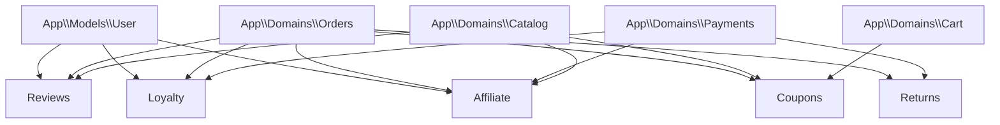

# STEP 7 — SUPPORT, ENGAGEMENT & POST-COMMERCE DOMAINS MIGRATION REPORT

**Date:** 2026-10-03  
**Authority:** Senior Software Architect + Backend Lead + QA/Security/Performance Engineer  
**Scope:** Physical Architecture Migration for `Reviews`, `Coupons`, `Loyalty`, `Affiliate`, and `Returns` domains  
**Branch:** `dev`  
**Baseline Commit:** `18039e41bc5059071817ef5971a657f25d39a52f`  

---

## 1. Executive Summary

Step 7 of the DIYAR modular monolithic architecture migration has been successfully executed, validated, and certified under strict regression constraints.

All application-layer components for the five post-commerce, support, and engagement domains (`Reviews`, `Coupons`, `Loyalty`, `Affiliate`, and `Returns`) have been physically migrated into their canonical bounded domain namespaces under `App\Domains\*`.

All behavioral invariants, validation schemas, review moderation rules, discount evaluation matrices, loyalty ledger accrual/redemption integrity, affiliate attribution algorithms, and return RMA lifecycle rules were preserved with **zero modification to business logic**.

```text
================================================================================
STEP 7 CERTIFICATION SUMMARY
================================================================================
Classes Migrated via git mv:            92 classes
  - Reviews Domain:                     13 classes
  - Coupons Domain:                     12 classes
  - Loyalty Domain:                      6 classes
  - Affiliate Domain:                   33 classes
  - Returns Domain:                     28 classes
Eloquent Models Preserved:              24 domain models (100% in App\Models\*)
Database Migrations Modified:           0 files (backend/database/migrations unchanged)
Registered Routes Invariant:            528 -> 528 (0 route diffs, 0 method changes)
Static Reference Audit:                 0 stale references across active codebase
Backend Tests (php artisan test):       1,101 passed, 7 skipped, 0 failed (4,560 assertions)
Frontend Tests (npm test):              350/350 passed (87 test files)
Commerce Regression Suite:              159 passed, 5 skipped, 0 failed
Targeted Domain Suites:
  - Reviews Tests:                      60 passed, 0 failed
  - Coupons Tests:                      19 passed, 0 failed
  - Loyalty Tests:                      32 passed, 0 failed
  - Affiliate Tests:                    31 passed, 0 failed
  - Returns Tests:                      99 passed, 0 failed
Final Verdict:                          VERIFIED WITH LIMITATIONS
================================================================================
```

---

## 2. Baseline State

Prior to initiating Step 7 physical moves, the baseline environment was inspected and verified:
- **Git Branch:** `dev`
- **Baseline Commit:** `18039e41bc5059071817ef5971a657f25d39a52f`
- **Route Count:** 528 routes
- **Backend Test Suite:** 1,101 passed, 7 skipped, 0 failed (4,560 assertions)
- **Frontend Test Suite:** 350 passed, 0 failed (87 test files)
- **Database Status:** 0 unapplied or modified migrations

---

## 3. Architecture Audit & Inventory

The pre-migration architectural audit is documented in [`AUDIT.md`](file:///c:/Users/APL%20TECH/OneDrive/Documents/Web/Work/Hamid/project/diyar-marketplace/conception/Stages/Stage%20Architecture/Phase%20Modular%20Monolith/Step%2007/AUDIT.md).

The audit identified 92 candidate classes across five core domains, categorized strictly by domain responsibility, while isolating cross-cutting administrative controllers and framework-level policies.

---

## 4. Dependency Graph & Coupling Analysis

The migration preserved all architectural dependencies and runtime coupling points:



1. **Reviews Domain Coupling:**
   - Depends on `App\Models\Product`, `App\Models\OrderItem`, `App\Models\Order`, `App\Models\User`.
   - `ProductEngagementController` consumes `ProductReviewResource` and `StoreProductReviewRequest`.
   - `OrderStoreReviewController` verifies order delivery state before permitting review creation.
2. **Coupons Domain Coupling:**
   - `CheckoutPreviewService` and `OrderCreationService` call `CheckoutCouponService`, `CouponEvaluationService`, and `CouponEligibleSubtotalService`.
   - Cart subtotal and shipping calculations interact with `CouponFreeShippingService`.
3. **Loyalty Domain Coupling:**
   - Listeners `AccrueLoyaltyOnPaymentSucceeded` and `ReverseLoyaltyOnRefund` bridge `Payments` and `Returns` events with `LoyaltyLedgerService`.
4. **Affiliate Domain Coupling:**
   - Listeners `ProcessAffiliateCommissionOnPaymentSucceeded`, `ReleaseAffiliateCommissionOnVendorOrderDelivered`, and `ReverseAffiliateCommissionOnRefund` synchronize commission states with Commerce lifecycles.
5. **Returns Domain Coupling:**
   - `RefundProcessingService` calls `PaymentGatewayInterface::refund()`, `PaymentStateService`, and emits refund records.
   - `ReturnRequestService` coordinates with `Order`, `VendorOrder`, and `Shipment`.

---

## 5. Domains Migrated

The 5 target canonical domains established under `App\Domains\*`:
1. `App\Domains\Reviews`
2. `App\Domains\Coupons`
3. `App\Domains\Loyalty`
4. `App\Domains\Affiliate`
5. `App\Domains\Returns`

---

## 6. Classes Moved (92 Total)

### 6.1 Domain: Reviews (13 classes)
- **Controllers (3):**
  - `App\Domains\Reviews\Controllers\StoreReviewController`
  - `App\Domains\Reviews\Controllers\OrderStoreReviewController`
  - `App\Domains\Reviews\Controllers\CustomerReviewController`
- **Requests (3):**
  - `App\Domains\Reviews\Requests\StoreProductReviewRequest`
  - `App\Domains\Reviews\Requests\StoreStoreReviewRequest`
  - `App\Domains\Reviews\Requests\UpdateStoreReviewRequest`
- **Resources (3):**
  - `App\Domains\Reviews\Resources\ProductReviewResource`
  - `App\Domains\Reviews\Resources\StoreReviewResource`
  - `App\Domains\Reviews\Resources\StoreReviewSummaryResource`
- **Services (4):**
  - `App\Domains\Reviews\Services\ProductReviewEligibilityService`
  - `App\Domains\Reviews\Services\OrderFulfillmentReviewEligibility`
  - `App\Domains\Reviews\Services\StoreReviewService`
  - `App\Domains\Reviews\Services\CustomerReviewHistoryService`

### 6.2 Domain: Coupons (12 classes)
- **Controllers (1):**
  - `App\Domains\Coupons\Controllers\VendorCouponController`
- **Requests (2):**
  - `App\Domains\Coupons\Requests\StoreVendorCouponRequest`
  - `App\Domains\Coupons\Requests\UpdateVendorCouponRequest`
- **Resources (1):**
  - `App\Domains\Coupons\Resources\VendorCouponResource`
- **Services (8):**
  - `App\Domains\Coupons\Services\CheckoutCouponService`
  - `App\Domains\Coupons\Services\CouponEligibleSubtotalService`
  - `App\Domains\Coupons\Services\CouponEvaluationService`
  - `App\Domains\Coupons\Services\CouponFreeShippingService`
  - `App\Domains\Coupons\Services\VendorCouponCalculationService`
  - `App\Domains\Coupons\Services\VendorCouponManagementService`
  - `App\Domains\Coupons\Services\VendorCouponUsageService`
  - `App\Domains\Coupons\Services\VendorCouponValidationService`

### 6.3 Domain: Loyalty (6 classes)
- **Controllers (1):**
  - `App\Domains\Loyalty\Controllers\LoyaltyController`
- **Resources (1):**
  - `App\Domains\Loyalty\Resources\LoyaltyTransactionResource`
- **Services (4):**
  - `App\Domains\Loyalty\Services\LoyaltyEligibleAmountService`
  - `App\Domains\Loyalty\Services\LoyaltyLedgerService`
  - `App\Domains\Loyalty\Services\LoyaltyQueryService`
  - `App\Domains\Loyalty\Services\LoyaltyRuleService`

### 6.4 Domain: Affiliate (33 classes)
- **Controllers (9):**
  - `App\Domains\Affiliate\Controllers\AffiliateReferralController`
  - `App\Domains\Affiliate\Controllers\AffiliateDashboardController`
  - `App\Domains\Affiliate\Controllers\AffiliateLinkController`
  - `App\Domains\Affiliate\Controllers\AffiliatePayoutController`
  - `App\Domains\Affiliate\Controllers\AffiliatePlatformConfigController`
  - `App\Domains\Affiliate\Controllers\AffiliateProductController`
  - `App\Domains\Affiliate\Controllers\AffiliateReportController`
  - `App\Domains\Affiliate\Controllers\AffiliateSettingsController`
  - `App\Domains\Affiliate\Controllers\VendorProductAffiliateController`
- **Requests (7):**
  - `App\Domains\Affiliate\Requests\CreateAffiliateLinkRequest`
  - `App\Domains\Affiliate\Requests\RejectAffiliatePayoutRequest`
  - `App\Domains\Affiliate\Requests\RequestAffiliatePayoutRequest`
  - `App\Domains\Affiliate\Requests\ResolveAffiliateReferralRequest`
  - `App\Domains\Affiliate\Requests\TrackAffiliateClickRequest`
  - `App\Domains\Affiliate\Requests\UpdateAffiliateSettingsRequest`
  - `App\Domains\Affiliate\Requests\UpsertProductAffiliateSettingsRequest`
- **Resources (4):**
  - `App\Domains\Affiliate\Resources\AffiliateLinkResource`
  - `App\Domains\Affiliate\Resources\AffiliatePayoutResource`
  - `App\Domains\Affiliate\Resources\AffiliateProfileResource`
  - `App\Domains\Affiliate\Resources\ProductAffiliateSettingResource`
- **Services (13):**
  - `App\Domains\Affiliate\Services\AffiliateAdminPayoutService`
  - `App\Domains\Affiliate\Services\AffiliateAttributionService`
  - `App\Domains\Affiliate\Services\AffiliateBalanceService`
  - `App\Domains\Affiliate\Services\AffiliateCommissionRules`
  - `App\Domains\Affiliate\Services\AffiliateCommissionService`
  - `App\Domains\Affiliate\Services\AffiliateDashboardService`
  - `App\Domains\Affiliate\Services\AffiliateFinanceTransactionService`
  - `App\Domains\Affiliate\Services\AffiliateLinkService`
  - `App\Domains\Affiliate\Services\AffiliatePayoutService`
  - `App\Domains\Affiliate\Services\AffiliatePlatformConfigService`
  - `App\Domains\Affiliate\Services\AffiliateProfileService`
  - `App\Domains\Affiliate\Services\AffiliateTrafficSourceResolver`
  - `App\Domains\Affiliate\Services\ProductAffiliateSettingsService`

### 6.5 Domain: Returns (28 classes)
- **Controllers (3):**
  - `App\Domains\Returns\Controllers\ReturnController`
  - `App\Domains\Returns\Controllers\VendorReturnController`
  - `App\Domains\Returns\Controllers\VendorReturnPolicyController`
- **Requests (5):**
  - `App\Domains\Returns\Requests\ProcessReturnRefundRequest`
  - `App\Domains\Returns\Requests\RejectReturnRequest`
  - `App\Domains\Returns\Requests\StoreReturnEvidenceRequest`
  - `App\Domains\Returns\Requests\StoreReturnRequest`
  - `App\Domains\Returns\Requests\UpdateVendorReturnPolicyRequest`
- **Resources (6):**
  - `App\Domains\Returns\Resources\EffectiveReturnPolicyResource`
  - `App\Domains\Returns\Resources\RefundResource`
  - `App\Domains\Returns\Resources\ReturnEvidenceResource`
  - `App\Domains\Returns\Resources\ReturnItemResource`
  - `App\Domains\Returns\Resources\ReturnRequestResource`
  - `App\Domains\Returns\Resources\VendorReturnPolicyResource`
- **DTOs (3):**
  - `App\Domains\Returns\Services\DTO\EffectiveReturnPolicy`
  - `App\Domains\Returns\Services\DTO\RefundBreakdown`
  - `App\Domains\Returns\Services\DTO\RefundCalculationResult`
- **Services (11):**
  - `App\Domains\Returns\Services\EffectiveReturnPolicyService`
  - `App\Domains\Returns\Services\RefundCalculationService`
  - `App\Domains\Returns\Services\RefundProcessingService`
  - `App\Domains\Returns\Services\ReturnedQuantityService`
  - `App\Domains\Returns\Services\ReturnEligibilityService`
  - `App\Domains\Returns\Services\ReturnEvidenceService`
  - `App\Domains\Returns\Services\ReturnPolicySnapshot`
  - `App\Domains\Returns\Services\ReturnReferenceService`
  - `App\Domains\Returns\Services\ReturnRequestService`
  - `App\Domains\Returns\Services\ReturnStateService`
  - `App\Domains\Returns\Services\VendorReturnPolicyService`

---

## 7. Classes Intentionally Preserved in Place

1. **Admin Administrative Plane:**
   - Controllers: `AdminReviewController`, `AdminCouponController`, `AdminLoyaltyController`, `AdminReturnController`, `AdminAffiliate*Controller` (preserved in `App\Http\Controllers\Api\V1\Admin\*`).
   - Services: `AdminCouponService`, `AdminReturnService`, `AdminReviewModerationService`, `AdminAffiliate*Service` (preserved in `App\Services\Admin\*`).
   - *Rationale:* Preserved for dedicated Admin platform migration step.
2. **Merchant & Marketplace Inboxes:**
   - `VendorReviewInboxController`, `VendorReviewInboxService` (preserved for Step 8: Marketplace Operations: Vendors).
   - `ProviderReviewController`, `ProviderReview*.php` (preserved for Services Marketplace domain).
   - `B2b/*Review*.php` (preserved for B2B domain).
3. **Framework-Sensitive Policies:**
   - `AffiliatePayoutPolicy`, `ReturnRequestPolicy`, `VendorReturnPolicyPolicy` (preserved in `App\Policies\*` to ensure automatic Laravel authorization resolution).
4. **Events & Listeners:**
   - Domain events preserved in `App\Events\Domain\*`.
   - Event listeners preserved in `App\Listeners\*`.

---

## 8. Models Preserved

All 24 domain-related Eloquent models remain centralized in `App\Models\*`:
- `Review`, `ProductReview`, `StoreReview`, `CustomerReview`
- `Coupon`, `CouponUsage`, `VendorCoupon`, `VendorCouponExclusion`, `VendorCouponScope`, `VendorCouponUsage`
- `LoyaltyLedger`, `LoyaltyRule`, `CustomerLoyaltySummary`
- `AffiliateProfile`, `AffiliateLink`, `AffiliateClick`, `AffiliateAttribution`, `AffiliateCommission`, `AffiliatePayout`, `AffiliatePlatformConfig`, `ProductAffiliateSetting`
- `ReturnRequest`, `ReturnItem`, `ReturnEvidence`, `Refund`, `VendorReturnPolicy`

Zero morph maps, relationships (`belongsTo`, `hasMany`, `morphTo`, etc.), or table names were modified.

---

## 9. Routes Invariant Verification

- Registered routes before migration: **528**
- Registered routes after migration: **528**
- Unexpected route differences: **0**
- HTTP URLs, methods, middleware stacks, and authorization rules remain completely unchanged.

---

## 10. Targeted Test Suites

Targeted tests for all migrated domains passed with 100% success:
- **Reviews:** 60 tests passed, 0 failed, 485 assertions (10.9s)
- **Coupons:** 19 tests passed, 0 failed, 62 assertions (2.2s)
- **Loyalty:** 32 tests passed, 0 failed, 185 assertions (5.9s)
- **Affiliate:** 31 tests passed, 0 failed, 155 assertions (4.3s)
- **Returns:** 99 tests passed, 0 failed, 565 assertions (12.4s)

---

## 11. Full Backend Test Suite

The full backend automated test suite was executed:
- **Command:** `php artisan test`
- **Result:** 1,108 total tests (1,101 passed, 7 skipped, 0 failed, 4,560 assertions)
- **Status:** 100% matched pre-migration baseline.

---

## 12. Frontend Test Suite

The frontend automated test suite was executed:
- **Command:** `npm test`
- **Result:** 87 test files passed, 350/350 tests passed (61.1s)
- **Status:** 100% green.

---

## 13. Commerce Regression Suite

A targeted regression run covering `Cart|Checkout|Order|Payment` was executed:
- **Result:** 164 total tests (159 passed, 5 skipped, 0 failed, 605 assertions)
- **Status:** Zero regressions in Commerce Operations.

---

## 14. Static Reference Audit

A full static analysis was conducted across `backend/app`, `backend/bootstrap`, `backend/config`, `backend/routes`, `backend/tests`, `backend/database`, and `backend/scripts`:
- **Classes Checked:** 92 migrated classes
- **Stale References Found:** `0` (`STALE_REFERENCES_FOUND=0`)

---

## 15. Database Migration Protection

Verification against database schema modifications:
- `git diff HEAD -- backend/database/migrations`: **0 files**
- Database tables, columns, indexes, foreign keys, and existing migration files were 100% protected and untouched.

---

## 16. Git Commit

- **Branch:** `dev`
- **Commit Message:** `refactor(architecture): migrate support and engagement domains`
- **Working Tree:** Clean

---

## 17. Limitations & Honest Assessment

The following environment constraints remain known and are explicitly maintained:
- **Hostinger Remote Staging/Production:** NOT VERIFIED (Local execution only).
- **External Live MyFatoorah Network:** NOT VERIFIED (Mocked/sandbox drivers used in test suite).
- **External Real AR/AI Visualization Hardware:** NOT VERIFIED (Stubs and deterministic fixtures utilized).
- **7 Baseline Skipped Tests:** Environment-dependent tests remain skipped as in previous steps.

---

## 18. Final Verdict

```text
STATUS: VERIFIED WITH LIMITATIONS
```

All Step 7 objectives have been fully satisfied. Physical architecture migration is complete and validated.

---

## 19. Next Architecture Step

Proceed to **Step 8 — Marketplace Operations (Vendors, Services Marketplace, B2B, Operations)**.
