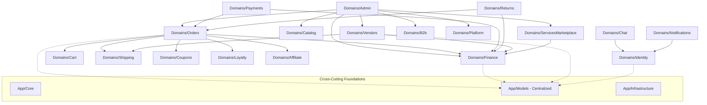

# STEP 10: BACKEND ARCHITECTURE SEAMS & CLEANUP AUDIT
## Modular Monolith Physical Architecture Audit

> **Document Type:** Step 10 Architecture Seams & Cleanup Audit  
> **Status:** AUDITED / READY FOR EXECUTION  
> **Date:** 2026-10-03  
> **Phase:** Phase Modular Monolith  
> **Baseline Commit:** `0abd05173e7cc337fc56ae335e8e63e0960944e4` (`refactor(architecture): migrate remaining backend domains`)  
> **Primary Authority:** Senior Software Engineer + Full-Stack Architect + QA/Security Engineer

---

## 1. Executive Summary & Purpose

Following the completion of **Step 9 (Remaining Backend Domains)**, all 234 planned domain classes across `Shipping`, `Chat`, `Notifications`, `Analytics`, `Blog`, `Projects`, `Assistant`, `Platform`, and `Admin` have been migrated into `App\Domains\*` with zero route diffs (528 routes), zero migration changes, and a fully passing test suite (1,101 backend passed / 7 skipped, 350/350 frontend passed, frontend build green).

As mandated by **Rule 25**, **Step 10 is NOT another blind migration**. It is the dedicated phase to audit and resolve:
1. **Cross-domain coupling & service-to-service dependencies**: Mapping dependencies between domains (e.g., Commerce -> Finance -> Orders -> Shipping).
2. **Remaining non-domain classes outside framework conventions**:
   - `App\Services\Finance\*` (18 classes), `App\Http\Requests\Finance\*` (2 classes), `App\Http\Resources\FinancialTransactionResource.php` (1 class), and `App\Support\Finance\IbanValidator.php` (1 class).
   - `App\Services\Media\*` (2 classes: `MediaOptimizationService`, `MediaUploadService`).
   - `App\Support\*` (13 domain-specific support classes remaining in root `app/Support/`).
   - `App\Exceptions\*` (4 spatial/room-designer domain exceptions).
   - `App\Contracts\Sms\SmsProvider.php` (isolated under root `app/Contracts/`).
   - `App\Jobs\Testing\QueueIntegrationProbeJob.php` (test utility job).
3. **Empty directories left over from historical moves** (`app/Channels/Notifications`, `app/Contracts/*`).
4. **Framework boundaries preservation**: Re-verifying policies, enums, models, commands, events, listeners, and service providers.

---

## 2. Inventory of Remaining Non-Domain Classes

### 2.1 Finance Subsystem (22 classes)
Finance is a foundational domain subsystem spanning double-entry ledger posting, escrow holds/releases, vendor balances, commission calculations, payout requests, and platform/vendor financial reporting.
- **Classes:**
  - `App\Services\Finance\CommissionResolver`
  - `App\Services\Finance\EscrowReleaseService`
  - `App\Services\Finance\FinancialPostingService`
  - `App\Services\Finance\FinancialReferenceService`
  - `App\Services\Finance\PayoutService`
  - `App\Services\Finance\PlatformFinanceExportService`
  - `App\Services\Finance\PlatformFinanceReportingService`
  - `App\Services\Finance\VendorBalanceService`
  - `App\Services\Finance\VendorFinanceExportService`
  - `App\Services\Finance\VendorFinancePeriodResolver`
  - `App\Services\Finance\VendorFinanceReportingService`
  - `App\Services\Finance\VendorTransactionQueryFilter`
  - `App\Services\Finance\DTO\CommissionResolution`
  - `App\Services\Finance\DTO\PlatformFinancePeriodReport`
  - `App\Services\Finance\DTO\PlatformFinanceSummary`
  - `App\Services\Finance\DTO\VendorBalanceSummary`
  - `App\Services\Finance\DTO\VendorFinanceAnalyticsPoint`
  - `App\Services\Finance\DTO\VendorFinancePeriodReport`
  - `App\Http\Requests\Finance\RejectVendorPayoutRequest`
  - `App\Http\Requests\Finance\RequestVendorPayoutRequest`
  - `App\Http\Resources\FinancialTransactionResource`
  - `App\Support\Finance\IbanValidator`
- **Assessment:**
  Finance represents a distinct, mission-critical bounded context (`App\Domains\Finance\*`). Establishing `App\Domains\Finance` gives financial ledger operations, payouts, and commissions their own dedicated domain boundary, cleanly decoupling them from general `Payments` (gateway adapters) and `Vendors` (profile/store management).

### 2.2 Media Services (2 classes)
- `App\Services\Media\MediaOptimizationService`
- `App\Services\Media\MediaUploadService`
- **Assessment:**
  Cross-cutting media processing utilities used across catalog, spatial layout, chat attachments, vendor logos, and reviews. Target: `App\Core\Support\Media\` or `App\Infrastructure\Storage\Media\`. Placing under `App\Core\Support\Media\` respects its shared utility role across all domains.

### 2.3 Domain-Specific Support Stragglers (13 classes in `app/Support/*`)
| Class | Current Path | Analysis | Target Domain / Path |
|---|---|---|---|
| `B2bNotificationSupport` | `app/Support/B2b/` | Domain-specific notification helper for B2B leads | `App\Domains\B2b\Support\B2bNotificationSupport` |
| `B2bCache` | `app/Support/Cache/` | Domain cache keys & tagging for B2B companies | `App\Domains\B2b\Support\B2bCache` |
| `BlogProjectCache` | `app/Support/Cache/` | Domain cache helper for Blog articles & Projects | `App\Domains\Blog\Support\BlogProjectCache` |
| `ChatQueue` | `app/Support/Chat/` | Chat queue names & routing definitions | `App\Domains\Chat\Support\ChatQueue` |
| `ChatReportCatalog` | `app/Support/Chat/` | Predefined chat report reasons | `App\Domains\Chat\Support\ChatReportCatalog` |
| `ConversationMessageBroadcastPayload` | `app/Support/Chat/` | Payload builder for Reverb broadcast | `App\Domains\Chat\Support\ConversationMessageBroadcastPayload` |
| `NotificationQueue` | `app/Support/Notifications/` | Notification queue priority mappings | `App\Domains\Notifications\Support\NotificationQueue` |
| `NotificationUrlSupport` | `app/Support/Notifications/` | URL resolver for deep notification links | `App\Domains\Notifications\Support\NotificationUrlSupport` |
| `ProviderSelfInteractionGuard` | `app/Support/ServiceMarketplace/` | Prevents provider booking own services | `App\Domains\ServicesMarketplace\Support\ProviderSelfInteractionGuard` |
| `ServiceMarketplacePresenter` | `app/Support/ServiceMarketplace/` | Formatting helper for provider profiles | `App\Domains\ServicesMarketplace\Support\ServiceMarketplacePresenter` |
| `UserNotificationPreferences` | `app/Support/User/` | User notification channel preferences struct | `App\Domains\Identity\Support\UserNotificationPreferences` |
| `VendorAccessResolver` | `app/Support/Vendor/` | Vendor team authorization & tenant resolver | `App\Domains\Vendors\Support\VendorAccessResolver` |
| `VendorOwnership` | `app/Support/Vendor/` | Verifies vendor resource ownership | `App\Domains\Vendors\Support\VendorOwnership` |

### 2.4 Domain Exceptions in `app/Exceptions/*` (4 classes)
| Class | Current Path | Domain Boundary | Target Path |
|---|---|---|---|
| `RoomDesignPayloadTooLargeException` | `app/Exceptions/RoomDesign/` | RoomDesigner | `App\Domains\RoomDesigner\Exceptions\` |
| `RoomDesignVersionConflictException` | `app/Exceptions/RoomDesign/` | RoomDesigner | `App\Domains\RoomDesigner\Exceptions\` |
| `IdempotencyConflictException` | `app/Exceptions/TryInRoom/` | TryInRoom | `App\Domains\TryInRoom\Exceptions\` |
| `VisualizationProviderException` | `app/Exceptions/Visualization/` | SpatialLayout | `App\Domains\SpatialLayout\Exceptions\` |

### 2.5 SMS Provider Contract (1 class)
- `App\Contracts\Sms\SmsProvider` -> Move to `App\Infrastructure\Sms\Contracts\SmsProvider` alongside `App\Infrastructure\Sms\Providers\*`.

### 2.6 Test Probe Job (1 class)
- `App\Jobs\Testing\QueueIntegrationProbeJob` -> Move to `App\Core\Support\Testing\QueueIntegrationProbeJob`.

### 2.7 Base Controller
- `App\Http\Controllers\Controller.php` -> Keep in `App\Http\Controllers\Controller.php` (standard Laravel base controller referenced by framework).

### 2.8 Empty Directories Cleanup
The following empty directories left over from file relocations will be pruned:
- `backend/app/Channels/Notifications/`
- `backend/app/Channels/`
- `backend/app/Contracts/Identity/`
- `backend/app/Contracts/Notifications/`
- `backend/app/Contracts/Payments/`
- `backend/app/Contracts/Search/`
- `backend/app/Contracts/Shipping/`
- `backend/app/Contracts/SpatialLayout/`
- `backend/app/Contracts/Visualization/`
- `backend/app/Contracts/Sms/` (after move)
- `backend/app/Contracts/`
- `backend/app/Exceptions/RoomDesign/` (after move)
- `backend/app/Exceptions/TryInRoom/` (after move)
- `backend/app/Exceptions/Visualization/` (after move)
- `backend/app/Exceptions/` (after move)
- `backend/app/Http/Requests/Finance/` (after move)
- `backend/app/Http/Requests/` (after move)
- `backend/app/Http/Resources/` (after move)
- `backend/app/Jobs/Testing/` (after move)
- `backend/app/Jobs/` (after move)
- `backend/app/Services/Finance/DTO/` (after move)
- `backend/app/Services/Finance/` (after move)
- `backend/app/Services/Media/` (after move)
- `backend/app/Services/` (after move)
- `backend/app/Support/B2b/` (after move)
- `backend/app/Support/Cache/` (after move)
- `backend/app/Support/Chat/` (after move)
- `backend/app/Support/Finance/` (after move)
- `backend/app/Support/Notifications/` (after move)
- `backend/app/Support/ServiceMarketplace/` (after move)
- `backend/app/Support/User/` (after move)
- `backend/app/Support/Vendor/` (after move)
- `backend/app/Support/` (after move)

---

## 3. Cross-Domain Coupling Map

An audit of cross-domain imports reveals the following structural relationships:

### Key Seam Observations:
1. **Finance as Central Clearinghouse:** `Orders`, `Payments`, `Returns`, `Vendors`, and `ServicesMarketplace` all post journal entries and manage escrow/payouts through `FinancialPostingService`, `EscrowReleaseService`, and `PayoutService`. Promoting `Finance` to `App\Domains\Finance` gives this clearinghouse formal domain status.
2. **Centralized Models Prevent ORM Sprawl:** By keeping all 114 Eloquent models in `App\Models\*`, cross-domain foreign keys, morph maps, and model events function without brittle cross-domain model aliasing or circular model inheritance.
3. **No Circular Domain Loops Detected:** Dependency flow is unidirectional:
   - Presentation / Controllers -> Domain Services -> Core / Infrastructure / Models.
   - Domain Orchestrators (Admin, Orders) depend on Domain Subsystems (Finance, Shipping, Coupons), not vice-versa.

---

## 4. Execution Plan for Step 10

1. **Move Finance Classes:**
   - Relocate `app/Services/Finance/*` -> `app/Domains/Finance/Services/*`
   - Relocate `app/Http/Requests/Finance/*` -> `app/Domains/Finance/Requests/*`
   - Relocate `app/Http/Resources/FinancialTransactionResource.php` -> `app/Domains/Finance/Resources/FinancialTransactionResource.php`
   - Relocate `app/Support/Finance/IbanValidator.php` -> `app/Domains/Finance/Support/IbanValidator.php`
2. **Move Media Classes:**
   - Relocate `app/Services/Media/*` -> `app/Core/Support/Media/*`
3. **Move Domain Support Classes:**
   - Relocate each support class from `app/Support/*` into its corresponding `app/Domains/<Domain>/Support/` directory.
4. **Move Domain Exceptions:**
   - Relocate exceptions from `app/Exceptions/*` into `app/Domains/<Domain>/Exceptions/`.
5. **Move SMS Provider Contract:**
   - Relocate `app/Contracts/Sms/SmsProvider.php` -> `app/Infrastructure/Sms/Contracts/SmsProvider.php`.
6. **Move Queue Integration Probe:**
   - Relocate `app/Jobs/Testing/QueueIntegrationProbeJob.php` -> `app/Core/Support/Testing/QueueIntegrationProbeJob.php`.
7. **Prune Empty Legacy Directories:**
   - Clean up empty residual folders under `app/Channels`, `app/Contracts`, `app/Exceptions`, `app/Jobs`, `app/Services`, `app/Support`.
8. **Update References & Autoload:**
   - Update namespaces, imports, route definitions, test cases, and service providers.
   - Run `composer dump-autoload`.
9. **Full Test Suite & Quality Gate Verification:**
   - Run backend test suite (target: 1,101 pass / 7 skip / 0 fail).
   - Run route invariant check (target: exactly 528 routes).
   - Run frontend tests (target: 350/350 pass).
   - Run frontend build (`npm run build`).
   - Check database migrations (`git diff backend/database/migrations` must be empty).
   - Verify 0 stale references across codebase.
10. **Document & Commit:**
    - Generate `conception/Stages/Stage Architecture/Phase Modular Monolith/Step 10/REPORT.md`.
    - Update `.agent/CURRENT_STATE.md`.
    - Commit with `refactor(architecture): cleanup backend architecture seams and legacy folders`.
