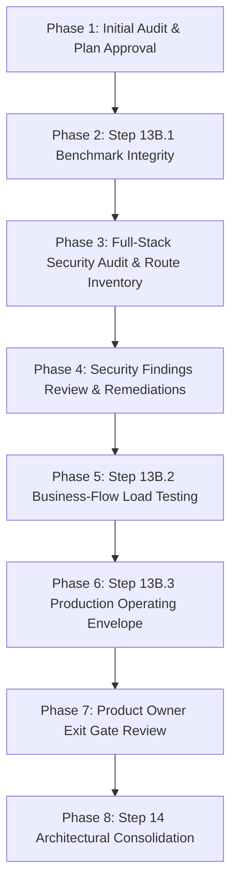

# DIYAR — STEP 13B.1–13B.3 & SECURITY AUDIT
# INITIAL REPOSITORY AND EVIDENCE AUDIT

**Phase:** Modular Monolith Architecture — Step 13B.1 → 13B.3 & Security Audit  
**Date:** 2026-10-08  
**Authority:** Senior Software Architect, Performance Engineer, Application Security Engineer, DevOps/SRE Lead  
**Environment:** Local Docker-based VPS Simulation (`diyar-vps-sim`) ONLY  
**Production VPS:** STRICTLY OUT OF SCOPE (Hostinger VPS Never Touched)  
**Status:** INITIAL AUDIT & EXECUTION PLAN FOR APPROVAL  

---

## 1. Executive Summary

This audit establishes the baseline for the progression **Step 13B.1 (Benchmark Integrity & Reproducibility) → Full-Stack Security Audit → Step 13B.2 (Realistic Business-Flow Load Testing) → Step 13B.3 (Production Operating Envelope) → Step 14 (Architectural Consolidation)**.

Step 13B successfully proved that Laravel Octane on Swoole can execute safely with 2 workers, 1 task worker, and 500 max-requests under local simulation, delivering an order-of-magnitude throughput improvement over PHP-FPM for catalog reads. However, prior testing focused primarily on read-heavy benchmark endpoints and runtime isolation invariants. 

This audit establishes:
1. The **exact repository state**, git branch, commit lineage, and verified regression baseline.
2. The **active Docker simulation infrastructure**, network topology, and resource limits.
3. The **existing benchmark methodology, raw evidence assets, and methodological limitations** that require remediation in Step 13B.1.
4. The **existing security test coverage** across the 528 registered routes and the methodology required for the full-stack security audit.
5. The **proposed execution sequence, risk mitigation matrix, stop conditions, and approval gates** prior to any application-code modifications.

---

## 2. Actual Git Branch & Working-Tree Status

- **Current Branch:** `dev`
- **Upstream Tracking:** `diyar/dev` (Local branch is ahead by 1 commit: `1968924`)
- **Working Tree:** Clean (zero uncommitted files or unstaged modifications)
- **Recent Commit History:**
  ```text
  1968924 docs(architecture): complete Step 13B Octane performance validation
  5b7bafb docs(architecture): complete Step 13 local VPS runtime validation
  6708c6c feat(infra): complete Step 13A hardening and fix CI/CD style and E2E tests
  d607372 feat(infra): configure and customize local VPS production simulation environment (Step 13)
  1a64564 docs(arch): complete Step 12A infrastructure and repository cleanup audit
  ```

---

## 3. Verified Starting Baseline Invariants

All suites were verified green at the completion of Step 13B:

| Verification Suite | Target Invariant | Measured Status | Evidence Reference |
|---|---|:---:|---|
| **Registered Routes** | Exact route count | **528 routes** | `backend/storage/logs/routes_inventory.json` |
| **Backend PHPUnit** | Zero failures / regressions | **1,101 passed, 7 skipped, 0 failed** (4,560 assertions) | `tests/` (120.3s execution time) |
| **Frontend Vitest** | Unit & component specs | **350 / 350 passed** (87 test suites) | `frontend/src/` (61.2s execution time) |
| **TypeScript Typecheck** | Zero compiler errors | **0 errors** | `npm --prefix frontend run typecheck` |
| **Frontend ESLint** | Zero warnings / errors | **0 warnings, 0 errors** | `npm --prefix frontend run lint` |
| **Frontend Build** | Production bundle compile | **PASS** (18.41s) | `frontend/dist/` |
| **Docker Simulation** | 7/7 containers healthy | **7/7 Up & Healthy** | `docker ps` on `diyar-vps-sim` |

---

## 4. Runtime Configuration & Environment Identity

### 4.1 Topology & Networking
The local production simulation runs under Docker Compose project `diyar-vps-sim` on a private bridge network (`diyar-vps-sim_backend`):

| Container Name | Service Role | Image / Dockerfile | Exposed Ports | Internal Upstream |
|---|---|---|---|---|
| `diyar-vps-sim-nginx-1` | Nginx HTTP Gateway | `nginx:1.27-alpine` | `8092:80` | Frontend SPA static + proxies API & WS |
| `diyar-vps-sim-app-1` | Laravel Octane / Swoole | `diyar-octane-test:latest` | None (internal) | `http://app:8000` |
| `diyar-vps-sim-mysql-1` | MariaDB / MySQL 8.0 | `mysql:8.0` | `3306` (internal) | `mysql:3306` (`diyar_vps_simulation`) |
| `diyar-vps-sim-redis-1` | Redis 7 In-Memory Cache | `redis:7-alpine` | `6379` (internal) | `redis:6379` (`diyar_vps_sim_` prefix) |
| `diyar-vps-sim-reverb-1` | Laravel Reverb WebSockets | `diyar-vps-sim-reverb:latest` | `8090` (internal) | `http://reverb:8090` (proxied at `/app/*`) |
| `diyar-vps-sim-queue-worker-1` | Background Job Worker | `diyar-vps-sim-queue-worker:latest` | None | Processes 9 Redis queues by priority |
| `diyar-vps-sim-scheduler-1` | Task Scheduler Daemon | `diyar-vps-sim-scheduler:latest` | None | `php artisan schedule:run` 60s loop |

### 4.2 Resource Allocation & Constraints
- **Host Machine:** Windows 11 with WSL2 / Docker Desktop engine (4 vCPU / 8 GiB RAM VM allocation).
- **Target Envelope:** Hostinger KVM2 specifications:
  - 2 vCPU
  - 8 GB RAM
- **Simulation Allocation:**
  - In `docker-compose.kvm2-test.yml`: Services are constrained to `cpuset: '0-1'` (sharing 2 vCPUs), leaving cores 2–3 for the k6 load generator outside the envelope to prevent load-generator CPU starvation.
  - Memory caps: MySQL limit 2560M, Redis limit 576M, App limit 1536M, Nginx 128M, Queues 384M each.
  - Active baseline memory footprint across all 7 containers is **~676 MiB**, representing <8.7% of the 8 GB ceiling.

---

## 5. Worker Profiles: FPM vs Octane

### 5.1 PHP-FPM Profile (`deploy/php/fpm-pool-kvm2.conf`)
- Engine: PHP 8.3 FPM
- Process Management: `pm = dynamic`
- `pm.max_children = 12`
- `pm.start_servers = 4`
- `pm.min_spare_servers = 2`
- `pm.max_spare_servers = 6`
- `pm.max_requests = 500`

### 5.2 Laravel Octane Profile (`Dockerfile.octane` & compose overlay)
- Engine: Swoole HTTP Server (PHP 8.3.33 CLI NTS with Swoole extension)
- CLI Arguments: `--server=swoole --host=0.0.0.0 --port=8000 --workers=2 --task-workers=1 --max-requests=500`
- Confirmed Process Hierarchy in Container:
  - PID 1: Octane supervisor (`php artisan octane:start`)
  - PID 9: Swoole Master Process (event loop & socket listener)
  - PID 10: Swoole Manager Process (worker lifecycle manager)
  - PID 69: Task Worker 1
  - PID 126: Application Worker 1
  - PID 127: Application Worker 2

---

## 6. Existing Benchmark Methodology & Raw Evidence

### 6.1 Current k6 Test Setup (`scripts/performance/step13b-benchmark.js`)
- Generator: k6 v0.54.0+ running from Windows host targeting `http://localhost:8092/api/v1`.
- Modes defined:
  - `smoke`: 5 constant VUs for 10s.
  - `moderate`: 20 constant VUs for 30s.
  - `saturation`: ramping VUs from 10 → 30 (15s) → 60 (20s) → 80 (15s) → 0 (10s).
- Endpoint Mix:
  - `/health` (20%)
  - `/products?per_page=12` (30%)
  - `/products/sim-luxury-sofa` (20%)
  - `/catalog/search?q=كنب&type=products&per_page=12` (20%)
  - `/categories` (10%)
- Existing Raw Evidence:
  - `backend/storage/certification/step13b/fpm/`: Raw k6 outputs for FPM smoke, moderate, saturation.
  - `backend/storage/certification/step13b/octane/`: Raw k6 outputs for Octane smoke, moderate, saturation.
  - `backend/storage/logs/octane-server-state.json`: Process tree snapshots and worker RSS memory logs.

### 6.2 Identified Methodological Limitations (To Address in Step 13B.1)
1. **Single Run vs Repeatability:** Step 13B executed a single authoritative matrix run per runtime. Step 13B.1 requires **at least 3 valid runs per scenario** to compute variance, median RPS, and run-to-run jitter.
2. **Cold vs Warm Cache Isolation:** Previous benchmarks ran sequentially where later iterations benefited from warm Redis keys. Step 13B.1 must benchmark explicitly flushed cold-cache paths separately from verified warm-cache paths.
3. **Response Body Schema Validation:** Previous script validated HTTP status `< 300` and top-level `json.success === true`. Step 13B.1 must enforce strict payload assertions (data array presence, item count, non-empty IDs, correct Arabic string presence) to prevent synthetic empty responses from skewing throughput.
4. **Load Model Specification:** Constant-VU executors introduce co-ordinated omission when latencies spike. Arrival-rate executors or explicit pacing must be evaluated and documented.

---

## 7. Existing Security Test Coverage

The repository possesses substantial targeted security test coverage:

### 7.1 Backend Security Suites
- **RBAC & Authorization:**
  - `PermissionMatrixTest.php`: Verifies role-to-permission mapping and boundary enforcement across admin, customer, vendor, and guest.
  - `AdminIsolationTest.php`: Ensures non-admin users cannot access administrative controllers.
  - `OwnershipAuthorizationTest.php`: Validates IDOR protection on customer profiles, orders, and addresses.
  - `OrderAuthorizationTest.php`: Validates order inspection, cancellation, and fulfillment permissions.
  - `ReturnAuthorizationTest.php`: Validates return request permissions.
- **Session & Identity Isolation:**
  - `AuthSessionIsolationTest.php`: Multi-guard session isolation and session token invalidation.
  - `UserSessionSecurityTest.php`: Revocation of concurrent sessions and device fingerprint verification.
  - `TwoFactorAuthenticationTest.php`: 2FA challenge lifecycle and rate-limiting.
  - `RedisSessionSecurityIntegrationTest.php`: Redis session encryption, hash lookups, and TTL enforcement.
- **Input & Abuse Protection:**
  - `CatalogSearchSecurityTest.php`: Sanitization of search queries and protection against search injection.
  - `UploadSecurityTest.php`: MIME-type verification, extension validation, path traversal prevention, and virus/size checks.
  - `RateLimitingTest.php`: Throttle middleware enforcement across public and authentication endpoints.
  - `PaymentWebhookSecurityTest.php`: HMAC signature validation and replay protection for payment webhooks.
  - `BroadcastChannelAuthorizationTest.php`: Reverb private channel authorization guards.

### 7.2 Frontend Security Controls
- **Sanitization:** `sanitizeHtml.test.ts` validates DOMPurify sanitization of rich-text content.
- **CSRF & Auth State:** `useAuth.ts` and `paymentAuthRecovery.ts` manage stateful cookie handshakes, 419 re-negotiation, and token expiration.
- **Role Guards:** `roles.test.ts` validates frontend route guards matching backend abilities.

### 7.3 Identified Security Audit Gaps (To Address in Full-Stack Audit)
1. **Route Coverage Accounting:** Out of the 528 registered routes, existing tests target specific critical domains (orders, admin, auth, uploads, search). A systematic route-by-route audit inventory covering all 528 endpoints across 7 standard security axes (Method, Auth, Role, IDOR, Input Validation, SQLi vectors, Mass Assignment) has not been compiled into an authoritative registry.
2. **SQL Injection Dynamic Review:** Dynamic queries, filter scopes, sorting (`sort_by`, `direction`), and raw expressions across all Eloquent models must be systematically audited for SQL injection vulnerability.
3. **Mass Assignment Audit:** FormRequests and `$fillable` definitions across models must be audited for unvalidated fields (e.g., `role`, `is_admin`, `price`, `status`, `seller_id`).

---

## 8. Missing Evidence & Unverified Claims

Prior to this phase, the following claims remain unverified or require empirical documentation:
1. **Multi-Run Performance Repeatability:** Run-to-run variance across 3 repeated trials under KVM2 constraints is not yet recorded.
2. **Cold-Cache vs Warm-Cache Split:** Throughput drop on cold Redis/database cache is unmeasured.
3. **Multi-Step Stateful Concurrency:** Real marketplace business journeys (Add to Cart → Inventory Reservation → Race for last unit → Checkout → Payment Webhook → Order Completion) have not been run under multi-VU k6 load.
4. **528-Route Security Coverage Matrix:** Formal per-route security verification matrix is missing.
5. **Sustainable Operating Envelope SLA:** Formal capacity envelope with approved latency/error budgets has not been officially codified into an Architecture Decision Record (ADR).

---

## 9. Proposed Execution Sequence & Approval Protocol

In accordance with Section 0 and Section 10 of the mission guidelines, execution will follow a strict, sequential gating model:



### 9.1 Phase 2 — Step 13B.1: Benchmark Integrity & Reproducibility
- **Actions:**
  - Enhance `scripts/performance/step13b-benchmark.js` to add strict JSON schema assertions (asserting item IDs, arrays, non-empty payloads).
  - Execute 3 repeated runs for each mode (Smoke 5 VU, Moderate 20 VU, Saturation 80 VU) on both FPM and Octane.
  - Execute explicit Cold-Cache runs (clearing Redis before execution) vs Warm-Cache runs.
  - Preserve raw k6 JSON outputs in `backend/storage/certification/step13b1/`.
  - Compile `Step 13B.1/REPORT.md`.

### 9.2 Phase 3 — Full-Stack Security Audit & Route Inventory
- **Actions:**
  - Generate `Security Audit/ROUTE_INVENTORY.md` covering all 528 routes.
  - Execute static analysis across FormRequests, Policies, and Eloquent scopes.
  - Execute targeted non-destructive security probes (IDOR, BOLA, SQLi payloads, mass assignment mutation, unauthenticated access).
  - Inspect Redis namespaces, database grants, and frontend security boundaries.
  - Compile `Security Audit/REPORT.md` and `Security Audit/REMEDIATION_TRACKER.md`.

### 9.3 Phase 4 — Security Findings Remediation (Requires Explicit Approval)
- **Protocol:** If any high or critical vulnerability is identified, halt affected workloads immediately. Report finding, root cause, proposed fix, and regression test. Only apply code modifications upon approval.

### 9.4 Phase 5 — Step 13B.2: Realistic Business-Flow Load Testing
- **Actions:**
  - Create synthetic test data using existing seeders/factories with unique test run IDs (`run_step13b2_*`).
  - Implement and run k6 business-flow script: Browsing → Search → Cart → Concurrent Inventory Reservation (race condition on final stock unit) → Simulated Checkout → Order Retrieval.
  - Post-run database integrity audit: Verify stock counts, order totals, zero negative inventory, zero orphan transactions.
  - Compile `Step 13B.2/REPORT.md`.

### 9.5 Phase 6 — Step 13B.3: Production Operating Envelope
- **Actions:**
  - Propose provisional SLAs (p95 < 100ms for catalog, < 250ms for transactions, error rate < 0.01%, CPU < 85%).
  - Identify degradation boundaries and define the sustainable operating point for KVM2 (2 vCPU / 8 GB).
  - Compile `Step 13B.3/REPORT.md`.

### 9.6 Phase 7 & 8 — Step 14: Architectural Consolidation
- **Actions:**
  - Compile canonical operational runbooks, architecture decision records (ADRs), and disaster recovery guides.
  - Update `.agent/CURRENT_STATE.md`.
  - Compile `Step 14/REPORT.md`.

---

## 10. Stop Conditions & Safety Matrix

Testing will halt immediately upon any of the following conditions:
1. **Production Connectivity:** Any network packet targeting external Hostinger IPs or production domains.
2. **Data Corruption:** Any negative inventory balance, leaked cross-user session, or orphaned payment.
3. **Privilege Escalation:** Any customer or guest accessing admin endpoints or another user's cart/orders.
4. **SQL Injection:** Any unhandled SQL syntax error or altered query semantics via user input.
5. **Resource Runaway:** CPU or memory leak exceeding container boundaries or causing host instability.

---

## 11. Approval Request

**To the User / Product Owner:**  
The repository inspection is complete, baseline invariants are 100% verified, and the environment is healthy.  
Non-invasive evidence collection and Step 13B.1 benchmark execution can begin immediately upon your confirmation.  
No application code changes will be made prior to reporting security audit findings and receiving explicit approval.
