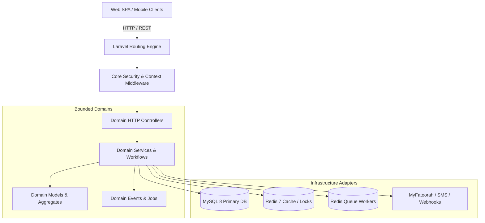

# DIYAR — Backend Architecture & Domain Organization

> **Date:** 2026-09-30  
> **Status:** APPROVED / BASELINE ARCHITECTURE  
> **Authority:** Senior Software Architect + Senior Laravel Engineer  
> **Scope:** Backend (`backend/app/`, `backend/routes/`, `backend/config/`)

---

## 1. Executive Architectural Overview

The DIYAR marketplace backend is a high-performance **modular monolith** running on Laravel 13 with PHP 8.4, optimized for Laravel Octane / FrankenPHP.

To ensure high cohesion, low coupling, discoverability, and rapid onboarding without breaking the active production-grade runtime or test baselines, the codebase enforces a strict **Domain-Driven Modular Monolith** organization:

1. **`Core/` (Cross-Cutting Platform Foundations):** Common support abstractions, generic exception rendering, system-wide middleware, API response contracts, and root service providers.
2. **`Domains/` (Business Feature Capabilities):** The core marketplace domains encapsulating domain logic, HTTP controllers, form requests, resource transformers, policies, jobs, events, and domain services.
3. **`Infrastructure/` (Technical & External Adapters):** Concrete drivers and integrations for Redis, MySQL, Reverb, external SMS gateways, payment providers (MyFatoorah), and AI spatial visualization engines.



---

## 2. Target Directory Hierarchy & Layer Responsibilities

```text
backend/app/
├── Core/
│   ├── Exceptions/           # Domain-agnostic application exceptions & handlers
│   ├── Middleware/           # Security headers, correlation IDs, maintenance, auth context
│   ├── Providers/            # Application lifecycle & bootstrap service providers
│   ├── Rules/                # Global validation rules (e.g. Saudi phone, national ID)
│   └── Support/              # Generic utility wrappers, money formatters, API envelopes
│
├── Domains/
│   ├── Admin/                # Central administrative operations & health control plane
│   ├── Affiliate/            # Referral attribution, tracking clicks, commissions & payouts
│   ├── Analytics/            # Metrics ingestion, search queries, performance counters
│   ├── Assistant/            # Conversational shopping assistant integrations
│   ├── B2b/                  # B2B enterprise company listings, RFQs & leads
│   ├── Blog/                 # CMS articles, taxonomy & social engagement
│   ├── Cart/                 # Cart sessions, line-item pricing, guest-to-user merges
│   ├── Catalog/              # Products, categories, product colors, stock counts
│   ├── Chat/                 # Realtime buyer-vendor messaging & attachment handling
│   ├── Checkout/             # Order synthesis, totals, fee calculation & reservations
│   ├── Coupons/              # Promotions, coupon scopes, exclusions & redemption limits
│   ├── Identity/             # Authentication, OTP, user profiles, address book, security sessions & roles
│   ├── Loyalty/              # Customer points ledger, tier calculations & reward rules
│   ├── Orders/               # Order lifecycle, vendor sub-orders, fulfillment status
│   ├── Payments/             # Payment transactions, gateways, webhooks & allocations
│   ├── Platform/             # Announcements, contact forms, themes & system settings
│   ├── Projects/             # Visual interior showcase projects & inspiration portfolios
│   ├── Returns/              # RMA workflows, dispute resolution & evidence handling
│   ├── Reviews/              # Product and vendor review scoring & sentiment aggregation
│   ├── RoomDesigner/         # 2D/3D interactive canvas state & spatial layouts
│   ├── Search/               # Text & faceted product search, ngram boolean index engine
│   ├── ServicesMarketplace/  # Service categories, quotes, bookings & provider profiles
│   ├── Shipping/             # Rate calculators, delivery zones & courier integrations
│   ├── TryInRoom/            # AR/AI camera room preview jobs & source image handling
│   ├── Vendors/              # Merchant stores, legal profiles, working hours & team members
│   └── VisualSearch/         # Vector/dHash image feature extraction & indexing
│
└── Infrastructure/
    ├── Mail/                 # Email OTP transport drivers
    ├── Notifications/        # Push notification transport (APNs, FCM, Composite)
    └── Sms/                  # External SMS providers and OTP delivery gateways (Msegat, Log)
```

---

## 3. Domain Boundary Rules

1. **High Cohesion, Low Coupling:** Each feature domain owns its internal state transitions, data transformations, and business workflows.
2. **Explicit Seams for Shared Dependencies:** When domain A requires data or action from domain B, it interacts via explicit public service methods, domain events, or contracts—never through direct mutation of private domain entities.
3. **No Circular Domain Dependencies:** Domain dependencies must flow strictly in one direction:
   ```text
   HTTP Controllers / Jobs / Webhooks
              ↓
     Domain Application Services
              ↓
      Domain Models / Contracts
              ↓
    Infrastructure & Core Support
   ```
4. **Isolated Admin Presentation:** Admin controllers (`Admin\Http\Controllers`) represent the administrative control-plane and presentation layer. They consume existing domain services rather than duplicating business logic.

---

## 4. Search Architecture

The search domain (`Domains/Search/`) preserves the optimizations established in Stage 26.9:

```text
ProductSearchContract
         ↓
ProductSearchService
         ↓
ProductService (MySQL 8 ngram FULLTEXT Engine)
```

* **Source of Truth:** MySQL 8 remains the sole database and search engine source of truth.
* **Query Execution:** Pure boolean fulltext search (`MATCH(...) AGAINST (? IN BOOLEAN MODE)`) over normalized terms.
* **Review Aggregation:** Decoupled batched hydration (`hydrateReviewAggregates()`) executing a single indexed aggregation query across card sets.
* **Deferred Infrastructure:** External search engines (Meilisearch, Elasticsearch) remain strictly deferred until empirical production telemetry on Hostinger demonstrates real need.

---

## 5. Environment Strategy

The repository follows a clean, minimal environment configuration contract:

* `.env.example`: The primary, fully documented template for development and CI.
* `.env.production.example`: The canonical template defining required production environment keys (strict SSL, secure Redis caching/queues, disabling debug/sandbox modes).
* `.env.loadtest.example`: Configuration parameters for load testing and benchmark executions.
* **Ignored Runtime Files:** `.env`, `.env.production`, `.env.local`, `.env.*.local` are strictly ignored by `.gitignore` and must never be tracked in git.

---

## 6. Rules for Adding Future Features

1. **Identify the Bounded Context:** Determine if the new feature belongs to an existing domain or warrants a new bounded domain in `Domains/`.
2. **Colocate Technical Components:** Place controllers, requests, resources, and services within that domain's directory structure.
3. **Expose Stable Contracts:** If another domain needs to interact with this feature, define a clear service contract or dispatch a domain event.
4. **Maintain Test Coverage:** Ensure unit and feature tests mirror the domain structure under `tests/Feature/` and `tests/Unit/`.
