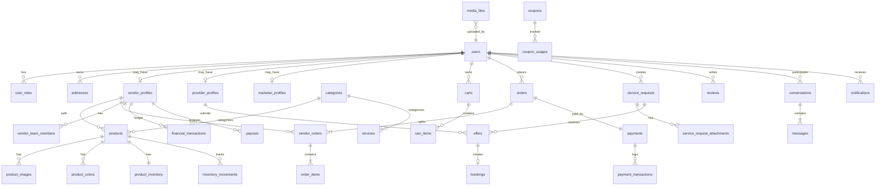

# DIYAR — Database Design (Conceptual)

> **Stage:** 0 — Phase 0.4  
> **DBMS:** MySQL 8 (V1)  
> **Note:** Conceptual design only — no migrations in Stage 0

---

## 1. Design Principles

1. Single `users` table with role memberships — no per-role user tables
2. Ledger append-only for financial truth — no mutable balance without transactions
3. Price/inventory snapshots on order items — immutable after purchase
4. Separate order status vs vendor_order status
5. Soft deletes on key business entities
6. All tables: `id`, `created_at`, `updated_at`; financial tables: audit fields

---

## 2. Entity Relationship Diagram

---

## 3. Table Definitions

### 3.1 Identity & Users

#### `users`

| Column | Type | Notes |
|--------|------|-------|
| id | BIGINT UNSIGNED PK | |
| name | VARCHAR(255) | Required |
| phone | VARCHAR(20) UNIQUE | Required, primary identity |
| email | VARCHAR(255) NULL UNIQUE | Optional |
| email_verified_at | TIMESTAMP NULL | |
| phone_verified_at | TIMESTAMP NULL | |
| password | VARCHAR(255) | Hashed |
| account_status | ENUM | pending_verification, active, suspended, disabled |
| avatar_media_id | FK NULL | → media_files |
| locale | VARCHAR(10) | Default `ar` |
| deleted_at | TIMESTAMP NULL | Soft delete |

#### `user_roles`

| Column | Type | Notes |
|--------|------|-------|
| id | BIGINT UNSIGNED PK | |
| user_id | FK → users | |
| role | ENUM | customer, vendor, provider, marketer, admin |
| status | ENUM | pending, active, suspended, rejected |
| approved_at | TIMESTAMP NULL | |
| approved_by | FK NULL → users | |
| UNIQUE(user_id, role) | | |

#### `addresses`

| Column | Type | Notes |
|--------|------|-------|
| id | BIGINT UNSIGNED PK | |
| user_id | FK | |
| label | VARCHAR(100) | e.g. المنزل |
| line1, line2 | VARCHAR | |
| city | VARCHAR | |
| region | VARCHAR | |
| postal_code | VARCHAR NULL | |
| latitude, longitude | DECIMAL NULL | Future |
| is_default | BOOLEAN | |

---

### 3.2 Marketplace Actors

#### `vendor_profiles`

| Column | Type | Notes |
|--------|------|-------|
| id | BIGINT UNSIGNED PK | |
| user_id | FK UNIQUE | |
| store_name | VARCHAR | |
| slug | VARCHAR UNIQUE | |
| description | TEXT | |
| logo_media_id, cover_media_id | FK NULL | |
| location | VARCHAR | |
| status | ENUM | pending, active, suspended |
| rating_avg | DECIMAL(3,2) | Denormalized |
| settings | JSON | Shipping prefs, policies |

#### `provider_profiles`

Similar to vendor_profiles + `service_areas` JSON, `completed_projects_count`

#### `marketer_profiles`

| Column | Type | Notes |
|--------|------|-------|
| id | BIGINT UNSIGNED PK | |
| user_id | FK UNIQUE | |
| status | ENUM | |
| payment_details | JSON NULL | For V1.1 payouts |

#### `vendor_team_members`

| Column | Type | Notes |
|--------|------|-------|
| id | BIGINT UNSIGNED PK | |
| vendor_profile_id | FK | |
| user_id | FK NULL | Null if invited pending |
| email | VARCHAR | Invite target |
| role | ENUM | owner, manager, support |
| status | ENUM | invited, active, removed |

---

### 3.3 Catalog & Products

#### `categories`

| Column | Type | Notes |
|--------|------|-------|
| id | BIGINT UNSIGNED PK | |
| parent_id | FK NULL | Self-ref hierarchy |
| name | VARCHAR | Arabic |
| slug | VARCHAR UNIQUE | |
| type | ENUM | product, service, both |
| sort_order | INT | |
| is_active | BOOLEAN | |

#### `products`

| Column | Type | Notes |
|--------|------|-------|
| id | BIGINT UNSIGNED PK | |
| vendor_profile_id | FK | |
| category_id | FK | |
| name | VARCHAR | |
| slug | VARCHAR | UNIQUE per vendor |
| description | TEXT | |
| sale_price | DECIMAL(12,2) | |
| compare_price | DECIMAL(12,2) NULL | |
| width, height, depth | DECIMAL NULL | cm |
| materials | JSON | |
| warranty | VARCHAR NULL | |
| product_type | ENUM | single, bundle |
| availability_mode | ENUM | in_stock, out_of_stock, preorder |
| status | ENUM | draft, active, archived |
| deleted_at | TIMESTAMP NULL | |

#### `product_colors`

| Column | Type | Notes |
|--------|------|-------|
| id | PK | |
| product_id | FK | |
| name | VARCHAR | |
| hex_code | CHAR(7) | |

#### `product_images`

| Column | Type | Notes |
|--------|------|-------|
| id | PK | |
| product_id | FK | |
| media_file_id | FK | Max 5 per product (app rule) |
| sort_order | INT | |

#### `product_inventory`

| Column | Type | Notes |
|--------|------|-------|
| id | PK | |
| product_id | FK UNIQUE | |
| stock_quantity | INT UNSIGNED | |
| reserved_quantity | INT UNSIGNED | Default 0 |
| available_quantity | INT UNSIGNED | Computed/stored |

#### `inventory_movements`

| Column | Type | Notes |
|--------|------|-------|
| id | PK | |
| product_id | FK | |
| type | ENUM | increase, decrease, adjustment, sale, return, reservation, release |
| quantity | INT | Signed |
| reference_type, reference_id | Morph | Order, Return, etc. |
| note | VARCHAR NULL | |
| created_by | FK → users | Audit |

---

### 3.4 Cart

#### `carts`

| Column | Type | Notes |
|--------|------|-------|
| id | PK | |
| user_id | FK NULL | Null for guest |
| session_id | VARCHAR NULL | Guest identifier |
| expires_at | TIMESTAMP NULL | |

#### `cart_items`

| Column | Type | Notes |
|--------|------|-------|
| id | PK | |
| cart_id | FK | |
| item_type | ENUM | product, service |
| product_id | FK NULL | |
| service_id | FK NULL | |
| quantity | INT | |
| attributes | JSON NULL | Color selection etc. |
| unit_price_snapshot | DECIMAL | For display consistency |

---

### 3.5 Orders

#### `orders`

| Column | Type | Notes |
|--------|------|-------|
| id | PK | |
| order_number | VARCHAR UNIQUE | Human-readable |
| user_id | FK | |
| status | ENUM | pending, confirmed, processing, completed, cancelled |
| shipping_address_id | FK | Snapshot reference |
| subtotal | DECIMAL | |
| shipping_total | DECIMAL | |
| assembly_total | DECIMAL | |
| discount_total | DECIMAL | |
| vat_amount | DECIMAL | 15% |
| grand_total | DECIMAL | |
| coupon_id | FK NULL | |
| notes | TEXT NULL | |

#### `vendor_orders`

| Column | Type | Notes |
|--------|------|-------|
| id | PK | |
| order_id | FK | |
| vendor_profile_id | FK | |
| status | ENUM | pending, accepted, processing, shipped, delivered, cancelled |
| shipping_cost | DECIMAL | |
| assembly_cost | DECIMAL | |
| discount_amount | DECIMAL | |
| vendor_subtotal | DECIMAL | |
| platform_commission | DECIMAL | |
| vendor_net | DECIMAL | |
| tracking_number | VARCHAR NULL | |

#### `order_items`

| Column | Type | Notes |
|--------|------|-------|
| id | PK | |
| vendor_order_id | FK | |
| product_id | FK | |
| product_name | VARCHAR | Snapshot |
| unit_price | DECIMAL | Snapshot |
| quantity | INT | |
| requires_assembly | BOOLEAN | |
| attributes | JSON NULL | |

---

### 3.6 Payments & Finance

#### `payments`

| Column | Type | Notes |
|--------|------|-------|
| id | PK | |
| order_id | FK UNIQUE | |
| gateway | VARCHAR | moyasar, hyperpay, etc. |
| gateway_reference | VARCHAR NULL | |
| method | ENUM | mada, card, apple_pay, tabby |
| amount | DECIMAL | |
| status | ENUM | pending, paid, failed, partially_refunded, refunded |
| paid_at | TIMESTAMP NULL | |

#### `payment_transactions`

Gateway response log (append-only audit)

#### `financial_transactions` (LEDGER)

| Column | Type | Notes |
|--------|------|-------|
| id | PK | |
| vendor_profile_id | FK NULL | Null for platform-level |
| type | ENUM | sale, platform_commission, refund, payout, escrow, escrow_release, adjustment |
| amount | DECIMAL | Signed |
| balance_after | DECIMAL NULL | Running available balance |
| escrow_balance_after | DECIMAL NULL | |
| reference_type, reference_id | Morph | Order, Payout, Return |
| description | VARCHAR | |
| created_by | FK NULL | |

**Rule:** Never UPDATE amount on existing rows. Corrections via adjustment entries.

#### `commission_rules`

| Column | Type | Notes |
|--------|------|-------|
| id | PK | |
| scope | ENUM | global, category, vendor, product |
| scope_id | BIGINT NULL | |
| rate_percent | DECIMAL(5,2) | Default 10.00 |
| effective_from, effective_to | DATE | |

#### `payouts`

| Column | Type | Notes |
|--------|------|-------|
| id | PK | |
| vendor_profile_id | FK | |
| amount | DECIMAL | |
| status | ENUM | requested, processing, paid, rejected |
| processed_by | FK NULL → users | Admin |
| processed_at | TIMESTAMP NULL | |

---

### 3.7 Shipping & Returns

#### `shipments`

| Column | Type | Notes |
|--------|------|-------|
| id | PK | |
| vendor_order_id | FK | |
| carrier | VARCHAR NULL | |
| tracking_number | VARCHAR | |
| status | ENUM | pending, shipped, delivered |
| shipped_at, delivered_at | TIMESTAMP | |

#### `returns`

| Column | Type | Notes |
|--------|------|-------|
| id | PK | |
| order_id | FK | |
| vendor_order_id | FK | |
| user_id | FK | |
| status | ENUM | requested, under_review, approved, rejected, received, refunded, closed |
| reason | VARCHAR | |
| description | TEXT | |

#### `return_items`

| Column | Type | Notes |
|--------|------|-------|
| id | PK | |
| return_id | FK | |
| order_item_id | FK | |
| quantity | INT | |

---

### 3.8 Services

#### `services`

| Column | Type | Notes |
|--------|------|-------|
| id | PK | |
| provider_profile_id | FK | |
| category_id | FK | |
| title | VARCHAR | |
| description | TEXT | |
| base_price | DECIMAL NULL | |
| duration | VARCHAR NULL | |
| is_active | BOOLEAN | |

#### `service_requests`

| Column | Type | Notes |
|--------|------|-------|
| id | PK | |
| user_id | FK | |
| title | VARCHAR | |
| description | TEXT | |
| budget_min, budget_max | DECIMAL NULL | |
| location | VARCHAR | |
| status | ENUM | pending, offers_received, in_progress, completed, cancelled |
| accepted_offer_id | FK NULL → offers | |

#### `service_request_categories` (pivot)

#### `service_request_attachments`

| Column | Type | Notes |
|--------|------|-------|
| media_file_id | FK | JPG/PNG/PDF max 10MB |

#### `offers`

| Column | Type | Notes |
|--------|------|-------|
| id | PK | |
| service_request_id | FK | |
| provider_profile_id | FK | |
| price | DECIMAL | |
| message | TEXT | |
| duration_days | INT NULL | |
| quotation_media_id | FK NULL | |
| status | ENUM | pending, accepted, rejected, withdrawn |

#### `bookings`

| Column | Type | Notes |
|--------|------|-------|
| id | PK | |
| offer_id | FK | |
| user_id | FK | |
| provider_profile_id | FK | |
| service_id | FK NULL | |
| scheduled_date | DATE | |
| scheduled_time | TIME | |
| location | VARCHAR | |
| price | DECIMAL | |
| payment_status | ENUM | pending, paid, refunded |
| status | ENUM | pending, confirmed, in_progress, completed, cancelled |

---

### 3.9 Engagement

#### `reviews`

| Column | Type | Notes |
|--------|------|-------|
| id | PK | |
| user_id | FK | |
| reviewable_type, reviewable_id | Morph | Product, Service, Provider |
| order_item_id | FK NULL | Purchase proof |
| booking_id | FK NULL | Service proof |
| rating | TINYINT | 1-5 |
| comment | TEXT | |
| status | ENUM | pending, approved, rejected |

#### `coupons`

| Column | Type | Notes |
|--------|------|-------|
| id | PK | |
| code | VARCHAR UNIQUE | |
| type | ENUM | fixed, percentage |
| value | DECIMAL | |
| min_order_amount | DECIMAL NULL | |
| max_discount | DECIMAL NULL | |
| starts_at, ends_at | TIMESTAMP | |
| usage_limit | INT NULL | |
| used_count | INT | |
| is_active | BOOLEAN | |

#### `conversations`

| Column | Type | Notes |
|--------|------|-------|
| id | PK | |
| type | ENUM | customer_vendor, customer_provider, customer_admin |
| subject | VARCHAR NULL | |

#### `conversation_participants`

| conversation_id | FK | |
| user_id | FK | |
| role | ENUM | customer, vendor, provider, admin |

#### `messages`

| Column | Type | Notes |
|--------|------|-------|
| id | PK | |
| conversation_id | FK | |
| sender_id | FK → users | |
| body | TEXT | |
| read_at | TIMESTAMP NULL | |

#### `notifications`

| Column | Type | Notes |
|--------|------|-------|
| id | PK | |
| user_id | FK | |
| type | VARCHAR | OrderCreated, etc. |
| data | JSON | |
| read_at | TIMESTAMP NULL | |

#### `media_files`

| Column | Type | Notes |
|--------|------|-------|
| id | PK | |
| disk | VARCHAR | |
| path | VARCHAR | |
| mime_type | VARCHAR | |
| size_bytes | BIGINT | |
| uploaded_by | FK → users | |

---

## 4. Key Indexes

| Table | Index | Purpose |
|-------|-------|---------|
| products | (vendor_profile_id, status) | Vendor catalog |
| products | (category_id, status) | Category browse |
| orders | (user_id, created_at) | Order history |
| vendor_orders | (vendor_profile_id, status) | Vendor inbox |
| financial_transactions | (vendor_profile_id, created_at) | Ledger history |
| service_requests | (status, created_at) | Provider inbox |
| cart_items | (cart_id) | Cart load |

---

## 5. Tables Deferred (Not V1)

| Table | Version |
|-------|---------|
| loyalty_accounts, loyalty_transactions | V1.1 |
| affiliate_links, affiliate_clicks | V1.1 |
| b2b_companies | V1.1 |
| blog_posts | V1.1 |
| ai_conversations | V2 |

---

## 6. Migration Order (Stage 1+ reference)

1. users, user_roles, addresses, media_files
2. vendor_profiles, provider_profiles, marketer_profiles
3. categories, products, inventory
4. carts, cart_items
5. orders, vendor_orders, order_items
6. payments, financial_transactions, commission_rules
7. services, service_requests, offers, bookings
8. reviews, coupons, notifications, conversations, messages
9. returns, shipments, payouts
