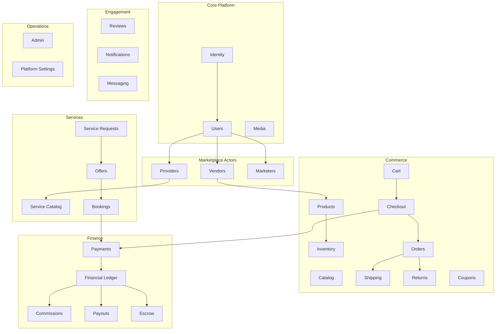

# DIYAR — Domain Architecture

> **Stage:** 0 — Phase 0.3  
> **Architecture style:** Modular monolith (Laravel 13)

---

## 1. Bounded Contexts



---

## 2. Module Map (Laravel `app/Modules/` or domain folders)

| Module | Responsibility | Key Aggregates |
|--------|----------------|----------------|
| **Identity** | Auth, OTP, sessions, password recovery | User credentials, OTP tokens |
| **Users** | Profiles, addresses, preferences | User, Address, Profile |
| **Vendors** | Store profiles, team, settings | Vendor, VendorTeamMember |
| **Providers** | Service provider profiles | Provider |
| **Marketers** | Marketer profiles (V1 registration; V1.1 affiliate) | MarketerProfile |
| **Catalog** | Categories, taxonomy | Category |
| **Products** | Product CRUD, variants, images | Product, ProductColor, ProductImage |
| **Inventory** | Stock, reservations, movements | Inventory, InventoryMovement, StockReservation |
| **Cart** | Guest/auth carts, merge | Cart, CartItem |
| **Checkout** | Validation, totals, order creation | CheckoutSession |
| **Orders** | Order lifecycle, vendor orders | Order, VendorOrder, OrderItem |
| **Payments** | Gateway abstraction, webhooks | Payment, PaymentTransaction |
| **Finance** | Ledger, balances, escrow | FinancialTransaction, VendorBalance |
| **Commissions** | Rate resolution, commission records | CommissionRule, Commission |
| **Payouts** | Payout requests, processing | Payout |
| **Shipping** | Rate calculation, shipments | ShippingMethod, ShippingRate, Shipment |
| **Returns** | Return requests, refunds linkage | Return, ReturnItem |
| **Services** | Service listings | Service |
| **ServiceRequests** | RFQ workflow | ServiceRequest, Attachment |
| **Offers** | Provider bids | Offer |
| **Bookings** | Scheduled services | Booking |
| **Reviews** | Polymorphic reviews | Review |
| **Coupons** | Admin coupons, validation | Coupon, CouponUsage |
| **Notifications** | In-app + queued email | Notification |
| **Messaging** | Conversations, polling messages | Conversation, Message |
| **Media** | Upload handling | MediaFile |
| **Admin** | Operations, settings, moderation | PlatformSetting, RoleActivationPolicy |

---

## 3. Core Aggregates

### 3.1 User (root)

```
User
├── account_status
├── phone (required, unique)
├── email (optional, unique if set)
├── password
└── roles[] → UserRole
      ├── role: customer|vendor|provider|marketer|admin
      ├── status: pending|active|suspended|rejected
      └── profile → Vendor | Provider | MarketerProfile
```

**Rule:** Single users table. No separate login tables per role.

### 3.2 Order (root)

```
Order
├── customer (User)
├── status (order-level)
├── totals (computed snapshot)
├── payment (Payment)
└── vendor_orders[] → VendorOrder
      ├── vendor
      ├── status (vendor-level)
      ├── shipping
      ├── financials (commission, vendor_net)
      └── items[] → OrderItem (price snapshot)
```

**Rule:** VendorOrder is the fulfillment and financial boundary.

### 3.3 Service Request (root)

```
ServiceRequest
├── customer
├── categories[]
├── budget, description, attachments
├── status
└── offers[] → Offer
      └── ONE accepted → Booking → Payment
```

---

## 4. Domain Events (conceptual)

| Event | Triggers |
|-------|----------|
| `UserRegistered` | OTP send |
| `OrderPlaced` | Notifications, inventory finalize |
| `PaymentConfirmed` | Order confirm, escrow credit, commission calc |
| `VendorOrderShipped` | Customer notification |
| `OfferAccepted` | Booking creation, reject other offers |
| `PayoutProcessed` | Ledger debit, vendor notification |
| `ReturnApproved` | Refund initiation |

Events dispatched via Laravel events + database queue jobs in V1.

---

## 5. Cross-Module Rules

| Rule | Enforced By |
|------|-------------|
| Prices from database at checkout | Checkout module |
| Stock reservation in transaction | Inventory + Checkout |
| Commission from config service | Commissions module |
| One accepted offer per request | Offers module |
| Review eligibility | Reviews module (policy) |
| Financial immutability | Ledger append-only transactions |

---

## 6. V1 vs Future Module Boundaries

| Module | V1 | V1.1+ |
|--------|-----|-------|
| Marketers (affiliate links) | Registration only | Full tracking |
| Loyalty | — | New module |
| B2B | — | New module or extend Vendors |
| Blog/CMS | — | New module |
| AI | — | Separate service, V2 |

---

## 7. Frontend Domain Mapping

| UI Area | Primary Backend Modules |
|---------|------------------------|
| AuthPage | Identity |
| Profile pages | Users |
| Category/Product pages | Catalog, Products |
| Checkout/Orders | Cart, Checkout, Orders, Payments |
| Vendor dashboard | Vendors, Products, Inventory, Orders, Finance |
| Service dashboard | Providers, ServiceRequests, Offers, Bookings |
| Affiliate dashboard | Marketers (V1.1) |
| ChatPage | Messaging |
| Admin (TBD UI) | Admin |

---

## 8. Extension Points (PROPOSED)

- `PaymentGatewayInterface` — swap gateways
- `CommissionResolverInterface` — global → category → vendor hierarchy
- `ShippingCalculatorInterface` — per-vendor → carrier APIs
- `RoleActivationPolicyInterface` — auto vs manual approval
- `NotificationChannelInterface` — in-app, email, future push

---

*See `DATABASE_DESIGN.md` for persistence model and `API_SPECIFICATION.md` for boundaries.*
