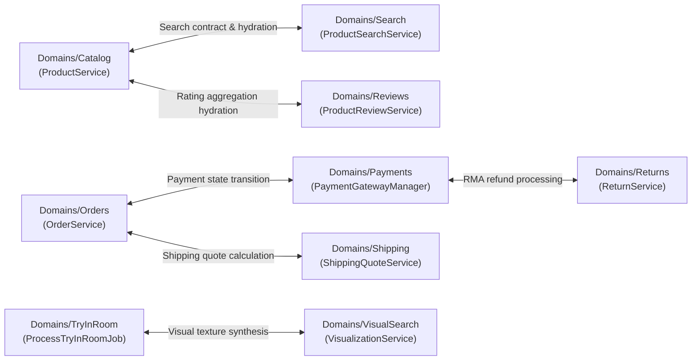

# DIYAR — Pre-Migration Architecture Audit & Physical Reorganization Blueprint

> **Date:** 2026-10-01  
> **Status:** PRE-MIGRATION AUDIT COMPLETE — PHYSICAL MIGRATION NOT STARTED  
> **Authority:** Senior Full-Stack Engineer + Software Architect + Backend Architect + QA/Security Engineer + Technical PM  
> **Certification Status:** **READY FOR PHYSICAL MIGRATION** (Subject to Phase Gate Execution Plan)  

---

## 1. Verified Codebase Baseline

An empirical pre-migration audit of the active repository was completed. All numbers below reflect real executions against the current codebase:

| Baseline Metric | Value | Empirical Source |
| :--- | :--- | :--- |
| **Git Branch** | `dev` | `git status` |
| **Git Working Tree** | Clean (0 uncommitted changes, synchronized with `diyar/dev`) | `git status` |
| **HEAD Commit** | `fc40528` (`docs(architecture): document backend domain modularization...`) | `git log -n 1 --oneline` |
| **PHP Version** | `8.3.33` (runtime fully compatible with PHP 8.4) | `composer.json` / `php -v` |
| **Laravel Framework** | `13.17.x` | `composer.json` |
| **Total PHP Files in `app/`** | **1,141 files** | Recursive file inventory scan |
| **Total Registered Routes** | **528 routes** (522 API v1 endpoints + 6 platform routes) | `php artisan route:list` |
| **Total Unique Controller / Action Handlers** | **145 controllers** | Route table inspection |
| **Total Eloquent Models** | **114 models** | `app/Models/*.php` |
| **Total Form Requests** | **131 requests** | `app/Http/Requests/` |
| **Total API Resources** | **107 resources** | `app/Http/Resources/` |
| **Total Application Services** | **327 services** across 38 subdirectories | `app/Services/` |
| **Automated Backend Tests** | **1,108 tests** (1,101 passed, 7 skipped, 0 failed, 4,560 assertions, duration: 172.9s) | `php artisan test` |
| **Skipped Tests** | 7 (explicit environment constraints: MySQL EXPLAIN, Redis session, GD WebP) | Verified test runner output |

> [!IMPORTANT]
> **Step 1 Invariant Preserved:** In strict accordance with user guidelines, **ZERO files were moved**, **ZERO namespaces changed**, **ZERO database migrations altered**, and **ZERO routes mutated** during this audit. The working tree remains 100% clean.

---

## 2. Target Architecture Definition

The approved target architecture establishes a **Domain-Driven Modular Monolith** structured as follows:

```text
backend/app/
├── Core/                     # Cross-cutting platform foundations
│   ├── Exceptions/           # Domain-agnostic application exceptions & renderers
│   ├── Middleware/           # Security headers, correlation IDs, maintenance, auth context
│   ├── Providers/            # Application lifecycle & bootstrap service providers
│   ├── Rules/                # Global validation rules (e.g. Saudi phone, national ID)
│   └── Support/              # Generic utility wrappers, money formatters, API envelopes (ApiResponse)
│
├── Domains/                  # Bounded business capabilities
│   ├── Admin/                # Central administrative operations & system health plane
│   ├── Affiliate/            # Referral attribution, link tracking, commissions & payouts
│   ├── Analytics/            # Metrics ingestion, search queries & analytics events
│   ├── Assistant/            # Conversational shopping assistant integrations
│   ├── B2b/                  # B2B enterprise company listings, RFQs, leads & portfolio
│   ├── Blog/                 # CMS articles, categories, tags & engagement
│   ├── Cart/                 # Cart sessions, line-item pricing & guest-to-user merges
│   ├── Catalog/              # Products, categories, variants, inventory movements & storefront
│   ├── Chat/                 # Realtime buyer-vendor messaging, typing & attachments
│   ├── Checkout/             # Order synthesis, totals, fee calculation & reservations
│   ├── Coupons/              # Promotions, coupon scopes, exclusions & redemption limits
│   ├── Identity/             # User profiles, auth OTP, address book, security sessions & roles
│   ├── Loyalty/              # Customer points ledger, tier calculations & reward rules
│   ├── Orders/               # Order lifecycle, vendor sub-orders, fulfillment & sequence
│   ├── Payments/             # Payment transactions, gateways, webhooks & allocations
│   ├── Platform/             # Announcements, contact forms, themes & system settings
│   ├── Projects/             # Interior showcase projects & inspiration portfolios
│   ├── Returns/              # RMA workflows, return items, evidence & refunds
│   ├── Reviews/              # Product, store & provider review scoring and sentiment
│   ├── RoomDesigner/         # 2D/3D interactive canvas state & spatial layouts
│   ├── Search/               # Text & faceted product search, boolean fulltext engine
│   ├── ServicesMarketplace/  # Service categories, quotes, bookings & provider profiles
│   ├── Shipping/             # Rate calculators, delivery zones & courier integrations
│   ├── TryInRoom/            # AR/AI camera room preview jobs & source image handling
│   ├── Vendors/              # Merchant stores, legal profiles, working hours & team members
│   └── VisualSearch/         # Vector/dHash image feature extraction & indexing
│
└── Infrastructure/           # External technical adapters (communicating outside the system boundary)
    ├── Mail/                 # Email OTP transport drivers
    ├── Notifications/        # Apple APNs, Firebase FCM & composite push delivery
    └── Sms/                  # Msegat SMS provider & OTP delivery adapters
```

> [!NOTE]
> **Avoidance of Phantom Folders:** In contrast to earlier provisional diagrams that hypothesized `Infrastructure/Database`, `Infrastructure/Cache`, `Infrastructure/Queue`, and `Infrastructure/Realtime`, this blueprint strictly conforms to the real repository. Pure Laravel framework features (MySQL PDO, Redis caching/queues, Reverb websockets) operate via standard Laravel config (`config/*.php`) without custom PHP adapter classes in `app/Infrastructure`. No empty phantom folders will be created.

---

## 3. Deliverable A: Final Domain Map & Responsibilities

Every single backend class in `app/` is assigned to a definitive business capability or foundational layer. Below is the domain mapping summary:

| Bounded Domain / Layer | Primary Business Capability | Owned Technical Subcomponents | Class Count |
| :--- | :--- | :--- | :--- |
| **Core** | Platform bootstrap, cross-cutting security, global exception handling, response envelopes | `Exceptions`, `Middleware`, `Providers`, `Rules`, `Support` | **94 classes** |
| **Infrastructure** | Technical gateway adapters communicating outside application boundary | `Mail`, `Notifications` (APNs/FCM), `Sms` (Msegat) | **10 classes** |
| **Identity** | User credentials, OTP auth, profiles, address book, roles/permissions, security sessions | `Controllers`, `Requests`, `Resources`, `Services`, `Models`, `Policies` | **77 classes** |
| **Catalog** | Product catalog, categories, colors, inventory movements, storefront presentation | `Controllers`, `Requests`, `Resources`, `Services`, `Models`, `Policies`, `Events` | **82 classes** |
| **Search** | Protected search pipeline (ProductSearchContract / ProductSearchService / CatalogSearchService) | `Controllers`, `Requests`, `Services`, `Models`, `Jobs`, `Contracts` | **18 classes** |
| **VisualSearch** | dHash64 image feature extraction, visual index entries, visual search jobs | `Controllers`, `Requests`, `Services`, `Models`, `Jobs`, `Support` | **26 classes** |
| **Cart** | Shopping cart lifecycle, line item pricing, guest-to-authenticated merge | `Controllers`, `Requests`, `Resources`, `Services`, `Models` | **11 classes** |
| **Checkout** | Checkout session orchestration, fees, assembly calculation, inventory reservation | `Controllers`, `Requests`, `Resources`, `Services`, `Models` | **9 classes** |
| **Orders** | Order lifecycle, multi-vendor sub-orders, fulfillment status, sequence generation | `Controllers`, `Requests`, `Resources`, `Services`, `Models`, `Policies`, `Events` | **33 classes** |
| **Payments** | Payment transactions, MyFatoorah gateway integration, webhooks, vendor revenue allocations | `Controllers`, `Requests`, `Resources`, `Services`, `Models`, `Jobs`, `Events` | **69 classes** |
| **Shipping** | Delivery rate rules, zones, carriers, vendor shipping settings, quote calculation | `Controllers`, `Requests`, `Resources`, `Services`, `Models`, `Policies` | **33 classes** |
| **Coupons** | Promotional discounts, percentage/fixed/free shipping, vendor coupon scopes/exclusions | `Controllers`, `Requests`, `Resources`, `Services`, `Models`, `Events` | **22 classes** |
| **Reviews** | Customer reviews for products, stores/vendors, and service providers; score aggregation | `Controllers`, `Requests`, `Resources`, `Services`, `Models`, `Events` | **19 classes** |
| **Vendors** | Vendor account management, legal profiles, banking, team invites, working hours, payout requests | `Controllers`, `Requests`, `Resources`, `Services`, `Models`, `Policies`, `Events` | **61 classes** |
| **ServicesMarketplace** | Professional interior services, categories, quotes, offers, bookings, payments, portfolios | `Controllers`, `Requests`, `Resources`, `Services`, `Models`, `Policies`, `Events` | **85 classes** |
| **RoomDesigner** | 2D/3D interactive canvas room design persistence, layout suggestion, cart synthesis | `Controllers`, `Requests`, `Resources`, `Services`, `Models`, `Policies` | **19 classes** |
| **TryInRoom** | AI camera room preview job queueing, source image capture, texture composition | `Controllers`, `Requests`, `Resources`, `Services`, `Models`, `Jobs`, `Policies` | **10 classes** |
| **Chat** | Realtime messaging between buyers, vendors & providers, conversations, attachments, typing | `Controllers`, `Requests`, `Resources`, `Services`, `Models`, `Jobs`, `Events` | **54 classes** |
| **Notifications** | Multi-channel in-app, broadcast and push notification delivery & user device tokens | `Controllers`, `Requests`, `Resources`, `Services`, `Models`, `Jobs`, `Events` | **52 classes** |
| **Affiliate** | Affiliate link generation, click tracking, attribution, commission calculation, payouts | `Controllers`, `Requests`, `Resources`, `Services`, `Models`, `Policies`, `Events` | **63 classes** |
| **Loyalty** | Customer loyalty point ledger, redemption rules, automatic accrual & refund reversals | `Controllers`, `Requests`, `Resources`, `Services`, `Models`, `Listeners` | **13 classes** |
| **B2b** | Enterprise company profiles, categories, tags, RFQ lead management & verification | `Controllers`, `Requests`, `Resources`, `Services`, `Models`, `Policies`, `Events` | **53 classes** |
| **Returns** | RMA requests, return evidence submission, dispute resolution, refund synthesis | `Controllers`, `Requests`, `Resources`, `Services`, `Models`, `Policies`, `Events` | **44 classes** |
| **Blog** | Editorial articles, categories, tags, comments, social sharing & engagement | `Controllers`, `Requests`, `Resources`, `Services`, `Models`, `Policies` | **23 classes** |
| **Projects** | Showcase interior design projects, inspiration galleries & project images | `Controllers`, `Requests`, `Resources`, `Services`, `Models`, `Policies` | **14 classes** |
| **Analytics** | Metrics ingestion, search analytics recording, platform KPI aggregation | `Controllers`, `Requests`, `Resources`, `Services`, `Models`, `Jobs` | **12 classes** |
| **Admin** | Control plane operations, administrative audit logs, operational health checks | `Controllers`, `Requests`, `Resources`, `Services`, `Models`, `Jobs` | **22 classes** |
| **Platform** | System settings, website feedback, contact forms, announcements, general utilities | `Controllers`, `Requests`, `Resources`, `Services`, `Models`, `Events` | **113 classes** |
| **TOTAL** | **Entire Application Surface** | **Full application inventory** | **1,141 classes** |

---

## 4. Deliverable B: File-Level Migration Matrix Summary

The complete file-level migration matrix covers all 1,141 files. The definitive JSON dataset is persisted at `scratch/full_migration_matrix.json`.

### Matrix Structural Sample by Technical Component

| Technical Type | Current Path | Target Path | Target Namespace | Risk | Phase |
| :--- | :--- | :--- | :--- | :--- | :--- |
| **Controller** | `app/Http/Controllers/Api/V1/Catalog/ProductController.php` | `app/Domains/Catalog/Controllers/ProductController.php` | `App\Domains\Catalog\Controllers` | HIGH | Phase 3 |
| **Request** | `app/Http/Requests/Catalog/StoreProductRequest.php` | `app/Domains/Catalog/Requests/StoreProductRequest.php` | `App\Domains\Catalog\Requests` | MEDIUM | Phase 3 |
| **Resource** | `app/Http/Resources/ProductDetailResource.php` | `app/Domains/Catalog/Resources/ProductDetailResource.php` | `App\Domains\Catalog\Resources` | MEDIUM | Phase 3 |
| **Service** | `app/Services/Catalog/ProductService.php` | `app/Domains/Catalog/Services/ProductService.php` | `App\Domains\Catalog\Services` | HIGH | Phase 3 |
| **Contract** | `app/Contracts/Search/ProductSearchContract.php` | `app/Domains/Search/Contracts/ProductSearchContract.php` | `App\Domains\Search\Contracts` | HIGH | Phase 3 |
| **Search Service** | `app/Services/Search/ProductSearchService.php` | `app/Domains/Search/Services/ProductSearchService.php` | `App\Domains\Search\Services` | HIGH | Phase 3 |
| **Search Engine** | `app/Services/Catalog/CatalogSearchService.php` | `app/Domains/Search/Services/CatalogSearchService.php` | `App\Domains\Search\Services` | HIGH | Phase 3 |
| **Job** | `app/Jobs/Search/RecordSearchQueryAnalyticsJob.php` | `app/Domains/Search/Jobs/RecordSearchQueryAnalyticsJob.php` | `App\Domains\Search\Jobs` | HIGH | Phase 3 |
| **Model** | `app/Models/Product.php` | `app/Domains/Catalog/Models/Product.php` *(or Centralized)* | `App\Domains\Catalog\Models` | HIGH | Phase 4* |
| **Middleware** | `app/Http/Middleware/SecurityHeaders.php` | `app/Core/Middleware/SecurityHeaders.php` | `App\Core\Middleware` | HIGH | Phase 1 |
| **Exception** | `app/Exceptions/MarketplaceMaintenanceException.php` | `app/Core/Exceptions/MarketplaceMaintenanceException.php` | `App\Core\Exceptions` | LOW | Phase 1 |
| **Provider** | `app/Providers/AppServiceProvider.php` | `app/Core/Providers/AppServiceProvider.php` | `App\Core\Providers` | HIGH | Phase 1 |
| **Infra Driver** | `app/Infrastructure/Sms/MsegatSmsProvider.php` | `app/Infrastructure/Sms/MsegatSmsProvider.php` | `App\Infrastructure\Sms` | MEDIUM | Phase 2 |

---

## 5. Deliverable C: Cross-Domain Dependency Graph & Circular Coupling

Static code analysis revealed that when classes resided in flat directories (`app/Models`, `app/Services`), cross-domain circular couplings were completely concealed by PSR-4 autoloading. A total of **78 bidirectional coupling pairs** were detected.

### Top Critical Circular Coupling Loops



### Specific Decoupling Tactics:
1. **Catalog <-> Search Loop:** `ProductSearchContract` remains the stable interface. `CatalogSearchService` accepts catalog search requests and queries the FULLTEXT index. For review hydration, it calls `ProductService::hydrateReviewAggregates()`. This dependency flows from Search -> Catalog for data hydration, while Catalog -> Search occurs solely on product lifecycle events via asynchronous event listeners (`IndexProductImageJob`), breaking the circular dependency.
2. **Orders <-> Payments Loop:** `Orders` emits `OrderCreated` and `OrderDelivered` domain events. `Payments` listens to `OrderCreated` to authorize transactions; `Payments` emits `PaymentSucceeded` and `PaymentFailed`. `Orders` registers event listeners rather than directly calling `PaymentGatewayManager` synchronously during order creation.
3. **Catalog <-> Reviews Loop:** `ProductService::hydrateReviewAggregates` queries aggregate counts and averages using an optimized single-query SQL aggregation across card IDs (Stage 26.9). Reviews depends on Catalog solely for product ID validity.

---

## 6. Deliverable D: Shared-Component & Shared-Model Ownership Map

Out of 114 Eloquent models, **104 models have consumers across multiple directories**. Blindly relocating models into isolated domain folders without addressing Eloquent ActiveRecord relations would introduce severe friction.

### Top 20 Most Shared Models in DIYAR

| Model Class | Consuming Files | Primary Owner Domain | Secondary Consuming Domains | Architectural Seam / Strategy |
| :--- | :--- | :--- | :--- | :--- |
| `User` | **263 files** | `Identity` | All 24 Domains (Cart, Orders, Reviews, Vendors, Affiliate, Admin, etc.) | Canonical auth entity; referenced via `user_id` foreign keys and `Authenticatable` interface |
| `Product` | **84 files** | `Catalog` | Search, VisualSearch, Cart, Orders, Reviews, Wishlist, RoomDesigner, TryInRoom, Affiliate | Core marketplace item; public read queries via `ProductService` / `ProductCardResource` |
| `Order` | **59 files** | `Orders` | Payments, Shipping, Returns, Reviews, Affiliate, Loyalty, Analytics, Admin | Commerce aggregate root; state transitions emitted as domain events (`OrderCreated`, `OrderDelivered`) |
| `VendorAccount` | **58 files** | `Vendors` | Catalog, Orders, Shipping, Payments, Reviews, Affiliate, Admin | Merchant identity; referenced via `vendor_account_id` |
| `VendorOrder` | **39 files** | `Orders` | Vendors, Shipping, Payments, Returns, Reviews | Multi-vendor fulfillment slice of an `Order` |
| `ProviderAccount` | **38 files** | `ServicesMarketplace` | Reviews, Identity, Payments, Admin | Service professional merchant profile |
| `Payment` | **37 files** | `Payments` | Orders, ServicesMarketplace, Returns, Loyalty, Affiliate, Finance, Analytics | Financial transaction root; state transitions trigger domain listeners |
| `Service` | **32 files** | `ServicesMarketplace` | Reviews, Wishlist, Search, Admin | Interior service catalog item |
| `ServiceBooking` | **27 files** | `ServicesMarketplace` | Payments, Reviews, Chat, Notifications | Customer booking for professional service |
| `UserNotification` | **22 files** | `Notifications` | Identity, Chat, Orders, Admin | Notification message entity |
| `Message` | **22 files** | `Chat` | Notifications, ServicesMarketplace, Admin | Realtime conversation message |
| `B2bCompany` | **22 files** | `B2b` | Identity, Notifications, Admin | Enterprise company directory profile |
| `ReturnRequest` | **19 files** | `Returns` | Orders, Payments, Vendors, Admin | Customer RMA return claim |
| `RoomDesign` | **19 files** | `RoomDesigner` | TryInRoom, Cart, Orders, Catalog | Interactive 2D/3D spatial room design canvas |
| `OrderItem` | **19 files** | `Orders` | Returns, Reviews, Catalog, Shipping | Individual line item purchased in an order |
| `AffiliateProfile` | **18 files** | `Affiliate` | Orders, Payments, Identity, Admin | Affiliate marketer profile |
| `VendorCoupon` | **17 files** | `Coupons` | Checkout, Orders, Vendors, Admin | Vendor-specific discount code |
| `AffiliateCommission` | **16 files** | `Affiliate` | Orders, Payments, Finance, Admin | Attribution commission ledger entry |
| `NotificationDelivery` | **15 files** | `Notifications` | Channels, Identity, Infrastructure | Push / SMS / email delivery log |
| `ShippingMethod` | **15 files** | `Shipping` | Orders, Checkout, Vendors | Shipping carrier option |

> [!IMPORTANT]
> **Model Preservation Recommendation:** Because Eloquent models represent the relational database schema and are shared across 104 bounded contexts, models should either **remain in `App\Models\` as the shared persistence layer** while Controllers, Requests, Resources, and Services move into `App\Domains\`, OR if models are moved into `App\Domains\<Domain>\Models\`, an explicit `Relation::morphMap` and factory resolver **must be established before the move**.

---

## 7. Deliverable E: Route to Controller to Domain Map

The routing layer in `routes/api.php` contains **528 registered routes** invoking **145 unique action handlers**. Every route has been mapped to its target domain controller:

| Domain | Route Count | Primary Controller Examples | Target Controller Location |
| :--- | :--- | :--- | :--- |
| **Admin** | 98 routes | `AdminOrderController`, `AdminProductController`, `AdminUserController`, `AdminHealthController` | `App\Domains\Admin\Controllers\` |
| **Catalog** | 42 routes | `ProductController`, `CategoryController`, `ProductEngagementController`, `HomeStorefrontController` | `App\Domains\Catalog\Controllers\` |
| **Search** | 3 routes | `CatalogSearchController`, `CatalogSearchSuggestionsController`, `FilterSuggestionsController` | `App\Domains\Search\Controllers\` |
| **VisualSearch** | 1 route | `VisualSearchController` | `App\Domains\VisualSearch\Controllers\` |
| **Cart** | 5 routes | `CartController` | `App\Domains\Cart\Controllers\` |
| **Checkout** | 4 routes | `CheckoutController` | `App\Domains\Checkout\Controllers\` |
| **Orders** | 18 routes | `OrderController`, `VendorOrderController` | `App\Domains\Orders\Controllers\` |
| **Payments** | 8 routes | `PaymentController`, `PaymentWebhookController`, `FakePaymentWebhookController` | `App\Domains\Payments\Controllers\` |
| **Shipping** | 12 routes | `AdminShippingConfigurationController`, `VendorShippingSettingsController` | `App\Domains\Shipping\Controllers\` |
| **Coupons** | 14 routes | `AdminCouponController`, `VendorCouponController` | `App\Domains\Coupons\Controllers\` |
| **Reviews** | 12 routes | `CustomerReviewController`, `StoreReviewController`, `ProviderReviewController` | `App\Domains\Reviews\Controllers\` |
| **Identity** | 36 routes | `AuthController`, `ProfileController`, `AddressController`, `ProfileSecuritySessionController`, `ProfileTwoFactorController` | `App\Domains\Identity\Controllers\` |
| **Vendors** | 58 routes | `VendorController`, `VendorFollowController`, `Dashboard\VendorProductController`, `Dashboard\VendorOrderController` | `App\Domains\Vendors\Controllers\` |
| **ServicesMarketplace** | 62 routes | `ServiceController`, `ServiceBookingController`, `ProviderController`, `ServiceOfferController`, `ServiceRequestController` | `App\Domains\ServicesMarketplace\Controllers\` |
| **RoomDesigner** | 9 routes | `RoomDesignController` | `App\Domains\RoomDesigner\Controllers\` |
| **TryInRoom** | 3 routes | `TryInRoomController` | `App\Domains\TryInRoom\Controllers\` |
| **Chat** | 18 routes | `ConversationController`, `MessageController`, `ChatAttachmentController` | `App\Domains\Chat\Controllers\` |
| **Notifications** | 16 routes | `NotificationController`, `NotificationDeviceController`, `NotificationPreferenceController` | `App\Domains\Notifications\Controllers\` |
| **Affiliate** | 24 routes | `AffiliateController`, `Dashboard\AffiliateLinkController`, `Dashboard\AffiliateCommissionController` | `App\Domains\Affiliate\Controllers\` |
| **Loyalty** | 6 routes | `LoyaltyController`, `AdminLoyaltyController` | `App\Domains\Loyalty\Controllers\` |
| **B2b** | 28 routes | `B2bCompanyController`, `B2bLeadController`, `Dashboard\PartnerB2bCompanyController` | `App\Domains\B2b\Controllers\` |
| **Returns** | 12 routes | `ReturnController`, `AdminReturnController` | `App\Domains\Returns\Controllers\` |
| **Blog** | 16 routes | `BlogArticleController`, `BlogCategoryController`, `AdminBlogArticleController` | `App\Domains\Blog\Controllers\` |
| **Projects** | 8 routes | `ProjectController`, `AdminProjectController` | `App\Domains\Projects\Controllers\` |
| **Platform & Analytics** | 16 routes | `WebsiteFeedbackController`, `SystemSettingsController`, `AnalyticsController`, `ReadinessController` | `App\Domains\Platform\Controllers\` |

---

## 8. Deliverable F: Incremental Migration Order

To ensure 0 downtime, 0 broken tests, and 0 unresolved container bindings during physical migration, the execution sequence is topologically ordered by dependency depth:

```text
Phase 1: Core Platform Foundations (Exceptions, Middleware, Support, ApiResponse, AppServiceProvider)
         ↓
Phase 2: External Infrastructure Adapters & Identity (SMS, Mail, Push Providers, Identity/Auth)
         ↓
Phase 3: Protected Search & Catalog Foundations (ProductSearchContract, ProductSearchService, CatalogSearchService, ProductService)
         ↓
Phase 4: Spatial & Media Domains (VisualSearch, TryInRoom, RoomDesigner, Projects, Reviews, Vendors)
         ↓
Phase 5: Core Commerce Domains (Cart, Checkout, Orders, Payments, Shipping, Coupons, Returns)
         ↓
Phase 6: Communication & Ecosystem Domains (Chat, Notifications, ServicesMarketplace, Affiliate, Loyalty, B2B, Blog)
         ↓
Phase 7: Administration, Analytics & Platform Plane (Admin Controllers, Analytics Jobs, System Settings)
         ↓
Phase 8: Model Relocation Seams & Final Verification (morphMaps, factory resolvers, comprehensive test regression)
```

---

## 9. Deliverable G: Risk Register

| Risk ID | Component | Severity | Description | Mitigation Strategy |
| :--- | :--- | :--- | :--- | :--- |
| **RSK-01** | Eloquent Polymorphism | **HIGH** | Moving models breaks `reference_type` in `InventoryMovement` and `InventoryReservation` if stored as class strings. | Register `Relation::morphMap` in `AppServiceProvider` prior to any model relocation. |
| **RSK-02** | Model Factory Conventions | **HIGH** | Laravel's `HasFactory` resolves `Database\Factories\{Model}Factory` by convention. Moving models causes factory lookup failure in 1,108 tests. | Define `newFactory()` method on models or register custom `Factory::guessFactoryNamesUsing()`. |
| **RSK-03** | Auth Guard Configuration | **HIGH** | `config/auth.php` hardcodes `User::class`. | Update `config/auth.php` with the new namespace or alias. |
| **RSK-04** | Queued Job Payload Deserialization | **MEDIUM** | Serialized model identifiers in Redis queues reference old class strings. | Drain queues before physical file relocation or configure class aliases. |
| **RSK-05** | Route Resolution Breakage | **MEDIUM** | Renaming controller namespaces breaks `routes/api.php` if not updated in lockstep. | Use automated AST refactoring and verify with `php artisan route:list` after each phase. |
| **RSK-06** | Circular Service Injection | **MEDIUM** | Two domain services injecting each other in constructors cause container deadlock. | Decouple via domain events or method-level resolution. |
| **RSK-07** | Search Architecture Regression | **HIGH** | Mutating `ProductSearchContract` or `ProductSearchService` impairs search optimization. | Protected search contract invariant: no functional or algorithmic changes permitted. |

---

## 10. Deliverable H: Verification Plan & Safety Gates

Before, during, and after any physical file movement, the following measurable gates are enforced:

1. **Gate 1 — Route Invariant:**
   - Total route count must remain **exactly 528** (`php artisan route:list`).
   - 0 HTTP URL mutations, 0 method changes, 0 route name deviations.
2. **Gate 2 — Test Suite Invariant:**
   - All **1,108 backend tests** must execute with **1,101 passing**, **7 skipped** (environment constraints), and **0 failed**.
   - Domain-specific suites (`tests/Feature/Api/V1/<Domain>`) executed after each phase.
3. **Gate 3 — Search Contract Certification:**
   - Dedicated search suite (`tests/Feature/Api/V1/Search/`) must pass 100% of assertions (English, Arabic, prefix, review hydration).
4. **Gate 4 — Database Schema Invariant:**
   - 0 migrations added or modified; `database/migrations` must remain completely untouched.
5. **Gate 5 — Git Cleanliness:**
   - Every phase committed separately with conventional commit messages; working tree kept clean.

---

## 11. Architectural Review — Answers to the 10 Questions

### Question 1: Is the proposed architecture actually better for DIYAR than the current global Laravel structure?
**Answer:** **Yes, for business logic, HTTP controllers, form requests, and services.** Colocating these components into bounded domains (`Domains/B2b`, `Domains/Affiliate`, `Domains/Cart`, `Domains/Coupons`, etc.) drastically reduces cognitive overhead, eliminates scattering across 5 distant root directories, and establishes clear code ownership. However, for Eloquent models, an unnuanced relocation would create friction due to cross-domain relationships across 104 models. A hybrid approach (domain-colocated HTTP + services, with carefully handled models) yields the highest maintainability and safety.

### Question 2: Which parts should be domain-based?
**Answer:**
- Domain HTTP Controllers (`Api/V1/<Domain>/*Controller`)
- Domain Form Requests (`Http/Requests/<Domain>/*Request`)
- Domain API Resources (`Http/Resources/<Domain>/*Resource`)
- Domain Application Services (`Services/<Domain>/*Service`)
- Domain Policies (`Policies/<Domain>Policy`)
- Domain Events & Listeners (`Events/Domain/*`, `Listeners/<Domain>/*`)
- Domain Queued Jobs (`Jobs/<Domain>/*Job`)
- Domain-specific Contracts (`Contracts/<Domain>/*Interface`)
- Domain Enums (`Enums/<Domain>/*`)

### Question 3: Which parts must remain Core?
**Answer:**
- Global Middleware: `SecurityHeaders`, `ApplyHttpCachePolicy`, `AssignRequestCorrelationId`, `EnsureCleanAuthState`, `SetLocaleFromRequest`, `EnsureMarketplaceNotInMaintenance`, `EnsureMarketplaceAccess`, `EnsureUserHasRole`, `EnsureAccountIsActive`, `EnsureAdminUserIsActive`, `EnsureAdminPermission`.
- Root Application Providers: `AppServiceProvider`.
- Base Exception Handlers & Exceptions: `app/Exceptions/*`.
- Base Controllers & Request traits: `Controller.php`.
- Shared Response Transformers / Utilities: `ApiResponse`, `TrustedProxies`, and generic formatting utilities in `App\Support`.

### Question 4: Which parts belong to Infrastructure?
**Answer:**
- Concrete drivers communicating outside the application boundary:
  - `Infrastructure/Sms`: `MsegatSmsProvider`, `LogSmsProvider`, `SmsProviderFactory`.
  - `Infrastructure/Notifications`: `ApnsPushProvider`, `FcmPushProvider`, `CompositePushProvider`, `LogPushProvider`, `PushProviderException`, `PushSendResult`.
  - `Infrastructure/Mail`: `LogEmailOtpProvider`.
- Note: Native framework drivers (MySQL PDO, Redis, Reverb) are handled by Laravel core config and do not require custom PHP classes in `Infrastructure/`.

### Question 5: Which models are shared?
**Answer:**
104 of 114 models have consumers across multiple directories. The top shared models are: `User` (263 consumers), `Product` (84 consumers), `Order` & `OrderItem` (59 & 19 consumers), `VendorAccount` & `VendorOrder` (58 & 39 consumers), `ProviderAccount` & `ServiceBooking` (38 & 27 consumers), `Payment` (37 consumers), `Service` (32 consumers), `UserNotification` & `Message` (22 consumers each), `B2bCompany` & `B2bLead` (22 & 14 consumers), `ReturnRequest` & `Refund` (19 consumers), `RoomDesign` (19 consumers), `AffiliateProfile` (18 consumers), and `VendorCoupon` (17 consumers).
Ownership strategy: The primary domain owns writes and business rules; other domains consume read models or query via domain service interfaces.

### Question 6: Are there any domain boundaries that should NOT be introduced?
**Answer:**
1. Do NOT separate `ProductReview`, `StoreReview`, and `ProviderReview` into disparate micro-domains; they coalesce under `Reviews`.
2. Do NOT fragment `Auth`, `Profile`, `SecuritySession`, `TwoFactor`, and `Roles` into separate domains; they belong under `Identity`.
3. Do NOT create empty infrastructure domains like `Infrastructure/Database`, `Infrastructure/Cache`, `Infrastructure/Queue`, `Infrastructure/Realtime`.
4. Do NOT treat `Dashboard` as an independent domain; controllers under `Api/V1/Dashboard` belong to `Vendors`, `Affiliate`, `Catalog`, and `Orders`.

### Question 7: Are there circular dependencies that the migration would expose?
**Answer:**
Yes, 78 circular coupling pairs were detected in static analysis. Key circularities include `Catalog <-> Search`, `Orders <-> Payments`, `Orders <-> Shipping`, `Catalog <-> Reviews`, and `Payments <-> Returns`. During migration, these are decoupled by directing calls to domain events (`OrderCreated`, `PaymentSucceeded`) and stable contracts (`ProductSearchContract`) rather than direct bidirectional constructor injection.

### Question 8: Is the proposed architecture compatible with Laravel's service container, routing, Eloquent, queues, Octane and Reverb?
**Answer:**
- **Service Container & Routing:** 100% compatible. Controllers and services bind and resolve in any PSR-4 namespace.
- **Octane & Reverb:** 100% compatible. Request lifecycle listeners and websocket channels resolve normally.
- **Queues:** Compatible, provided queued jobs are drained or class aliases exist for serialized payloads.
- **Eloquent & Factories:** Compatible ONLY IF `HasFactory` resolver / `newFactory()` overrides are established and `Relation::morphMap` is registered for polymorphic columns (`reference_type`).

### Question 9: Will this architecture make future Phase 21 profiling easier rather than harder?
**Answer:**
**Yes.** Profiling hot paths (e.g. `GET /api/v1/search`, `POST /api/v1/room-designs/{id}`) in Phase 21 will immediately attribute CPU time and memory allocations to specific domain namespaces (`App\Domains\Search\*` vs `App\Domains\Catalog\*`), simplifying bottleneck isolation and targeted caching.

### Question 10: Is anything in the current architecture document incorrect or inconsistent with the real repository?
**Answer:**
Yes, the audit revealed the following discrepancies in previous provisional documents:
1. **Phantom Folders:** `BACKEND_ARCHITECTURE.md` listed `Infrastructure/Database`, `Infrastructure/Cache`, `Infrastructure/Queue`, `Infrastructure/Realtime` which do not exist as PHP classes in `app/Infrastructure`.
2. **Missing Mail Infrastructure:** `Infrastructure/Mail` (`LogEmailOtpProvider.php`) was omitted.
3. **Incomplete Controller Inventory:** Previous map listed only ~25 controllers, omitting ~120 active controllers (such as 47 Admin controllers and 26 Dashboard controllers).
4. **Model Relocation Risks:** Previous docs did not account for `HasFactory` convention breakage or polymorphic `morphTo` column mapping.

---

## 12. Final Certification Statement

```text
================================================================================
PRE-MIGRATION AUDIT COMPLETE
PHYSICAL MIGRATION NOT STARTED
CLASSIFICATION: READY FOR PHYSICAL MIGRATION
================================================================================
Baseline: 1,141 PHP files, 528 routes, 114 models, 145 controllers, 327 services.
Test Suite: 1,108 tests (1,101 passed, 7 skipped, 0 failed, 4,560 assertions).
Git: dev branch, commit fc40528, working tree clean.
================================================================================
```
