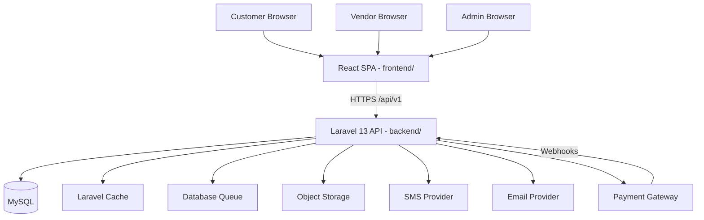
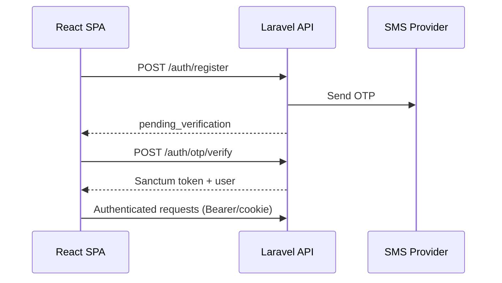
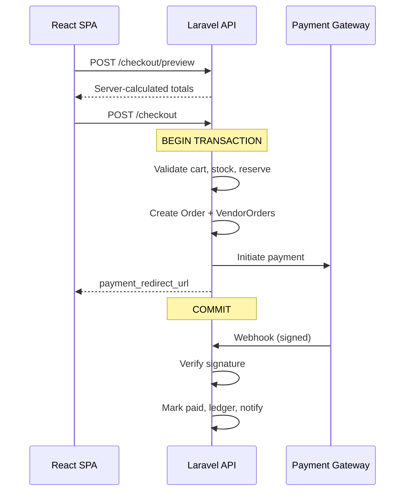

# DIYAR — System Architecture

> **Stage:** 0 — Phase 0.4  
> **Version:** V1 target architecture

---

## 1. Architecture Style

**Modular monolith** — single Laravel 13 deployable with clear domain module boundaries. No microservices in V1.

---

## 2. System Context



---

## 3. Layered Architecture (Backend)

```text
HTTP Request
    ↓
Route (/api/v1/*)
    ↓
Middleware (Sanctum, throttle, role)
    ↓
Controller (thin — request/response only)
    ↓
Action / Service (business logic)
    ↓
Domain Models (Eloquent)
    ↓
MySQL | Cache | Queue | Storage
```

**Rules:**
- Controllers do not contain business logic
- Financial/order operations use `DB::transaction()`
- Gateway-specific code only in Payment module adapters

---

## 4. Frontend Architecture (Target)

```text
Pages (existing)
    ↓
Feature hooks (TanStack Query)
    ↓
API client (Axios + interceptors)
    ↓
/api/v1 REST API
```

**Progressive migration:** Keep existing component structure; add `src/api/`, `src/types/`, `src/hooks/`.

---

## 5. Authentication Flow



- SPA mode: Sanctum cookie for same-domain or Bearer token for cross-domain
- Admin: seeder-created only

---

## 6. Checkout & Payment Flow



---

## 7. Infrastructure (V1)

| Component | V1 Choice | Notes |
|-----------|-----------|-------|
| App server | PHP-FPM + Nginx | Single instance acceptable for launch |
| Database | MySQL 8 | Managed recommended |
| Cache | File/database cache via Laravel | No Redis |
| Queue worker | `php artisan queue:work` | Database driver |
| Storage | Local dev; S3 prod | Laravel filesystem |
| Frontend hosting | CDN/static (GitHub Pages → production CDN) | Separate from API |
| SSL | Required | API + frontend |

---

## 8. Environments

| Env | Purpose |
|-----|---------|
| Local | Dev: Vite + Laravel Sail/Valet |
| Staging | QA + webhook testing |
| Production | Live |

---

## 9. Security Architecture

- Sanctum authentication on all protected routes
- Policy-based authorization per resource
- Rate limiting on auth endpoints
- Webhook signature verification
- File upload validation (MIME, size)
- CORS restricted to frontend origin
- No secrets in frontend bundle

See `SECURITY.md` for details.

---

## 10. Deployment Architecture

```text
Cloudflare (CDN/WAF)
    ├── app.diyar.sa → Static React build (frontend/)
    └── api.diyar.sa → Laravel (backend/)
            ├── MySQL
            ├── Queue worker (cron/supervisor)
            └── Storage (media)
```

---

## 11. Scalability Path (Post-V1)

When justified by metrics:
- Redis for cache + queue
- Horizontal app servers behind load balancer
- Read replicas for MySQL
- Meilisearch for advanced search
- WebSockets (Reverb) for chat
- PostgreSQL migration only if proven need

---

## 12. Repository Layout

```text
diyar-marketplace/          # Git root
├── github/                 # Workflow documentation
├── conception/             # This knowledge base
├── frontend/               # React SPA
└── backend/                # Laravel 13 API
```

---

*See `DOMAIN_ARCHITECTURE.md`, `DATABASE_DESIGN.md`, `DEPLOYMENT.md`, `adr/`.*
