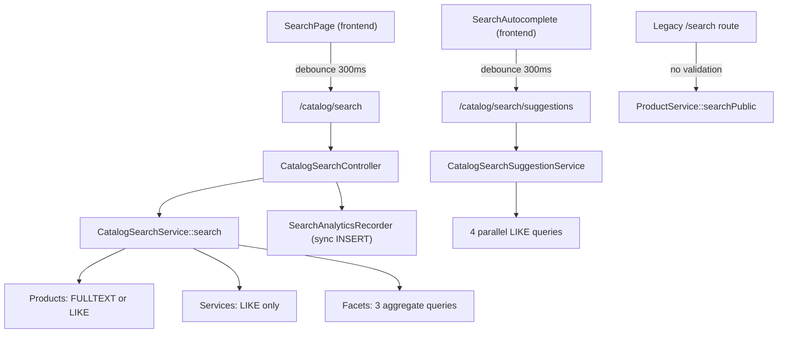

# Storefront Search — Database Engineering Audit

## Architecture Overview



---

## ✅ What's Done Well

| Area | Details |
|------|---------|
| **FULLTEXT index** | Products have `products_search_fulltext(name, description)` on MySQL — major win over pure `LIKE` |
| **Stampede-safe caching** | Facets use `StampedeSafeCache` with lock-based single-flight; prevents thundering herd |
| **Versioned cache invalidation** | `VersionedCache` + `CatalogCacheInvalidator` bumps version on product CUD; no stale facets |
| **Request validation** | `CatalogSearchRequest` validates all inputs with strict rules |
| **Frontend debouncing** | 300ms debounce on both search + suggestions; `keepPreviousData` for smooth UX |
| **Composite indexes** | `(status, created_at)`, `(status, sale_price)`, `(category_id, status)`, `(vendor_account_id, status)` all exist |
| **Analytics recording** | Search queries logged with timing, filters, and result count for future tuning |
| **Pagination bounds** | `PaginationBounds` enforces server-side `per_page` cap |

---

## 🔴 Critical Issues

### 1. Legacy `/search` Route — Unvalidated Input, SQL Injection Risk

**File:** [SearchController.php](file:///home/yacine/Documents/web/diyar-marketplace/backend/app/Http/Controllers/Api/V1/Catalog/SearchController.php)

```php
// Line 20 — passes raw $request->query() (ALL query params) directly
$paginator = $this->products->searchPublic($request->query(), $request->user());
```

- `$request->query()` returns **all** query string params **unvalidated** — no `FormRequest`, no type checks.
- Passes directly into `applyFilters()` which uses raw values in `whereFullText`, `LIKE`, `whereJsonContains`, etc.
- This endpoint is **live and routed** at `GET /search` alongside the validated `GET /catalog/search`.

> [!CAUTION]
> This is a security concern. The legacy `/search` endpoint bypasses all input validation. It should either be removed, deprecated, or wrapped with `CatalogSearchRequest`.

### 2. `scopePubliclyVisible` Uses Correlated Subquery — Full Table Scan Risk

**File:** [Product.php](file:///home/yacine/Documents/web/diyar-marketplace/backend/app/Models/Product.php#L137-L146)

```php
public function scopePubliclyVisible($query)
{
    return $query
        ->where('status', ProductStatus::Active)
        ->whereIn('vendor_account_id', function ($subquery) {
            $subquery->select('id')
                ->from('vendor_accounts')
                ->where('status', 'active');
        });
}
```

This generates `WHERE vendor_account_id IN (SELECT id FROM vendor_accounts WHERE status = 'active')` which MySQL executes as a **dependent subquery** (re-run for every row) unless the optimizer materializes it. This is attached to **every** public search/listing/facet query.

> [!WARNING]
> Replace with a `JOIN` or cache the active vendor IDs. On a table with thousands of products, this subquery executes per-row unless MySQL's optimizer can de-correlate it (not guaranteed with UUID PKs).

### 3. Service Search Has No FULLTEXT — Pure `LIKE '%term%'` on Joined Tables

**File:** [ServiceCatalogService.php](file:///home/yacine/Documents/web/diyar-marketplace/backend/app/Services/ServiceMarketplace/ServiceCatalogService.php#L109-L116)

```php
$term = '%'.$filters['q'].'%';
$query->where(function (Builder $q) use ($term) {
    $q->where('services.title', 'like', $term)
        ->orWhere('services.description', 'like', $term)
        ->orWhere('provider_accounts.business_name', 'like', $term);
});
```

- Leading-wildcard `LIKE '%term%'` **cannot use any index** — guaranteed full table scan.
- Crosses a JOIN boundary (`services` + `provider_accounts`) making it even worse.
- No FULLTEXT index exists on the `services` table at all.

---

## 🟡 Optimization Opportunities

### 4. Facet Queries Execute Full Search Twice (Vendor + Color Facets)

**File:** [CatalogSearchService.php](file:///home/yacine/Documents/web/diyar-marketplace/backend/app/Services/Catalog/CatalogSearchService.php#L193-L282)

Both `vendorFacets()` and `colorFacets()` independently build and execute the **same base query** with `publiclyVisible()` + `applyPublicFilters()`. The color facet query even adds a hard `LIMIT 500` subquery for product IDs, then runs a second query on `product_colors`.

That means a single search request with facets fires:
1. Product listing query (with pagination)
2. Service listing query (with pagination)  
3. Vendor facet aggregate query
4. Color facet product ID subquery + color query
5. Category facet query

**= 5-6 SQL queries per request**, with 3 of them (#3, #4) re-executing the heavy product base query.

> [!TIP]
> Consider computing vendor and color facets in a single pass using a CTE or collecting IDs from the main product listing query, rather than re-running the filter pipeline independently for each facet.

### 5. Analytics Recording is Synchronous — Blocks the Response

**File:** [CatalogSearchController.php](file:///home/yacine/Documents/web/diyar-marketplace/backend/app/Http/Controllers/Api/V1/Catalog/CatalogSearchController.php#L28-L37)

The `SearchAnalyticsRecorder::record()` does a synchronous `INSERT` into `search_query_events` **before** the response is returned. If the DB is slow or the table is large, this directly adds latency to search responses.

```php
// Line 28-37 — sync INSERT in the hot path
$this->analytics->record(
    query: $query,
    // ...
    durationMs: $durationMs,  // irony: measures itself
);
```

> [!TIP]
> Dispatch this as a queued job (`dispatch(new RecordSearchAnalytics(...))->afterResponse()`) or use `register_shutdown_function` / `terminable middleware` to fire after the response is sent.

### 6. `categoryFacets()` Ignores the Current Search Context

**File:** [CatalogSearchService.php](file:///home/yacine/Documents/web/diyar-marketplace/backend/app/Services/Catalog/CatalogSearchService.php#L237-L250)

```php
private function categoryFacets(array $filters): array
{
    return Category::query()
        ->active()
        ->whereIn('type', ['product', 'both', 'service'])
        ->orderBy('sort_order')
        ->get(['slug', 'name', 'type'])
        // ...
}
```

This returns **all** active categories regardless of whether they contain products matching the current search query. It doesn't reflect the actual result set — misleading for users who might filter by a category and get zero results.

### 7. Suggestion Service Fires 4 Sequential Queries

**File:** [CatalogSearchSuggestionService.php](file:///home/yacine/Documents/web/diyar-marketplace/backend/app/Services/Catalog/CatalogSearchSuggestionService.php#L46-L51)

```php
$suggestions = collect()
    ->merge($this->productSuggestions($prefix, $contains, min(4, $limit)))
    ->merge($this->vendorSuggestions($prefix, $contains, min(2, $limit)))
    ->merge($this->categorySuggestions($prefix, $contains, min(2, $limit)))
    ->merge($this->serviceSuggestions($prefix, $contains, min(2, $limit)))
```

Four sequential `LIKE` queries. Each with `CASE WHEN ... ORDER BY` that prevents index usage.

> [!TIP]
> These 4 queries are independent — they could be parallelized with `DB::select()` inside a `Promise\all()` / `async` wrapper, or combined into a single UNION query.

### 8. Color Facet Hard-Limits to 500 Product IDs

**File:** [CatalogSearchService.php](file:///home/yacine/Documents/web/diyar-marketplace/backend/app/Services/Catalog/CatalogSearchService.php#L260-L264)

```php
$productIds = Product::query()
    ->publiclyVisible()
    ->tap(fn (Builder $query) => $this->products->applyPublicFilters(...))
    ->limit(500)
    ->pluck('id');
```

This arbitrarily caps at 500 products. If a search matches 5000 products, the color facets will only reflect the first 500 (by whatever default ordering applies, which is `latest` due to `applyFilters`). Colors from older matching products are silently excluded.

### 9. Missing Composite Index for Discount Sort

When sorting by discount (`-discount`), the query uses:
```php
->orderByRaw('(compare_price - sale_price) DESC')
```

This computed expression **cannot use any index** and forces a full filesort. Given that "discounted/on sale" is a common storefront sort, this could be slow on large catalogs.

> [!TIP]
> Consider adding a `discount_amount` generated/virtual column with an index, or a pre-computed column updated on product save.

### 10. Popularity Sort Relies on `Schema::hasTable()` Check at Runtime

**File:** [ProductService.php](file:///home/yacine/Documents/web/diyar-marketplace/backend/app/Services/Catalog/ProductService.php#L476-L483)

```php
private function applyPopularSort(Builder $query, string $sort): void
{
    if (Schema::hasTable('product_likes')) {
        $query->withCount('likes')->orderBy('likes_count', ...);
    } else {
        $query->latest();
    }
}
```

`Schema::hasTable()` is called **on every request** that sorts by popularity. This is a metadata query to `information_schema` that, while cached in some drivers, should not be in the hot path.

---

## 🟢 Missing Features

### 11. No Arabic/RTL-Aware Tokenization

The marketplace is clearly Saudi-focused (SAR currency, Arabic UI strings). MySQL `FULLTEXT` with default parser uses whitespace tokenization which works poorly for Arabic text. Diacritics, hamza variants (`ا`, `أ`, `إ`, `آ`), and ta-marbuta/ha (`ة`/`ه`) are treated as different characters.

> [!IMPORTANT]
> For proper Arabic search, consider either adding ngram parser (`WITH PARSER ngram`) to the FULLTEXT index, or migrating to Meilisearch/Elasticsearch which have proper Arabic analyzers. The `SearchEngineInterface` abstraction is already in place for this.

### 12. No Search Result Caching (Only Facets Are Cached)

The main search results themselves (`products`, `services` pagination) are **never cached** — every request hits the database. Only facets benefit from `StampedeSafeCache`. For identical repeated queries (common for popular searches), this is wasted work.

### 13. No "Did You Mean" / Typo Tolerance

No fuzzy matching, Levenshtein distance, or phonetic matching. A typo in the search query returns zero results with no guidance. The `SearchEngineInterface` abstraction exists but the MySQL engine has no way to provide this.

### 14. Products & Services Share a Single Pagination

Both products and services share `filters.page` and `filters.per_page`. When `type=all`, changing page on products also changes the service page. This is visible in the frontend — both `PaginationBar` components use the same `filters.page`.

---

## Summary Table

| # | Issue | Severity | Effort |
|---|-------|----------|--------|
| 1 | Legacy `/search` — no validation | 🔴 Critical | Low |
| 2 | `publiclyVisible` subquery per row | 🔴 Critical | Medium |
| 3 | Service search — no FULLTEXT | 🔴 Critical | Medium |
| 4 | Facets re-execute full query ×2 | 🟡 Medium | Medium |
| 5 | Sync analytics INSERT in hot path | 🟡 Medium | Low |
| 6 | Category facets ignore search context | 🟡 Medium | Medium |
| 7 | Suggestion: 4 sequential queries | 🟡 Medium | Medium |
| 8 | Color facet 500 ID cap | 🟡 Low | Low |
| 9 | Discount sort — no index | 🟡 Medium | Low |
| 10 | `Schema::hasTable` in hot path | 🟡 Low | Low |
| 11 | No Arabic tokenization | 🟢 Feature gap | High |
| 12 | No search result caching | 🟢 Feature gap | Medium |
| 13 | No typo tolerance / "did you mean" | 🟢 Feature gap | High |
| 14 | Shared pagination for products/services | 🟢 UX gap | Medium |
